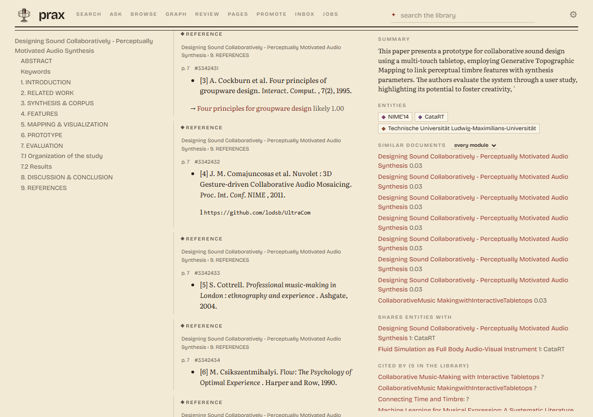
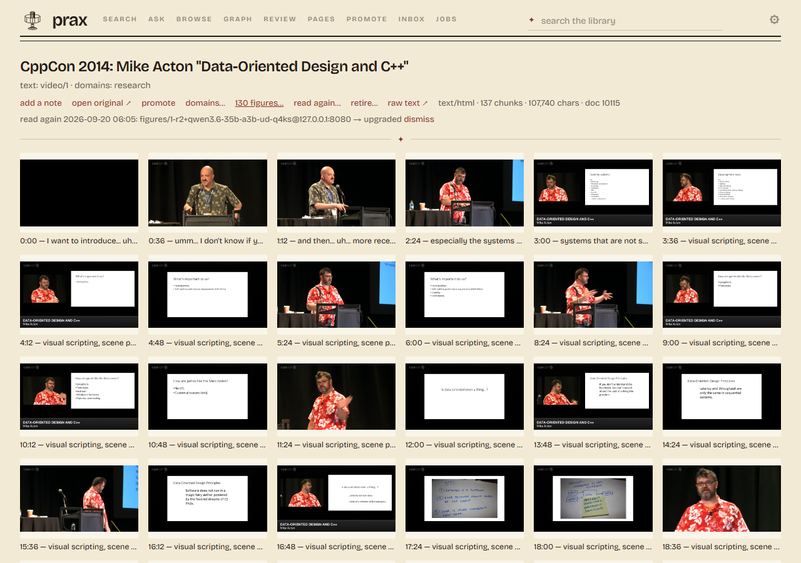
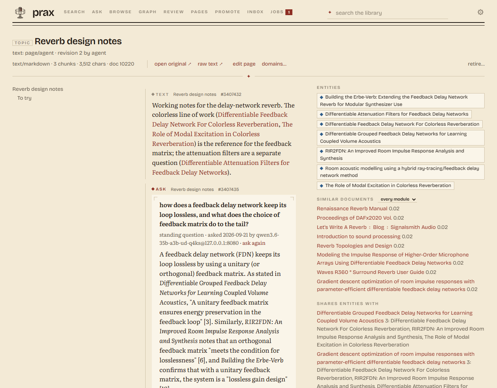

# prax

A personal library for what you read: papers, web pages, manuals,
notes. You get search that combines keywords and meaning, a graph of
how things connect, and answers with citations back to the source. It
runs on your own machines with your own models. You can use it from
the browser, from a shell, or from an agent.

    pip install -e ".[serve,work]"
    export PRAX_DATA_DIR=~/prax-data
    prax serve                                  # http://127.0.0.1:8000/ui/

    prax add paper.pdf
    prax add https://example.org/article
    prax search feedback delay networks
    prax ask --answer why do FDNs colour the tail

An empty store works from the first command. On the machine with the
models, `prax work --watch` finishes new documents: text, title, graph,
vectors. To keep everything running, list the parts under `run:` in
`prax.yaml` and run `prax up --install`. That starts them at login on
Windows, Linux or macOS, with a tray icon on a desktop. The longer
version, with the Zotero import and the browser extension, is in
[`docs/howto.md`](docs/howto.md).

<table>
<tr>
<td width="50%"></td>
<td width="50%"></td>
</tr>
<tr>
<td>Search. Each hit says which side found it: keywords, vectors, or the document's own summary.</td>
<td>Ask. The model searched again and read on before it answered. The citations point at passages, and the trail shows how it got there.</td>
</tr>
<tr>
<td></td>
<td></td>
</tr>
<tr>
<td>Graph. A method and its neighbours. Every link says how sure it is, which model wrote it, from which document and which sentence.</td>
<td>A schematic as a document, read by two vision models. Both readings are kept and both are named.</td>
</tr>
<tr>
<td colspan="2"></td>
</tr>
<tr>
<td colspan="2">A figure is read together with the words around it in the document. The reading names the process and its four steps instead of describing grey rectangles. The figure is a passage of the document: you can search for it, cite it, and an answer can use it.</td>
</tr>
<tr>
<td colspan="2"></td>
</tr>
<tr>
<td colspan="2">A talk sent from the browser. The transcript comes in paragraphs, each with its moment. A frame every so often is a figure, captioned with what was said there. The summary and the entities come from the same extraction a paper gets. Every moment is a link that seeks the player.</td>
</tr>
<tr>
<td width="50%"></td>
<td width="50%"></td>
</tr>
<tr>
<td>A paper's reference list. Each entry is matched against the library. The cited paper appears under it with a score, and the [n] in the text links to it.</td>
<td>A talk's figures at a glance: the frames, each with its moment and what was said. A paper shows its figures the same way, a scan its pages.</td>
</tr>
<tr>
<td colspan="2"></td>
</tr>
<tr>
<td colspan="2">A page of your own with a question in it. You write the question between two comment lines. prax answers it there, with sources, and answers again when new documents arrive. It never changes a word you wrote. The documents you link and the ones the answer cites show up in the column beside the page.</td>
</tr>
<tr>
<td colspan="2"></td>
</tr>
<tr>
<td colspan="2">Six themes. Each one is four colours, and they change the page and the logo together.</td>
</tr>
</table>

## What it does

**Takes things in.** Your Zotero library, read-only. Files you drop
in a folder. The page you are reading, or every tab in the window, sent
from the browser as a self-contained snapshot. A PDF behind a login,
fetched with your own session. `prax import` reads exports from GitHub
stars, chat apps, bookmarks, Pocket, Raindrop and Medium, and a
project's own docs folder.

**Reads them.** PDFs go through MuPDF, with OCR when you ask, or
through marker when you want the maths as LaTeX. HTML goes through
trafilatura, comments included. Word files, code and talks with their
transcripts are read too. Figures are pulled out and read by a vision
model. The model sees the words around the figure, so a plot comes back
as "the frequency responses of the five learned CNN kernels against the
ground truth filter" and not as "six stacked curves". You can search
for a figure by what it shows. A scanned book with no text layer comes
back as its pages, filed as pictures and read the same way. Reference
lists are cut into entries and each entry is matched against the
library. Titles that were file names get repaired.

**Finds them.** Keyword and vector search run over the passages and
over what each document is about, and the results are merged per
document. You can filter by kind of document or by subject. Acronyms
the library defines are expanded on the way in. Stopwords and reference
lists are left out, so a query is about what it says.

**Connects them.** A model reads each document against a small
ontology and writes typed relations: which paper uses which method,
which manual belongs to which piece of gear, which recipe needs which
ingredient. You can read the whole ontology in an afternoon. Citation
links come from Crossref or OpenAlex, and from each paper's own
reference list matched against the library, with a score. On a paper's
page the [12] in the text is a link to what entry 12 cites. Every
relation records who wrote it, from which document, under which version
of the ontology, and the sentence it came from.

**Answers questions.** With a model on the host, `ask` works the
library for a few steps before it writes. It searches again, reads on,
walks the graph and drops what does not help. Then it answers and cites
the passages it kept. You watch it happen. You can keep the answer as a
page with links to its sources, or as a standing question that prax
asks again when new documents arrive. Each new answer is a revision.
A daily briefing page lists what arrived and which answers changed.
What the model can and cannot do is in [`docs/ask.md`](docs/ask.md).

**Keeps what you write.** Notes, project logs and write-ups are
Markdown pages with a revision history. They are documents like any
other: searched, extracted, citable. Link a document from a page and
the link becomes a relation in the graph. Put a question in a page
between two comment lines and prax answers it there, with sources, and
answers again when new documents speak to it. When it asks again, the
model sees its earlier answer and is told what is new, so it revises
instead of starting over. prax never rewrites what you wrote yourself.
If you edit inside an answer, it leaves that block alone until you say
otherwise. Rename a page and its links follow.

**Mends itself.** `prax heal` finds the usual kinds of damage: a
placeholder entity, a page captured twice, a scan filed under its
cover's title, figures nobody has read. For each it tells you the
command that fixes it. Nothing is ever deleted. A wrong document is
hidden, with its history kept. When the service felt slow, its log says
what it was doing and which part took the time.

## Four ways in

**The web UI** at `/ui/`. Search and ask, a document with its context
and its figures, the graph, the review queue, your pages, the inbox and
the jobs.

**The `prax` command.** The whole library from a shell, and how most of
it gets used:

    prax                              where things stand, what to type next
    prax search granular synthesis    find documents
    prax ask --answer how does a feedback delay network work
    prax add ~/Downloads/paper.pdf    a file, a folder, a URL, or piped text
    prax import links bookmarks.html  what a service exported
    prax show 4312 | less             read one in the terminal
    prax graph "wave digital filter"  what the graph knows around a name
    prax status · jobs · heal · backup · doctor
    prax up · serve · work --watch    run it (--tray: an icon in the tray)

Each command is one HTTP call. `--json` makes any of them usable from
a script. `--door` points the same command at another machine, say the
board in the cupboard from your laptop.

**The browser extension.** It sends what you are reading, including
pages that need your login. A page arrives as a self-contained
snapshot. A paper arrives as its PDF, with the DOI and authors from the
abstract page. A YouTube talk arrives as its transcript and frames. A
selection arrives as an excerpt, or goes onto one of your pages. All
of this from the popup, the context menu or a single key.

**HTTP, for everything else.** One service is the only writer and the
only API. A shell script with `curl` and `jq` can do exactly what the
UI does. An MCP server ships with it for agents. Whatever a script or
an agent writes carries its own name, so you can inspect it or take it
back out as a unit. Recipes and the contract are in
[`docs/integrating.md`](docs/integrating.md).

## Whose models, and where it runs

Which model does which step is a line in a config file. It can be a
GGUF served by llama.cpp on your own card, any OpenAI-compatible
server, the Claude API for the few documents worth it, or `none` where
a person does the job better. Nothing is spent unless a command says so.
Private material never has to leave the house. The whole library below
was read by one local model on one card. The measurements against the
hosted model are in [`docs/eval/`](docs/eval/).

It runs on one machine or on two. In the two-machine setup a small
board holds the store and the service, and a desktop with a GPU does
the model work through it. Nothing in the serving path needs more than
a gigabyte of memory.

## The library it was built on

One real instance on 15 September 2026: a researcher's library after a
Zotero import, a year of browser captures and a few weeks of model
passes. The numbers are here for scale, not as targets.

| | |
|---|---|
| Documents | 10,305: 9,324 PDFs, 493 web pages, 104 text files, 73 notes, 34 talks from YouTube, 8 pages of my own. 8,990 came from Zotero; the rest were uploaded, sent from the browser or dropped in the folder |
| Text and passages | 1,265,000 passages (937,000 text, 148,000 reference entries, 109,000 figures, 45,000 tables, 17,000 formulas, 9,000 code), 1,106,000 of them with a vector; 7,570 acronyms the library defines |
| Figures | 62,400 with a picture across 4,966 documents, served out of the originals; 33,000 read by the local vision model, and each reading can be searched like a paragraph. Where the picture was drawn with vector paths and no extractor could lift it out, the region above its caption is rendered instead |
| Graph | 162,000 live relations over 144,000 entities (43,600 papers, 25,600 concepts, 15,500 methods, 9,500 authors), against six ontology modules. 22,900 names are folded into another: the same thing under a different spelling, an initials form, or — since 2026-09-24 — the same thing in another language |
| Languages | 71% English, 21% German, the rest French, Spanish, Italian and Dutch. The document field is written in English whatever the document is in, and an entity keeps the document's own word as a label in its own language |
| Retrieval | MRR 0.905 for the combined search over 62 real queries (0.82 keywords alone, 0.79 vectors alone), hit@1 0.85 |
| Running | one Windows desktop: service, worker and llama-server started at login, a backlog pass at 03:00, maintenance at 03:30, a backup at 04:30. A 2.3 GB database, a 1.3 GB vector index and a 20 GB archive |

715 of those documents are scans nothing could read yet. The service
has not moved onto the serving board, though the code for it is in
[`deploy/`](deploy/). What else is unfinished is in
[`docs/PLAN.md`](docs/PLAN.md).

## How it works

**A document.** The bytes are archived once under their SHA-256. The
database keeps the metadata and the hash, so the same file sent twice
is one document. A parser writes the text, which is stored under its
own hash and stamped with the parser that made it. The text is cut into
addressable passages: text under a heading, tables, figures, display
equations, code, the entries of the reference list. Each passage knows
where it sits in the text. The passages go into an FTS5 index and a
usearch vector index (reference entries into neither), and the document
gets a summary field of its own. A model reads the document against
the ontology modules it belongs to. Each relation it finds becomes a
link with its evidence, or goes to a review queue when it fits no type.
Reference entries are matched to the library by rules and become
citation links with a score.

**A query.** Four ranked lists are merged per document: keywords and
vectors over the passages, keywords and vectors over the summary
fields. A reranker can follow, and you can filter by type and subject.
`ask` builds on the same search. The graph is walked one or two hops
from an entity. Questions like "what is not connected" are SQL, not
retrieval.

**The batch work.** Parsing, titles, extraction and embedding are
batch jobs, never part of a request. A worker fetches work from the
service and posts the results back over HTTP. Nothing but the service
writes to the store. When a document lands, the service follows up on
its own: a transcript is polished, then its frames are read; a marker
read is followed by its equations. A nightly job keeps the derived
tables and the citation links current.

**Why it is built this way.** Everything derived from a document is a
model's work, kept so it need not be repeated: text, passages, vectors,
relations, summaries, figure readings. Each is keyed by the stamp of
whatever produced it. A better model or a better prompt is a new stamp.
Whatever is behind it can be found and redone on request, and the
earlier reading stays beside the new one. Only the originals are never
derived, so everything else can be thrown away and made again.

## Where it sits among the others

Every neighbour exposes tools to an agent now, so that is not what sets
prax apart. Bookmark managers keep links and have mobile apps. Zotero
MCP servers give an agent a curated library and nothing else. The
LLM-wiki family makes generated pages the index; prax keeps the
originals as the truth. Agent-memory frameworks are built for an
application's agents; prax is a tool for a person that agents can also
use. Paperless files paperwork. The comparison by family and by
product, with sources, is in
[`docs/research.md`](docs/research.md#where-prax-sits).

## Documentation

| | |
|---|---|
| [`docs/howto.md`](docs/howto.md) | Setting up, the batch jobs, `prax.yaml`, the service, the board, backup. |
| [`docs/integrating.md`](docs/integrating.md) | Using the library from scripts, agents and other tools. |
| [`docs/ask.md`](docs/ask.md) | What the asking model can and cannot do, what it costs, how to steer it. |
| [`docs/architecture.md`](docs/architecture.md) | The system as built: hosts, the life of a document and of a query, the modules, where to touch what. |
| [`CLAUDE.md`](CLAUDE.md) | Invariants and conventions. The file an agent session loads. |
| [`docs/rationale.md`](docs/rationale.md) | Decision records: what was chosen, what was measured, when to revisit. |
| [`docs/stratification.md`](docs/stratification.md) | What the patterns in the code are for, what comparable systems do about it, and the plan that follows. |
| [`docs/identity.md`](docs/identity.md) | What a thing is, and what it is called: the survey behind the identity change, and why the name column stays. |
| [`docs/generalizing.md`](docs/generalizing.md) | Repair or prevention: what a new library gets without the week of passes, and in which languages. |
| [`docs/normalization.md`](docs/normalization.md) | One thing under several names: the five kinds of duplicate and the mechanism for each, with what the measurements changed. |
| [`docs/ui.md`](docs/ui.md) | The web UI: the endpoints it uses, its routes and rules. |
| [`docs/design/BRIEF.md`](docs/design/BRIEF.md) | The look: the mark printed the way an 1877 label was, the six themes as four values, the type. |
| [`docs/sources.md`](docs/sources.md), [`docs/extension.md`](docs/extension.md) | Where documents come from, and the browser extension. |
| [`docs/claude-workflow.md`](docs/claude-workflow.md) | One agent workflow in full, as an example: the Claude Code plugin. |
| [`docs/eval/`](docs/eval/) | Measurements: extractors, retrieval, the local models. |
| ontology [`v2`](docs/ontology-v2.md) [`v4`](docs/ontology-v4.md) [`v5`](docs/ontology-v5.md) [`v6`](docs/ontology-v6.md) [`v7`](docs/ontology-v7.md) [`v8`](docs/ontology-v8.md), [`studio`](docs/ontology-studio.md), [`craft`](docs/ontology-craft.md) | How the vocabulary grew, one version at a time, and why. |
| [`docs/PLAN.md`](docs/PLAN.md), [`docs/research.md`](docs/research.md) | The staged plan, and the survey of the field. |
| [`prax.example.yaml`](prax.example.yaml) | Template for `prax.yaml`: models, steps, every other setting. |

## Scope and status

This is one person's tool. It was built with Claude Code over a few
weeks and shaped by one library and one set of machines. It is
published so the design and the measurements can be read and reused.
There is no installer and no multi-user story, and the defaults reflect
that one library. Every push runs the test suite on Linux and Windows,
and the quick start above in a fresh venv
([`ci.yml`](.github/workflows/ci.yml),
[`scripts/smoke.sh`](scripts/smoke.sh)). The extension has a test bed
of its own that drives it in headless Chrome and Firefox
([`scripts/extension_bed.mjs`](scripts/extension_bed.mjs)), and it is
used daily in Firefox, Waterfox and Chrome. Issues and pull requests
are welcome, but may wait.

The name: the praxinoscope came after the zoetrope, the same drum with
a sharper image. prax came after an external-disk store of the same
library.

## License

MIT, see [`LICENSE`](LICENSE), except the browser extension.
[`clients/browser-extension/`](clients/browser-extension/) is AGPL-3.0
because it bundles SingleFile for page snapshots, the way the Zotero
connector does. It is a separate program that talks to the service over
HTTP. The test fixture under [`tests/fixtures/`](tests/fixtures/) holds
open-access papers under their own Creative Commons terms, listed with
their licenses in
[`tests/fixtures/zotero/README.md`](tests/fixtures/zotero/README.md).
