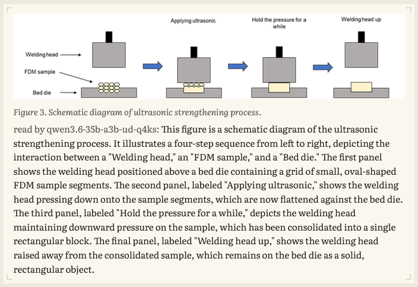
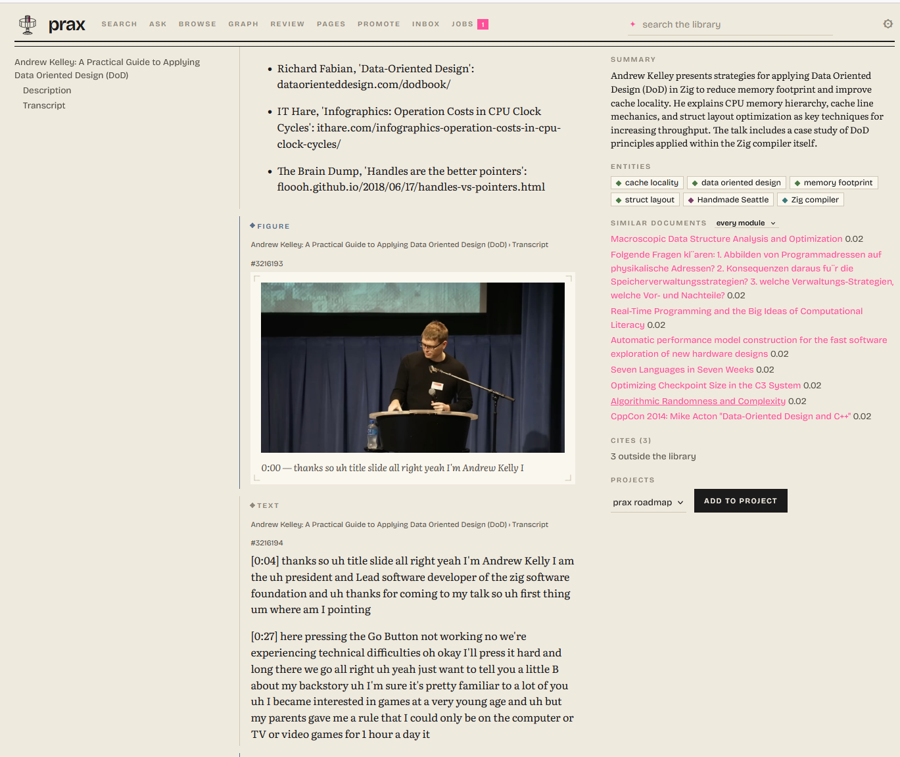

# prax

Keep what you read in one place you run yourself.

Papers, web pages, manuals, chats, notes. prax gives them search that
fuses words and meaning, a typed graph of how they connect, and answers
with citations back to the exact lines. It runs on your machines, with
your models, and every part of it is reachable from a shell script or an
agent as easily as from the browser.

    pip install -e ".[serve,work]"
    export PRAX_DATA_DIR=~/prax-data
    prax serve                                  # http://127.0.0.1:8000/ui/

    prax add paper.pdf
    prax add https://example.org/article
    prax search feedback delay networks
    prax ask --answer why do FDNs colour the tail

An empty store answers on the first request. On the machine with the
models, `prax work --watch` takes new documents the rest of the way —
text, title, graph, vectors. To keep all of it running — the door, the
worker, a local model server — name them under `run:` in `prax.yaml`
and `prax up --install` starts them at login, on Windows, Linux or
macOS alike. The longer version, with the Zotero import and the browser
extension: [`docs/howto.md`](docs/howto.md).

<table>
<tr>
<td width="50%"></td>
<td width="50%"></td>
</tr>
<tr>
<td>Search: hybrid hits, each saying which side found it — keywords, vectors, the document field.</td>
<td>Ask: the model searched again and read on before answering; the citations point at passages, and the trail shows how it got there.</td>
</tr>
<tr>
<td></td>
<td></td>
</tr>
<tr>
<td>Graph: a method's neighbourhood. Every edge carries its confidence, the model that wrote it, the document and the sentence.</td>
<td>A schematic as a document, read and transcribed by two vision models — each reading kept, both named.</td>
</tr>
<tr>
<td colspan="2"></td>
</tr>
<tr>
<td colspan="2">A figure is read with the document's own words around it — title, caption, the text on either side — so the reading names the process and its four steps rather than the grey rectangles. It is a chunk of the document: searchable, citable, read by an answer.</td>
</tr>
<tr>
<td colspan="2"></td>
</tr>
<tr>
<td colspan="2">A talk sent from the browser: the transcript in paragraphs, each headed by its moment; a frame every so often as a figure, captioned with the words spoken there and read by the vision model like any figure; the summary and the entities from the same extraction as a paper's. Every moment is a link that seeks the player on the page.</td>
</tr>
<tr>
<td colspan="2"></td>
</tr>
<tr>
<td colspan="2">Six themes. Each is four values — ground, tone, key, colour — that switch the page and the mark together.</td>
</tr>
</table>

## What it does

**Takes things in.** A Zotero library, read-only. Files dropped in a
folder. The page you are looking at, or every tab in the window, sent
from the browser as a self-contained snapshot — or the PDF behind a
login, fetched with your own session. `prax import` handles GitHub
stars, chat exports, bookmarks, Pocket and Raindrop, Medium, a project's
docs.

**Reads them.** PDFs through MuPDF, with OCR when you ask; HTML through
trafilatura, comments included; Word documents; code kept as code.
Figures are pulled out and read by a vision model that is shown what the
document says around them — its title, the caption, the text on either
side — so a plot comes back as "the frequency responses of the five
learned CNN kernels against the ground truth filter" rather than "six
stacked curves", and is searchable by what it shows. Titles that were
file names get repaired.

**Finds them.** Keyword and vector search over chunks *and* over what a
document is, fused per document, filtered by kind or by subject. The
library's own acronyms are expanded on the way in.

**Connects them.** Typed relations extracted against a small ontology
you can read in an afternoon — papers, methods and claims; gear and its
manuals; recipes and ingredients; builds and their parts. Citation edges
from Crossref or OpenAlex, and from each paper's own reference list
matched against the library — with a score, for the papers that have no
DOI. Every edge says who wrote it, from which
document, under which ontology version, with the sentence it was read
from.

**Answers questions.** With a model on the host, `ask` works the library
for a few steps before it writes — searching again, reading on, walking
the graph, setting aside what is beside the point — and cites the
passages it kept. You watch it happen, and the answer can be kept as a
page with edges to its sources. What it can and cannot do:
[`docs/ask.md`](docs/ask.md).

**Keeps what you write.** Notes, project threads, topic write-ups, as
Markdown pages with revisions. A model may append to a page; it never
overwrites a person.

**Mends itself.** `prax heal` names the damage that recurs — a
placeholder entity, a duplicate capture, figures nobody has read — and
offers the way on. Nothing is deleted; a wrong document is retired with
its history.

## Four ways in

**The web UI** at `/ui/`: search and ask, a document with its context
column, the graph, the review queue, pages, the inbox, the jobs.

**The `prax` command** is the whole library from a shell, and the way
most of it gets used:

    prax                              where things stand, what to type next
    prax search granular synthesis    find documents
    prax ask --answer how does a feedback delay network work
    prax add ~/Downloads/paper.pdf    a file, a folder, a URL, or piped text
    prax import links bookmarks.html  what a service exported
    prax show 4312 | less             read one in the terminal
    prax graph "wave digital filter"  what the graph knows around a name
    prax status · jobs · heal · backup · doctor
    prax up · serve · work --watch    run it

Each command is one HTTP call. `--json` turns any of them into a
script's input, and `--door` points the same command at another machine
— the board in the cupboard, from the laptop.

**The browser extension** sends what you are reading, including pages
that need your session: a page as a self-contained snapshot, a paper's
PDF from its abstract page with its DOI and authors, a talk from
YouTube as its transcript and frames, a selection as an excerpt or
onto one of your pages — from the popup, the context menu or one key.

**HTTP, for anything else.** One service is the only writer and the only
API, so a shell script with `curl` and `jq` reaches exactly what the UI
does; an MCP server ships with it for tool-using agents, and whatever
any of them writes carries its own name, so it can be inspected — or
retired — as a unit. Recipes and the contract:
[`docs/integrating.md`](docs/integrating.md).

## Whose models, and where it runs

Which model does which step is a line in a config file: a GGUF served by
llama.cpp on your own card, any OpenAI-compatible server, the Claude API
for the few documents worth it, or `none` where a person does better.
Nothing is spent unless a command says so, and private material never
has to leave the house — a whole library here was read by one local
model on one card, and the measurements against the hosted one are in
[`docs/eval/`](docs/eval/).

It runs on one machine, or on two: a small board holding the store and
the service, a desktop with a GPU draining the model work through it.
Nothing in the serving path needs more than a gigabyte of memory.

## The library it was built on

One real instance, 15 September 2026 — a researcher's library after a
Zotero import, a year of browser captures and a few weeks of passes.
Here for scale, not as targets.

| | |
|---|---|
| Documents | 9,950 — 9,447 PDFs, 317 web pages, 103 text files, 73 notes; 9,233 from Zotero, the rest uploaded, sent from the browser or dropped in the folder |
| Text and chunks | 995,000 chunks (859,000 text, 92,000 figures, 37,000 tables, 7,000 code), every one with a vector; 6,781 acronyms the library defines |
| Figures | 92,078 references across 5,107 documents, served out of the originals; 11,212 read by the local vision model with the document's own words around them, each reading searchable like any paragraph |
| Graph | 147,000 live edges over 126,600 entities — 42,700 papers, 29,600 concepts, 17,200 methods, 9,500 authors — against six ontology modules |
| Retrieval | MRR 0.905 hybrid over 62 real queries (0.82 keyword, 0.79 vector), hit@1 0.85 |
| Running | one Windows desktop: service, worker and llama-server as logon tasks, a backlog pass at 03:00, a backup at 04:30; a 2.0 GB database and a 20 GB archive |

715 of those documents are scans nothing could read yet, and the service
has not moved onto the serving board, though the code for it is in
[`deploy/`](deploy/). What else is unfinished:
[`docs/PLAN.md`](docs/PLAN.md).

## How it works

**A document.** Bytes are archived once under their SHA-256; the
database keeps metadata and the hash, so the same file sent twice is one
document. A parser writes a text artifact, stored by its own hash and
stamped with what produced it. The text is chunked into addressable
regions — text under a heading path, tables, figures, display equations,
code — each with a
locator back into the artifact; the chunks go into FTS5 and a usearch
vector index, and the document gets a field of its own. A model reads it
against the ontology modules it belongs to; each triple becomes an edge
with its evidence, or goes to a review queue when it fits no type.

**A query.** Four rank lists — keyword and vector over chunks, keyword
and vector over the document field — fused per document, optionally
reranked, filtered by type and subject. `ask` builds on the same search;
the graph is walked one or two hops from an entity, and complement
queries and weighted paths are SQL rather than retrieval.

**The passes.** Parsing, titles, extraction, embedding: batch jobs,
never inside a request. A worker fetches work from the service and posts
results back over HTTP. Nothing but the service writes to the store.

**What that buys.** Everything derived — text, chunks, vectors, edges,
summaries, figure readings — is a model's work kept so it need not be
repeated, keyed by the stamp of whoever made it. A better model or a
better prompt is a new stamp; what is behind it is found and redone on
request, and the earlier reading is kept beside the new one. The
originals are the only thing never derived, so all the rest can be
thrown away and made again.

## Where it sits among the others

Every neighbour exposes tools to an agent now, so that is not what sets
anything apart. Bookmark managers keep links and have the mobile apps;
Zotero MCP servers give an agent a curated library and nothing else; the
LLM-wiki family makes generated pages the index, where prax keeps the
originals canonical; agent-memory frameworks are built for an
application's agents, where prax is a tool for a person that agents also
use; Paperless files paperwork. The comparison by family and by product,
with sources: [`docs/research.md`](docs/research.md#where-prax-sits).

## Documentation

| | |
|---|---|
| [`docs/howto.md`](docs/howto.md) | Setting up, the batch jobs, `prax.yaml`, the doors, the board, backup. |
| [`docs/integrating.md`](docs/integrating.md) | Using the library from scripts, agents and other tools. |
| [`docs/ask.md`](docs/ask.md) | What the asking model can and cannot do, what it costs, how to steer it. |
| [`docs/architecture.md`](docs/architecture.md) | The system as built: hosts, life of a document and of a query, module map, where to touch what. |
| [`CLAUDE.md`](CLAUDE.md) | Invariants and conventions — the file an agent session loads. |
| [`docs/rationale.md`](docs/rationale.md) | Decision records: what was chosen, what was measured, when to revisit. |
| [`docs/ui.md`](docs/ui.md) | The web UI: the endpoints it uses, its routes and rules. |
| [`docs/design/BRIEF.md`](docs/design/BRIEF.md) | The look: the mark printed the way an 1877 label was, the six themes as four values, the type, the one rule that keeps it from going twee. |
| [`docs/sources.md`](docs/sources.md), [`docs/extension.md`](docs/extension.md) | Where documents come from; the browser extension. |
| [`docs/claude-workflow.md`](docs/claude-workflow.md) | One agent workflow in full, as an example: the Claude Code plugin. |
| [`docs/eval/`](docs/eval/) | Measurements: extractors, retrieval, the local models. |
| ontology [`v2`](docs/ontology-v2.md) [`v4`](docs/ontology-v4.md) [`v5`](docs/ontology-v5.md) [`v6`](docs/ontology-v6.md) [`v7`](docs/ontology-v7.md), [`studio`](docs/ontology-studio.md), [`craft`](docs/ontology-craft.md) | How the vocabulary grew, one version at a time, and why. |
| [`docs/PLAN.md`](docs/PLAN.md), [`docs/research.md`](docs/research.md) | The staged plan; the landscape survey. |
| [`prax.example.yaml`](prax.example.yaml) | Template for `prax.yaml`: models, steps, every other setting. |

## Scope and status

One person's tool, built with Claude Code over a few weeks and shaped by
one library and one set of machines. It is published so the design and
the measurements can be read and reused — there is no installer, no
multi-user story, and the defaults reflect that library. Every push runs
the suite on Linux and Windows and the quick start above in a fresh venv
([`ci.yml`](.github/workflows/ci.yml),
[`scripts/smoke.sh`](scripts/smoke.sh)). The extension has a test bed
of its own that drives it in headless Chrome and Firefox against a
throwaway door ([`scripts/extension_bed.mjs`](scripts/extension_bed.mjs)),
and is used daily in Firefox, Waterfox and Chrome. Issues and pull
requests are welcome but may wait.

The name: the praxinoscope succeeded the zoetrope — same drum, sharper
image. prax succeeds an external-disk store of the same library.

## License

MIT, see [`LICENSE`](LICENSE), except the browser extension:
[`clients/browser-extension/`](clients/browser-extension/) is AGPL-3.0
because it bundles SingleFile for page snapshots, the way the Zotero
connector does; it is a separate program talking to the service over
HTTP. The test fixture under [`tests/fixtures/`](tests/fixtures/) holds
open-access papers under their own Creative Commons terms, listed with
their licenses in
[`tests/fixtures/zotero/README.md`](tests/fixtures/zotero/README.md).
