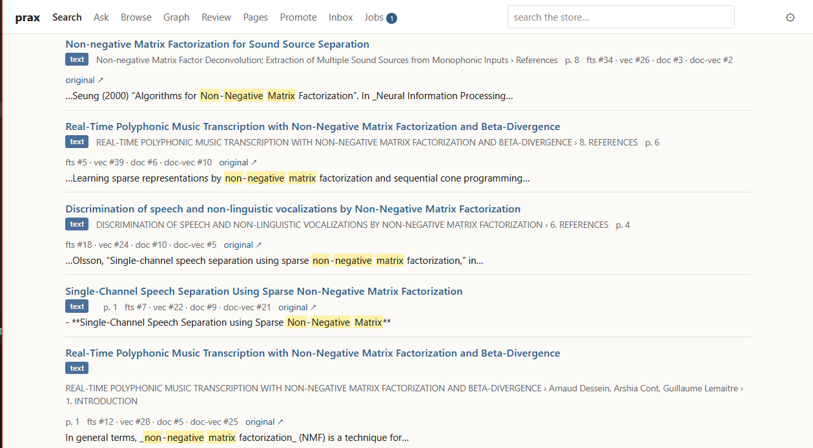
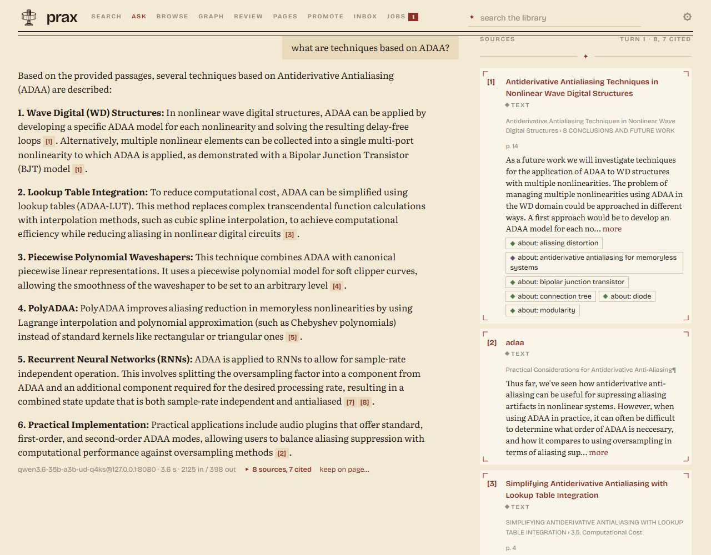
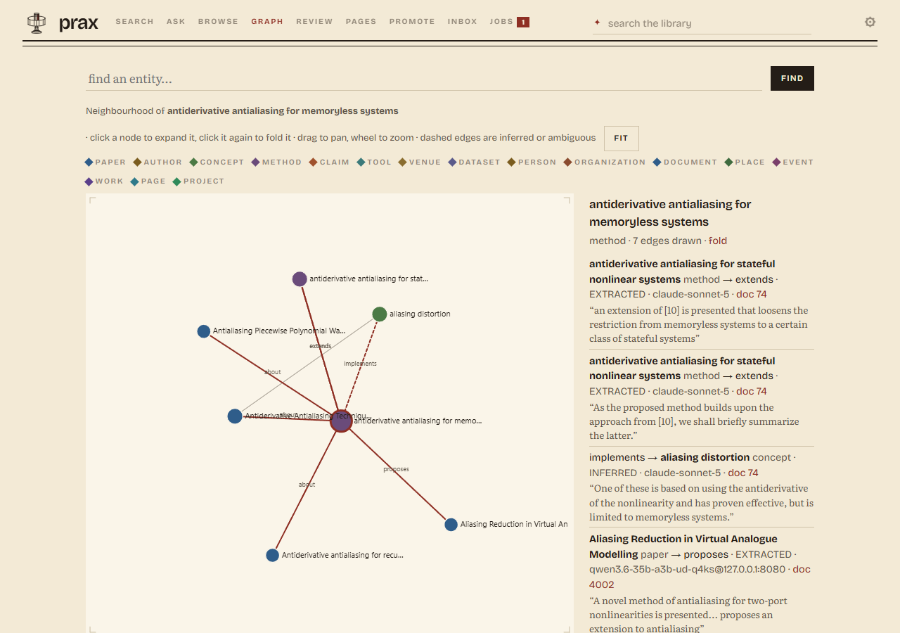
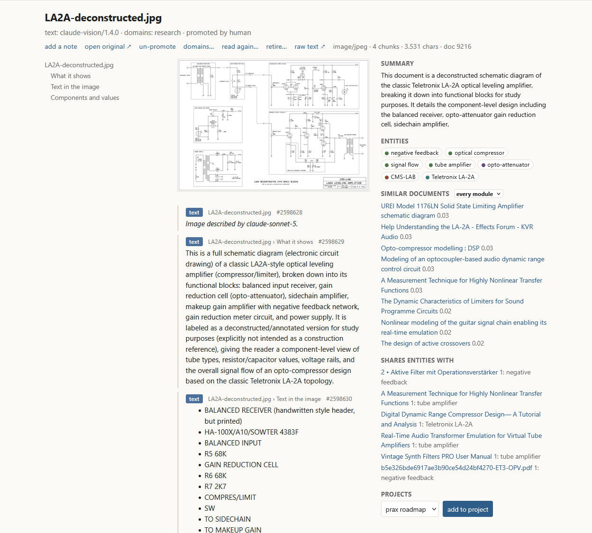
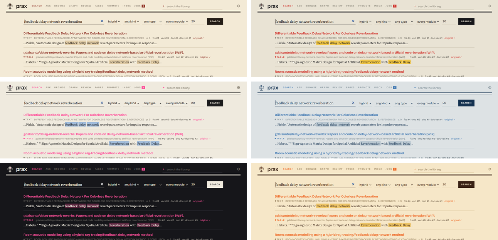

# prax

A library for what you read, collect and write, that you run yourself —
and that is also a database your tools and agents can work from. You can
search it, ask it questions, see how the things in it connect, and write
on top of it; a script can query it, an agent can do a piece of work in
it and leave the result there. It began with a researcher's papers.
Manuals, recipes, build logs, chats, starred repositories and bookmarks
go in the same way and are read with their own vocabulary. You work in
it through a web UI; a browser extension sends in what you are reading;
a command and an MCP server open the same library to scripts and to
Claude Code.

<table>
<tr>
<td width="50%"></td>
<td width="50%"></td>
</tr>
<tr>
<td>Search: hybrid hits, each saying which side found it — keywords, vectors, the document field.</td>
<td>Ask: an answer with numbered citations, the cited passages beside it, and a follow-up that knows the turns before.</td>
</tr>
<tr>
<td></td>
<td></td>
</tr>
<tr>
<td>Graph: a method's neighbourhood — papers, concepts, the methods that extend it — every edge with its confidence, the model that wrote it, its source document and the sentence it was read from.</td>
<td>A schematic as a document: described and transcribed by two vision models (each reading kept, one after the other), with its summary, entities and similar documents beside it.</td>
</tr>
<tr>
<td colspan="2"></td>
</tr>
<tr>
<td colspan="2">The six themes — Bindery, Dessau, Riso, Cyanotype, Night, Funk. Each is four values (ground, tone, key, colour) that switch the page and the mark together.</td>
</tr>
</table>

The name: the praxinoscope succeeded the zoetrope, same drum, sharper
image. prax succeeds an external-disk store of the same library.

## Four ways in

**The web UI** is where you work: search and ask, read a document with
its context column, browse, the graph, the review queue, pages, the
inbox, the jobs. The service serves it itself, at `/ui/`.

**The `prax` command** is the same library from a shell. `prax search`,
`prax ask`, `prax add`, `prax import`, `prax show` are the everyday;
`prax status`, `prax jobs`, `prax heal`, `prax backup` keep it; `prax
serve` and `prax work` run it. Every command is one call to the
service, `--json` makes it a script's, and `--door` points it at
another machine — the board across the network, from the desktop.

**The browser extension** sends in what you are reading: this tab or
every tab in the window, as a self-contained snapshot with its images,
or the PDF fetched with your own session when it sits behind a login.

**The MCP server** opens the same library to Claude Code as tools —
search, read, traverse, link, capture, write pages. It is a proxy with
no logic of its own. The Claude Code plugin packages it with a skill
that says when to reach for the library, `/prax:scope`, `/prax:research`,
`/prax:remember`, `/prax:sync` and `/prax:archive`, and a hook that
keeps a project's docs — and, when asked, its sessions — in the library.

Behind all four is one service that is the only writer, so a thing
done in the UI, in the shell or by an agent goes the same way and
leaves the same trace.

## What you can do

**Sources.** Import a Zotero library, read-only. Drop files in
a folder. Send the page you are looking at, or every tab in the window,
from the browser — a self-contained snapshot with its images, or the PDF
fetched with your own session when it sits behind a login. `prax add` a
file, a folder or a URL; `prax import` your GitHub stars, a Telegram,
Signal or WhatsApp export, a browser's bookmarks, a Pocket or Raindrop
CSV, Medium's export, a project's docs, your Claude Code sessions. What
arrives gets its text, a proper title, its
place in the graph and its vectors on its own, on the machine with the
models.

**Search.** Search that fuses words and meaning and ranks documents, not
fragments; that knows the library's own acronyms; that filters by kind
of document and by module (papers, gear, recipes…); that shows similar
documents, and a context column on every document: summary, entities,
citations in and out, related documents, notes, projects.

**Questions.** A question is answered from the best passages and from what the
graph knows about their documents, with numbered citations back to the
exact lines. The answer can be kept as a page with edges to the
documents it rests on.

**The graph.** A graph of typed, evidenced relations —
papers, methods, claims, organizations; devices, their manuals and
specifications; recipes and ingredients; builds and their parts —
extracted against a small ontology you can read in an afternoon, one
module per kind of life, grown from what the review queue shows the
models wanted to say. Citation edges from Crossref or OpenAlex. An
interactive map that expands a node at a time and folds it again.

**Pages.** Notes on documents, project threads with reading lists, topic
write-ups and syntheses across sources, as Markdown pages with
revisions. A model may append to a page; it never overwrites a person.

**From scripts and agents.** The same library answers to more than the web UI:

- From Claude Code it is a set of tools — search, read a passage, walk
  the graph, link, capture, write or append a page — so an agent can do
  a piece of research in it and file the result back into it, as a
  page with edges to what it rests on, its own name on every edge. "What
  do the papers in this project claim about wave digital filters, with
  the passages" is a question an agent answers from the store and
  leaves there.
- The graph is typed against a vocabulary you control, so a workflow
  can rely on it: every recipe `calls_for` ingredients, every build is
  `made_with` components. A shopping list for the weekend's three
  recipes, or the parts for a build you have only read about, is a
  traversal, not a prompt.
- From a script it is `prax … --json`, or the same HTTP the UI uses.
  From anything else it is one SQLite file, a folder of originals named
  by their hash, Markdown pages and YAML ontology files; nothing is
  locked in.

And it lives: captures, imports and the worker keep it growing on their
own; a better model re-reads what an earlier one read without losing
the earlier reading; the UI follows a change feed, and a workflow can
follow the same one.

**Provenance.** Every edge says who wrote it, from which document, under
which ontology version, with what evidence. A misfit goes to a review
queue, never into the graph. A document sent twice is one document; a
wrong one is retired, not deleted, with its history kept. `prax heal`
finds the damage that recurs and mends it in the open; `prax backup`
copies the whole store, incrementally, to a directory of your choosing.

**Where it runs, whose models.** It runs on your machines: a small board at home for the
service, a desktop with a GPU for the heavy passes — or nothing at all
when you choose a hosted model. Which model does which step is a line
in a config file: a model served by llama.cpp on your own card, any
OpenAI-compatible server, the Claude API for the few documents worth
it, none for the steps where a person or the calling model does better.
Nothing is spent unasked, and private material never has to leave the
house: a whole library was read by a local model on one card, and the
measurements comparing it with the hosted one are in [`docs/eval/`](docs/eval/).

## One library, as an example

What the passes leave behind, on one real instance: a researcher's
library on 15 September 2026, as `prax status` prints it. The numbers
are here for scale — what a personal library looks like after a Zotero
import, a year of browser captures and a few weeks of passes — not as
targets.

| | |
|---|---|
| Documents | 9,950: 9,447 PDFs, 318 web pages, 103 text files, 73 notes, 3 images, one wiki page. 9,233 came from Zotero, 428 were uploaded, 283 sent from the browser, 3 dropped in the folder; 72 are retired duplicates of a page sent twice |
| Text | 9,227 documents with text. 360 scans read by OCR, 68 of them Arabic in reading order; 715 documents nothing here could read yet (scans without a text layer, waiting for an OCR or vision request); every text cleaned of ligature and Symbol-font glyphs on the way in |
| Chunks and vectors | 995,000 chunks — 859,000 text, 92,000 figures, 37,000 tables, 6,950 code blocks — every one with a vector (a 1.0 GB index), plus 9,878 document vectors; 5,887 acronyms the library defines |
| Figures and images | 92,000 figure references found in 3,968 PDFs and 162 web pages, each served out of the original; 10,982 of them, in 1,444 documents, read by the local vision model, the reading under the image and searchable; a schematic read by two vision models, each reading kept |
| Graph | 146,800 live edges: 65,000 by the local Qwen3.6-35B-A3B, 25,600 Crossref citations, 19,300 by Sonnet 5, 19,100 by the typing rules, 6,600 by the local typing pass, 6,800 from Zotero, 4,100 by replay after an ontology change |
| Entities | 133,000: 42,600 papers, 29,600 concepts, 17,100 methods, 9,500 authors, 8,900 tools, 5,400 organizations, 4,100 claims, 2,700 people, 1,900 venues, 823 datasets; 6,900 merged aliases |
| Ontology | six modules — core, research, studio, and craft with kitchen and workshop on top of it; 9,844 documents read against research, 20 studio, 12 workshop, 3 kitchen |
| Extraction | 8,674 documents summarised and read into the graph, by the local model or Sonnet 5; 6 promoted to Sonnet's closer read |
| Review queue | 4,093 open items — down from 25,700 once the typing rules and the local typing pass had been over it — the evidence the next ontology change is drawn from |
| Retrieval, 62 queries over the library | MRR 0.905 hybrid (0.82 keyword, 0.79 vector); hit@1 0.85 |
| Running | on one Windows desktop: the door, the worker and llama-server as logon tasks; a backlog pass and the maintenance pass at 03:00, a backup at 04:30; a 2.0 GB database and a 20 GB archive of originals |

Not built: the move of the service onto the serving board (the code is
in place, [`deploy/`](deploy/); the move is not made). The browser extension is
hand-tested in Firefox, Waterfox and Chrome. Checklists with dates and
the planned passes: [`docs/PLAN.md`](docs/PLAN.md).

## Where it sits among the others

Every neighbour exposes tools to an agent now, so that is not what
sets anything apart. The closest ones, one per family, on what does
(● yes, ◐ partly or through an add-on, – no; September 2026, from the
projects' own pages). The [table by family](docs/research.md#where-prax-sits)
in [`docs/research.md`](docs/research.md) says what each family is for and what prax does
differently, with sources, after a note on what changed in a year.

| | originals kept, by hash | reads PDFs and papers | words + meaning search | typed graph | an ontology you write | who wrote each edge, from what | local models | no server database | apps, extension |
|---|---|---|---|---|---|---|---|---|---|
| **prax** | ● | ● | ● | ● | ● | ● | ● | ● | ◐ extension, no mobile |
| Karakeep (bookmarks) | ◐ page archives | ◐ stored, text searched | ● | – | – | – | ● | ◐ SQLite + Meilisearch | ● |
| Zotero + an MCP server | ● Zotero's own | ● | ◐ meaning | – | – | – | ● | ◐ Zotero's SQLite + an index | ● |
| SwarmVault (LLM wiki) | ● `raw/` | ● | ● | ● | ◐ a schema file | ◐ extracted / inferred / ambiguous | ● | ● | ◐ clipper |
| Cognee (agent memory) | – | ● | ● | ● | ● RDF | ◐ | ● | ◐ three embedded engines | – |
| Paperless-ngx (documents) | ● | ● OCR | ◐ add-on | – | – | – | ◐ add-on | – | ◐ third-party apps |

Read the columns, not the dots: the bookmark manager is the one to
keep links in and has the mobile app; the Zotero servers are the way to
give an agent a curated library and nothing else; the LLM-wiki family
makes the generated pages the index, where prax keeps the originals
canonical and the pages as one layer among several; Cognee is a
framework for an application's agents, prax a finished tool for a
person that agents also use; Paperless files paperwork. Its own, as far
as that survey can see: the content-addressed store under one writer,
the small modular ontology written by hand and stamped on every edge,
provenance complete enough to redo a model's work, models as
configuration with a measured local-first stance, and a Pi-class
serving target with the model work drained through the door — on one
real library rather than a demo. What it lacks that they have: mobile
apps, audio and video ingestion, whole-corpus summaries, a hosted or
multi-user option, thirty-tool MCP surfaces with CRUD on everything.

## Quick start

    python -m venv .venv && . .venv/bin/activate    # Windows: .venv\Scripts\Activate.ps1
    pip install -e ".[serve,work,dev]"
    export PRAX_DATA_DIR=/path/to/store             # Windows: $env:PRAX_DATA_DIR = "D:\prax-data"
    prax serve                                      # http://127.0.0.1:8000/ui/

Then, from another shell, `prax add paper.pdf` and `prax search …`, or
open the UI. An empty store answers on the first request. `prax work
--watch` on the machine with the models takes new documents the rest of
the way (text, title, graph, vectors) through the door, never through
the database; `prax` alone says where things stand and what to type
next. Copy [`prax.example.yaml`](prax.example.yaml) to the store as `prax.yaml` to say which
model does which step. Every step, with the commands — the Zotero import,
the batch passes, the extension, the board: [`docs/howto.md`](docs/howto.md).

---

## How it works

**A document.** Bytes arrive from an importer, the drop folder, an
upload or the browser and are archived once, named by their SHA-256; the
database keeps metadata and the hash, so the same file sent twice is one
document. A parser produces a text artifact (Markdown; PDFs through
MuPDF with OCR on request, HTML through trafilatura, Word documents,
code kept as code, images described by a vision model), stored by its
own hash and stamped with what produced it. The text is chunked into
addressable regions — text under a heading path, tables, figure
captions, code — each with a locator back into the artifact; the chunks
go into FTS5 and, as bge-small vectors, into a usearch index, and the
document gets a field of its own (title, kind, summary) with both. A
model reads the text against the ontology modules the document belongs
to and emits triples; each becomes an edge with its confidence,
evidence, source document, ontology version, producer and run, or goes
to the review queue when it fits no type. Pages are documents too, with
revisions.

**A query.** The words are expanded with the library's acronyms; four
rank lists — keyword and vector over chunks, keyword and vector over the
document field — are fused per document, optionally reranked by a
cross-encoder, and filtered by document type and module. `ask` takes
the best passage per document and the graph's facts about it to the
configured model and resolves the answer's citations to chunk ids. The
graph is walked one or two hops from an entity; complement queries and
weighted paths are SQL, not retrieval.

**The passes.** Parsing, titles, extraction and embedding are batch
jobs, never done inside a request. A worker fetches work from the door
and posts results back over HTTP; the door is the only process that
writes to the store and holds the delta vector indexes that new
vectors land in before a merge. Every pass is a job the UI shows, with
the host's memory beside it.

## How it integrates, and what you can build on it

**One door.** The service (`prax.api`, FastAPI, a bearer token) is the
only writer and the one API. The web UI, the `prax` command, the
browser extension, the MCP server and the importers are all HTTP
clients of it: none opens the database, and the same client works
against the door on this machine and against the one on a board across
the network. Endpoints are agent-shaped — `search` returns snippets and
ids, `get` a window of one document, `traverse` a hop or two — so a
model's context stays cheap.

**For agents.** `prax.mcp_server` exposes the door to Claude Code as
tools: `search`, `get`, `get_chunk`, `context`, `documents`, `traverse`,
`link`, `ask`, `get_page`, `write_page`, `append_page`, `ingest`,
`ingest_file`, `capture_url`, `promote`, `set_domains`. It is a proxy with no logic of
its own, so the door's handlers are the whole contract. Everything is
addressable — document ids, chunk ids with character ranges, entity
names, page slugs — and everything a model writes carries its
provenance, so an agent's contribution can coexist with yours, be
inspected, and be retired as a unit when a better reading replaces it.
The ontology module is the schema a workflow can trust: versioned, and
stamped on every edge. `GET /changes` is a stamp that moves when the
store did; the UI polls it, and so can anything else. The Claude Code
plugin (`clients/claude-plugin/`, [`docs/claude-workflow.md`](docs/claude-workflow.md)) adds the
judgement: a skill for when to use the library, commands to orient a
session, answer with citations, file decisions on the project's page,
sync the project's docs and archive its sessions (what was said, tool
calls left out), and a session-end hook that does the last two on its
own. The agent story is built for Claude Code today; the change
feed is polling, not push; and "scheduled" means a cron line running
`prax backup` or `prax import`.

**For sources.** A new importer is a reader that yields items — a
document of its own with a key and a version, or a link for the door to
fetch — and `feed.run` sends them through the door, skipping what the
library already holds; the GitHub, chat and links importers are each a
file ([`docs/sources.md`](docs/sources.md)). The drop folder takes anything, with a
subfolder naming the module. The extension posts what a browser sees.

**Models are configuration.** `prax.yaml` names models — the Claude
API, any OpenAI-compatible server such as llama-server — and assigns
one to each step: extraction, promotion, ask, titles, vision,
adjudication; `none` leaves a step to a person or to the calling model.
The extraction prompt, grammar and schema are generated from the
ontology, so a swapped model needs no prompt work. The other settings
(embedder, index precision, reranker, parsing limits, the door's
origins, backup and model paths) live in the same file, and any of them
can be overridden for one run from the environment.

**Hosts.** The shape is a small board holding the store and the door
(`deploy/`: a systemd unit, an int8 vector index, no model steps) and a
desktop draining the model work through it; on one machine the two are
one process and one worker. Nothing in the serving path needs more than
a gigabyte of memory.

## Design

**The look.** The mark is the praxinoscope itself, in elevation, printed
the way an 1877 colour label was: three blocks pulled in sequence — the
silhouette, the key drawing, one colour facet on the mirror prism — with
two deliberate misregistrations. A theme is four values, ground, tone,
key and colour, and those four are the whole page and the whole mark;
Bindery is the default, Night the dark one. The page takes the
*furniture* of a Victorian label without its costume: rules that end in a
mark, corner brackets instead of card borders, small caps with wide
tracking, a double rule under the masthead, room — and two contemporary
faces, Bricolage Grotesque for the chrome and Literata for anything you
read. The one rule that keeps it from going twee: ornament may cost
space, never a click. The brief, with what was tried and dropped:
[`docs/design/BRIEF.md`](docs/design/BRIEF.md).

**The shape.** Ten invariants in [`CLAUDE.md`](CLAUDE.md) hold it: SQLite is the canonical
store and the only database; files are content-addressed; every mutation
goes through one module; one writer; a thin MCP proxy; agent-shaped
endpoints that return snippets and ids, never whole documents; nothing in
the serving path that needs more than a gigabyte of memory; edges are
evidence with provenance, never truth; a small versioned ontology;
importers never write to their source. The reasoning behind each, with
what was measured and when to revisit: [`docs/rationale.md`](docs/rationale.md). The system as
built, module by module, with a "where to touch what" table:
[`docs/architecture.md`](docs/architecture.md).

## Documentation

| File | What it is |
|---|---|
| [`CLAUDE.md`](CLAUDE.md) | Architecture invariants and conventions. Loaded into every Claude Code session. |
| [`docs/architecture.md`](docs/architecture.md) | The system as built: hosts, life of a document and of a query, module map, data model, batch jobs, configuration, where to touch what, numbers. |
| [`docs/howto.md`](docs/howto.md) | Setting up, every batch job, `prax.yaml`, the doors, the UI, the board, backup. |
| [`docs/rationale.md`](docs/rationale.md) | Decision records R1 to R16: what was chosen, why, what was measured, when to revisit. |
| [`docs/ui.md`](docs/ui.md) | The web UI: endpoints it uses, routes, rules. |
| [`docs/design/BRIEF.md`](docs/design/BRIEF.md) | The visual design: the mark and its three passes, the six themes as four values, the type, the page's furniture, what was tried and dropped, what is open. The assets beside it. |
| [`docs/ontology-v2.md`](docs/ontology-v2.md), [`-v4`](docs/ontology-v4.md), [`-v5`](docs/ontology-v5.md), [`-v6`](docs/ontology-v6.md), [`-v7`](docs/ontology-v7.md), [`docs/ontology-studio.md`](docs/ontology-studio.md), [`docs/ontology-craft.md`](docs/ontology-craft.md) | How the ontology grew: from the review queue's evidence, for syntheses, for organizations and mentions, for where a document was written and the weak relation widened, and to a first stable shape with authorship, publishing, place and part-of in core; the studio module for gear; craft with kitchen and workshop on top of it. |
| [`docs/PLAN.md`](docs/PLAN.md) | Staged build plan with checklists and dates. |
| [`docs/sources.md`](docs/sources.md) | Data sources: the Zotero import, citation sources, captures, the drop folder, `prax import` and what else would fit. |
| [`docs/extension.md`](docs/extension.md) | The browser extension: installing it, what it sends, its settings, how it authenticates. |
| [`docs/claude-workflow.md`](docs/claude-workflow.md) | prax in a Claude Code workflow: the plugin, a project's knowledge into the library and the library's into a project. |
| [`docs/eval/`](docs/eval/) | Measurements: extractors, retrieval on the fixture and the library, the local LLM, the document field. |
| [`docs/research.md`](docs/research.md) | The landscape survey the first decisions were drawn from, and a revisit from September 2026 placing prax among its neighbours. |
| [`prax.example.yaml`](prax.example.yaml) | Template for `prax.yaml`: models, steps, and every other setting. |

## Scope and status

This is one person's tool, built with Claude Code over a few weeks and
shaped by one library and one set of machines (a Windows desktop with
an RTX 4090 for batch work, an 8 GB Arm board as the serving target). It
is published so the design and the measurements can be read and reused,
not as a packaged product: there is no installer, no multi-user story,
and the defaults reflect that library. What a stranger's machine would
find is checked on every push — the suite on Linux and Windows, and the
quick start above in a fresh venv ([`ci.yml`](.github/workflows/ci.yml),
[`scripts/smoke.sh`](scripts/smoke.sh)). Issues and pull requests are
welcome but may wait.

## License

MIT, see `LICENSE`, except the browser extension:
[`clients/browser-extension/`](clients/browser-extension/) is AGPL-3.0 (its own `LICENSE`) because it
bundles SingleFile for page snapshots, the way the Zotero connector does;
it is a separate program talking to the server over HTTP. The test
fixture under [`tests/fixtures/`](tests/fixtures/) holds open-access papers under their own
Creative Commons terms; [`tests/fixtures/zotero/README.md`](tests/fixtures/zotero/README.md) lists them
with their licenses.
