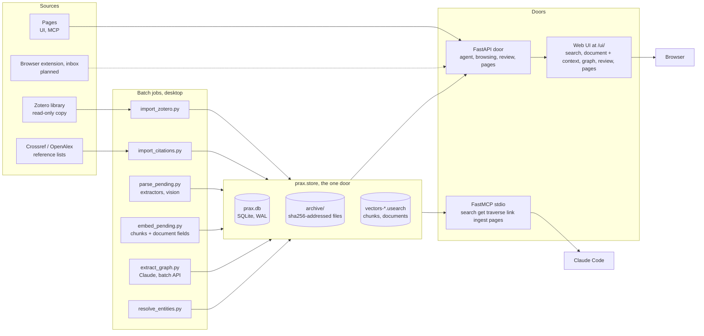
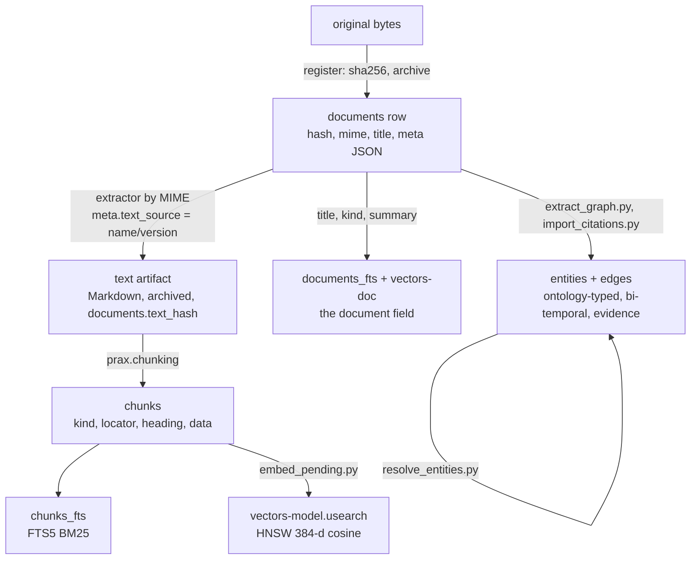
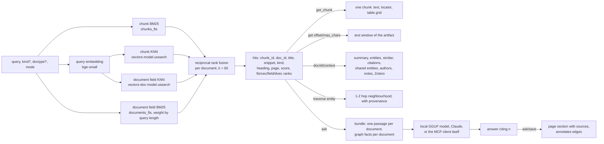

# prax architecture

The picture of the whole system as built through Stage 3 (September 2026).
Invariants are in `CLAUDE.md`, the reasoning behind each choice in
`rationale.md` (R1–R15), practical commands in `howto.md`, the web UI in
`ui.md`. This document explains how the parts fit and where to touch what.

## 1. The shape in one paragraph

prax is one SQLite file plus a content-addressed archive of original files,
wrapped in a single Python package. Everything that changes the store goes
through `prax.store` ("one door"). Sources register originals; batch jobs
turn originals into text artifacts, text into structure-aware chunks, and
chunks into a keyword index and vectors; a document-level field says what
each document is; Claude extraction and the citation importer turn
documents into an evidence-bearing graph over a small versioned ontology;
entity resolution merges names for the same thing; pages written by a
person or an agent are documents too. Two thin doors serve queries: a
FastAPI HTTP service (with a plain web UI as its client) and a FastMCP
server that gives Claude search, get, traverse, link, ingest and page
tools. The desktop runs the batch jobs; a Pi-class board is meant to
serve.



## 2. Two hosts, one directory

| Where | What runs | Why |
|---|---|---|
| Windows desktop (12 cores, GTX 1070 8 GB) | development, every batch job: import, parse, OCR, vision, embed, extract, resolve, eval; the local llama.cpp path | MuPDF layout analysis, OCR, embedding and a 7B model are CPU/GPU heavy; never on the serving path (invariant 7) |
| Pi-class SBC (an 8 GB Radxa Dragon Q6A is on hand; a Mac mini or N100 box under consideration) | the HTTP door, the UI and the MCP door over Tailscale | under 1 GB resident: SQLite, FTS5, two memory-mapped usearch files and one query embedding |

The store is one directory (`PRAX_DATA_DIR`):

    prax.db, prax.db-wal, prax.db-shm     the database
    archive/<xx>/<sha256>                originals and text artifacts
    vectors-<model>.usearch              chunk vectors, keyed by chunk id
    vectors-doc-<model>.usearch          document-field vectors, keyed by document id
    batches/<id>.json                    submitted extraction batches
    zotero-import/zotero.sqlite          the importer's private copy

Moving the service is a copy of that directory (R11). On Windows the door
keeps the vector files memory-mapped, so an embedding run needs the door
stopped; the batch host and the serving host otherwise coexist under WAL
and the single-writer rule (invariant 4).

## 3. Life of a document

Every source ends up in the same steps. Each step leaves a stamp that lets
a later, better pass find its work again.



1. **Register** (`store.register`). The original bytes are hashed
   (sha256), written once to `archive/`, and a `documents` row is inserted
   with MIME type, title, source URL and a `meta` JSON blob. The same bytes
   under two Zotero records are one document. Nothing is parsed here. (R2,
   R4)
2. **Extract** (`prax.parsers`, `scripts/parse_pending.py`). An extractor
   chosen by MIME type turns the original into Markdown: pymupdf4llm for
   PDFs with a text layer, plain MuPDF as fallback, RapidOCR for scans when
   asked, Docling when named, trafilatura for HTML with `<pre>` blocks
   fenced, plain decode for text with source files fenced as code (by
   extension, else Magika), and `claude-vision` for images (Claude
   describes the picture and transcribes its text, handwriting included).
   The Markdown is its own content-addressed artifact (`documents.text_hash`),
   stamped in `meta.text_source` as `name/version[-rN]`; every attempt is
   appended to `meta.parse_history`. A better extractor later is a queue
   selection (`--upgrade <prefix>`), never a migration. (R3, R8)
3. **Chunk** (`prax.chunking`, inside `index_text`). The Markdown is parsed
   into sections of paragraphs, whole tables with caption and parsed grid,
   figure captions and code listings. Each chunk has a `kind`, a `locator`
   (character range into the artifact plus page, with the invariant
   `chunk.text == artifact[start:end]`), the heading path it sits under,
   and for tables a JSON grid in `data`. Chunks are disposable:
   `scripts/rechunk.py` rebuilds them from the artifacts. (R13)
4. **Index**. FTS5 rows follow chunk inserts through triggers.
   `scripts/embed_pending.py` embeds chunks that have no vector from the
   current model into a usearch HNSW file, then embeds the document field.
   The document field (title, kind words, creators, venue, extraction
   summary, an image description's opening paragraph) is rebuilt by the
   store whenever a document's text or metadata changes and indexed in
   `documents_fts`; it is what makes "schematic" find the schematic. (R6)
5. **Graph**. The Zotero importer seeds `authored_by` edges;
   `prax.extraction` sends the document's header, its first 12,000
   characters and its closing sections to Claude (sync or the Batch API)
   and writes the returned triples with a quoted `evidence`, parking
   misfits in `review_queue`; `prax.importers.citations` writes `cites`
   edges from Crossref or OpenAlex reference lists. Every edge carries the
   ontology version it was written under and bi-temporal validity; nothing
   is deleted, only invalidated. Types are validated against
   the composed ontology at the door; when a module grows, `prax.review`
   replays the queue. (R7)
6. **Resolve**. `prax.resolution` merges entities that name the same thing
   through `canonical_id`: sure merges (case, accents, punctuation, author
   initials), concept/method twins into the method, and likely merges by
   name embedding that a Claude adjudicator confirms. Traversal, hubs and
   context walk canonical ids; edges keep the alias they were written with.
7. **Pages**. A note on a document, a project thread or a topic write-up is
   a document with `source = wiki`, Markdown text and append-only
   revisions; its relationships are edges (`annotates`, `part_of`). An
   agent may append but never overwrite a person's revision. (R15)

## 4. Life of a query



`search` first expands the query: a token the library defines as an
acronym (the `acronyms` table, from "phrase (ACRONYM)" in the texts)
becomes the token or its phrase for the keyword side (the embedder sees
the query as typed; expanding it measured worse). It then fuses up to
five rank lists per document: chunk BM25 over any term, chunk BM25 over
chunks holding the query's rare acronym-shaped terms (weight 3), chunk
KNN, and BM25 and KNN over the document field. The field list is weighted 2 for
queries of up to three words and fades to 1 by seven, because a short
query names a thing and a long one describes content. A hit says which
lists found it; a hit found only through the field opens at the
document's best-matching chunk. `fts` and `vec` modes are the raw chunk
lists; hybrid degrades to FTS-only when no vectors exist, so the serving
host works before embeddings do. Responses stay small by design (invariant
6): snippets and ids, then `get_chunk`, `get` or `context` for exactly
what is needed.

`ask` is retrieval plus generation on top of the same search (`prax.ask`). The bundle is one passage per document (the matched chunk, 1,200 characters) for the top eight documents plus what the graph records about each of them (its extracted relations, canonical names, `cites` left out), about 3,000 tokens, so it fits a 7B model with an 8 K window. Which model answers is a per-host setting (`PRAX_ASK`): `local` runs a GGUF model in the door's process on the desktop (Qwen2.5-7B answers in about 20 s on the GTX 1070), `claude` calls the API, `none` returns the bundle alone, which is what the MCP tool gives Claude Code by default and what the serving board does, since it loads no model (invariant 7). The answer cites passages as `[n]`; the numbers are resolved to chunk and document ids, the UI links them, and an answer worth keeping is appended to a page as the agent with its sources listed and `annotates` edges to the documents it rests on.

## 5. Module map

| Module | Responsibility | Writes SQLite? |
|---|---|---|
| `prax.store` | the only door: connect, migrations, register, index_text, chunks, the document field, search (FTS, vec, hybrid, doctype), get, context, similar documents, hubs, link, traverse, invalidate, review queue, pages, embedding bookkeeping for chunks and fields | yes, the only one |
| `prax.chunking` | Markdown → structure-aware chunks with locators | no (pure) |
| `prax.parsers` | extractor registry by MIME type with revisions; `parsers.queue` the parse queue with fallback chain, size/page/OCR guards, history; `parsers.vision` images described by Claude | via store |
| `prax.embeddings` | ONNX embedder registry (bge-small default), provider/variant selection, hash embedder for tests | no |
| `prax.vectors` | a usearch index file: view for reads, writable copy for batch jobs, atomic save | no (writes the index file) |
| `prax.ontology` | loads the module files in `ontology/` (core, research, studio), composes them (unique names, subtypes, aliases that never shadow a declared name, self types, a composed version), validates edge types, narrows to a document's domains | no |
| `prax.importers.zotero` | read-only copy of `zotero.sqlite` → documents, notes, attachments, authored_by seeds; idempotent per key | via store |
| `prax.importers.citations` | Crossref or OpenAlex by DOI or exact title → `cites` edges, citation counts in `meta.citations`; idempotent per document | via store |
| `prax.extraction` | document input (head plus closing sections), ontology-derived prompt and JSON schema, Claude and local extractors, `apply()` into edges / review queue / stamps with guards | via store |
| `prax.lineformat` | tab-separated output format for local models: bounded GBNF grammar from the ontology, parse/render to `Extraction` | no |
| `prax.local_llm` | optional llama.cpp runtime (`local` extra): DLL path quirk, one loaded GGUF model behind `chat()`, shared per process | no |
| `prax.models` | `prax.yaml`: named models and the step that uses each; the registry that resolves a step to a spec and a loaded runtime (gguf, OpenAI-compatible server, Claude, stub), once per process | no |
| `prax.titles` | titles worth the name: the classifier (file names, Zotero's auto names, ALL CAPS), the recase rule, the local-model guess with hints, confidence from the text | via store (`retitle`) |
| `prax.acronyms` | "phrase (ACRONYM)" definitions from a text, letters checked against the phrase's initials; the batch script writes the `acronyms` table the search expands from | no |
| `prax.ask` | a question answered from the library: bundle (passages plus graph facts), answer backends (local, Claude, none, stub), citation resolution, saving an answer to a page | via store |
| `prax.review` | replay of the review queue against a newer ontology; the typing rules that recover what a model meant from its systematic misfits | via store |
| `prax.resolution` | entity merge candidates (normalized names, initials, concept/method twins, name embeddings), adjudicators, apply through `merge_entities` | via store |
| `prax.rerank` | optional cross-encoder over the top hits; off by default (measured no gain) | no |
| `prax.evaluation` | fixture store builder, query set runner, report | via store (throwaway) |
| `prax.pipeline` | the batch passes as functions (extract, retitle, embed) and `process_captures`, the pipeline the inbox watcher runs over new captures without spending money; jobs bookkeeping around each | via store |
| `prax.inbox` | captures: uploads, pages sent with their rendered DOM, URLs fetched server-side, the drop folder scan; canonical URLs and re-capture links; HTML indexed at once, the rest left to the queue; domains from the request, the folder or the rules | via store |
| `prax.auth` | bearer token or session cookie on the HTTP door; loopback-only when unset | no |
| `prax.api` | FastAPI door: agent endpoints, browsing, context, graph overview, review, pages, ask; serves the UI's static files with no-cache | via store |
| `prax/ui/` | the web UI: one page, plain JS and CSS, vendored Markdown renderer, an SVG force layout; a client of the door (R14) | no |
| `extension/` (repo root) | the browser extension: a client of the door's capture endpoints, nothing of its own (`docs/extension.md`) | no |
| `prax.mcp_server` | FastMCP stdio door; no logic | via store |
| `prax.config` | paths, `PRAX_DATA_DIR`, migrations dir | no |

Schema version: `PRAGMA user_version` is the number of the last applied
migration; `store.init_db` runs on every connect (door, scripts, MCP)
and applies the pending numbered files in order, each in its own
transaction, so any client upgrades the store it opens, and refuses a
store newer than the code. Data written by a tool carries the tool's
version on the row (`ontology_version`, `producer`/`run`, the parse
stamp's extractor and revision, the embedding model, `title_source`),
which is how a later pass knows what to redo.
| `scripts/*.py` | thin CLIs over the modules above: import, parse, rechunk, embed, refresh fields, extract, import citations, resolve, replay, eval, compare extractors, bench the local model, build fixture | via store |

## 6. Data model

```
documents        id, hash (sha256 of original), mime, title, source_url,
                 original_path, text_hash (artifact), added_at, parsed_at, meta JSON
chunks           id, doc_id, seq, text, kind, locator JSON, heading JSON, data JSON
chunks_fts       FTS5 over chunks.text (content table; triggers keep it in step)
chunk_embeddings chunk_id, model, embedded_at          (which model made the vector)
documents_fts    FTS5 over the document field (title, kind, creators, venue, summary, ...)
document_embeddings  doc_id, model, embedded_at        (which document has a field vector)
vectors-<model>.usearch       HNSW index keyed by chunk id, f16, cosine (a file, not a table)
vectors-doc-<model>.usearch   HNSW index of the document field, keyed by document id
entities         id, name, type, canonical_id (resolution merges), created_at
edges            src, dst, rel, confidence, weight, source_doc, ontology_version,
                 evidence (a quote or a source id), producer, run,
                 valid_from, valid_to, ingested_at
review_queue     triples the extractor could not fit, with reason, evidence, resolution
pages            doc_id, slug, kind (addendum | project | topic)
page_revisions   doc_id, revision, text_hash, author (human | agent), note, created_at
```

Schema changes are numbered migrations in `src/prax/migrations/`
(`0001_baseline` through `0007_provenance`), applied by `store.init_db` and
tracked in `PRAGMA user_version`. The vector indexes are files beside the
database, not tables (R6). (R12)

`documents.meta` is the extension point for anything a source knows that
has no column yet. Conventions in use:

| key | meaning |
|---|---|
| `source` | `"zotero"`, `"wiki"` for pages; a browser capture or inbox file later |
| `zotero.kind`, `zotero.keys`, `zotero.items`, `zotero.parent`, `zotero.modified`, … | provenance and change detection for the importer |
| `creators`, `date`, `doi`, `abstract`, `tags`, `collections`, `fields` | lifted metadata |
| `text_source` | extractor stamp of the current text artifact |
| `parse_history` | every extraction attempt: extractor, chars, seconds, outcome or error |
| `summary` | the extraction's two-sentence summary |
| `extraction`, `extraction_history` | stamp of the last extraction (extractor, ontology version, run, counts, token usage) and every earlier stamp |
| `citations` | source, work id, citation count, reference count, fetch time |
| `page` | slug, kind, current revision and author of a page |

## 7. Batch jobs and their stamps

Every batch job is idempotent because it selects by a stamp and writes a
stamp. Interrupt any of them and rerun the same command.

| Job | Selects | Writes | Guards |
|---|---|---|---|
| `import_zotero.py` | Zotero keys not in `meta.zotero.keys`, or changed `dateModified` | documents, text from Zotero's cache, `authored_by` edges | copies `zotero.sqlite`, opens read-only |
| `parse_pending.py` | `parsed_at IS NULL`, or `meta.text_source` prefix, or `--ids` | text artifact, chunks, `text_source`, `parse_history` | fallback chain; scans refused without OCR; 40 MB / 400 page caps; "seen" skip; short new text keeps the old; vision and Docling explicit only |
| `rechunk.py` | indexed documents (or legacy rows) | chunks only | none needed |
| `embed_pending.py` | chunks without a vector from the current model, then document fields without one | the two `.usearch` files, `chunk_embeddings`, `document_embeddings` | dimension check; batch 64; saves every 50 K; reconciles on start; the door must be stopped on Windows |
| `refresh_document_fields.py` | every document (or `--ids`) | `documents_fts`; drops the vector of a changed field | backfill after migration 0005 or a change to `store.document_field` |
| `extract_graph.py` | indexed documents whose `meta.extraction.ontology_version` is not current, with at least 500 characters of text | edges, `review_queue`, `meta.summary`, `meta.extraction` | sync with a budget, or Batch API (`--submit-batch` / `--collect-batch`, idempotent per document); reference-number names rejected; page/project names must be pages |
| `import_citations.py` | documents without `meta.citations`, DOIs first (`--resolve-titles` for the rest) | `cites` edges, `meta.citations` | two sources behind one flag; polite-pool contact; retries |
| `resolve_entities.py` | unmerged entities | `entities.canonical_id` | sure tier automatic; `--twins` and `--adjudicate` opt in |
| `replay_review.py` | open typed review items | edges, `review_queue.resolution` | links only what the current ontology accepts |
| `backfill_provenance.py` | edges without a producer | `edges.producer`, `edges.run` | from evidence prefixes and document stamps; idempotent |
| `eval_retrieval.py` | the query set | a report | throwaway or existing store |

Long passes run as batches of short-lived processes (`--limit N` in a
loop); the queue makes each batch do real work.

## 8. Configuration

| Variable | Effect |
|---|---|
| `PRAX_DATA_DIR` | the store directory (default `<repo>/data`) |
| `PRAX_TOKEN` | bearer token for the HTTP door; unset = loopback clients only |
| `ANTHROPIC_API_KEY` | the Claude API for extraction, vision and adjudication |
| `prax.yaml` in the data directory (`PRAX_CONFIG`) | which model does which step: named models (`claude`, `gguf`, `openai`, `stub`) and the `extract`, `promote`, `ask`, `titles`, `vision`, `adjudicate` steps with their settings (howto 3k); `domains:` rules that give documents their domain set (`scripts/assign_domains.py`) |
| `PRAX_EXTRACT`, `PRAX_PROMOTE`, `PRAX_ASK`, `PRAX_TITLES`, `PRAX_VISION`, `PRAX_ADJUDICATE` | a model name or `none`: overrides the step for one run |
| `PRAX_EXTRACT_MODEL`, `PRAX_ASK_MODEL`, `PRAX_VISION_MODEL`, `PRAX_EXTRACT_EFFORT` | the Claude model id (and effort) for a step that resolves to Claude |
| `PRAX_LOCAL_MODEL`, `PRAX_LOCAL_CTX` | the implicit `local` model: a GGUF file and its context, when the file names none |
| `PRAX_CITATIONS_MAILTO` | polite-pool contact for Crossref and OpenAlex |
| `PRAX_RERANK` | cross-encoder name, `stub`, or `0` (default off) |
| `PRAX_ONTOLOGY` | another ontology directory (or a single legacy file) |
| `PRAX_EMBED` | model name, `hash` (tests), `0` (off) |
| `PRAX_EMBED_VARIANT`, `PRAX_EMBED_PROVIDERS`, `PRAX_EMBED_THREADS` | onnxruntime precision, providers, threads |
| `PRAX_VEC_DTYPE`, `PRAX_VEC_EF` | index precision (`f16`, `i8`) and search expansion |
| `PRAX_MAX_LAYOUT_MB`, `PRAX_MAX_LAYOUT_PAGES` | caps for MuPDF layout analysis |
| `PRAX_OCR_MAX_PAGES` | page budget of the OCR extractor |
| `PRAX_PYTHON` | interpreter for the MCP server in `.mcp.json` |

## 9. Where to touch what

| I want to… | Touch |
|---|---|
| add a source | a module under `prax.importers` that calls `store.register` / `index_text` and stamps `meta.source`; a script; a fixture and tests |
| add an extractor | a `bytes -> str` function (`filename=` when `hints=True`) and an `Extractor` entry in `prax.parsers.REGISTRY`; bump `revision` when its output changes; run `parse_pending.py --upgrade <old stamp>` |
| change chunking | `prax.chunking`; run `rechunk.py --all`; the locator invariant is asserted |
| add a media kind (audio) | a chunk `kind` and locator shape in `prax.chunking`; an analyzer that produces the searchable rendering (images already go through `claude-vision`) |
| change what a document *is* for search | `store.document_field`; run `refresh_document_fields.py`, then `embed_pending.py` |
| change the embedding model | an entry in `prax.embeddings.MODELS`; `embed_pending.py` re-embeds into new index files; another dimension also needs `VEC_DIM` |
| add entity or relation types | the module file under `ontology/` plus that module's version bump (a new domain is a new file that requires `core`); `replay_review.py`; old edges keep their version; the bump re-selects documents for extraction |
| replace one producer's work | re-extract (a new `run`), then `store.retire_run(producer=, run=)` on the old one; history stays |
| change the extraction prompt | `extraction.system_prompt` (the JSON text is cached across calls) and `docs/eval/` for a before/after on the three benchmark papers |
| change the schema | a new `NNNN_name.sql` under `src/prax/migrations/`; never edit an applied one |
| retire a producer's earlier reading of one document | happens in `extraction.apply()` through `store.retire_reading` when the same producer re-reads it under another ontology subset or version; `retire_run` for a whole producer or pass |
| put a document in a domain (which ontology modules it is read against) | `store.set_domains` / `add_domain` / `remove_domain` (`meta.domains`; the document page's "domains…", `PUT /doc/{id}/domains`, the `set_domains` MCP tool) or the `domains:` rules in prax.yaml through `scripts/assign_domains.py`; extraction builds prompt, grammar and schema for `ontology.for_domains(doc.domains)` and stamps the subset's version; `extract_graph.py --domain <name>` re-runs one domain |
| retire a document, or find the duplicate captures | `store.retire_document` / `unretire_document` ("retire…" on the document page, `POST /doc/{id}/retire`); `store.dedupe_captures` (`scripts/dedupe_captures.py`) by chunk fingerprint per URL; a new capture is compared with the earlier ones before it is registered (`prax.inbox`) |
| see what runs on the batch host | `GET /jobs`, the Jobs view; a pass wraps itself in `store.Job` (`jobs` table, migration 0009) |
| take in a file, a page or a URL | `prax.inbox` (`ingest_upload`, `ingest_html`, `ingest_url`, `scan`); the Inbox view, `POST /ingest/file|html|url`, the `capture_url` MCP tool, `scripts/inbox.py --watch --parse` on the batch host for the drop folder and the pending parses |
| send a document to the expensive model | flag it (`store.promote`, the page's "promote", the Promote view, the MCP tool); `extract_graph.py --promoted` runs the `promote` step's model over flagged documents it has not read |
| add an agent tool | a store function first, then one handler each in `prax.api` and `prax.mcp_server`; keep responses compact |
| add a UI view | a hash route and a render function in `prax/ui/app.js`; new data needs a read endpoint on the door, never a store call from the browser |
| add a page kind | `store.PAGE_KINDS` and the `pages` view; relationships stay edges |
| fix a document's title | `store.retitle(con, id, title, source="human")`; the old one stays in `meta.title_history`, the paper entity follows; `repair_titles.py --ids` reruns the model for named documents |
| move a step to another model (a GPU box, a cheaper API) | a `models` entry and the step's `model` in `prax.yaml`; nothing in code; `PRAX_<STEP>` for one run |
| change what a model sees when asked | `ask.gather` (passages, facts) and `ask.SYSTEM`; a backend is an `Answerer` with `name` and `answer(bundle)` |

## 10. Numbers as of 2026-09-12

| | |
|---|---|
| Documents | 9,236 (8,452 with text; 9,019 PDFs, 108 web pages, 100 text files, 3 link records, 1 image, 1 page) |
| Archive / database / vectors | 18 GB / 1.6 GB / 749 MB + 8 MB |
| Chunks | 855,920: 772,304 text, 41,791 figure captions, 35,062 tables, 6,763 code |
| Vectors | 855,920 chunk vectors and 9,236 document vectors (bge-small, f16) |
| Graph | 114,677 live edges: 58,179 by Qwen3.6-35B-A3B on the 4090, 25,641 citations (Crossref), 19,357 by Sonnet 5, 6,756 from Zotero, 3,729 by the typing rules, 553 by replay; 52 invalidated |
| Entities | 34,005 papers, 16,246 concepts, 9,717 methods, 7,024 authors, 4,069 tools, 2,976 claims, 1,075 venues, 327 datasets; 6,888 merged aliases |
| Extraction | 7,897 documents with a summary and entities: 6,878 by the local 35B (8.3 h, about 4 kWh), 1,019 by Sonnet 5 (about $35) |
| Review queue | 18,372 open items after the typing rules and ontology v5, almost all untyped `about`, `cites`, `part_of` and `published_in` from the local pass |
| Citations | 1,545 documents resolved at Crossref by DOI or exact title |
| Titles | 3,503 replaced by the local 7B model (text-confirmed), 268 recased; 801 unconfirmed and 782 without text keep their file name |
| Retrieval eval (62 library queries) | MRR 0.82 fts, 0.79 vec, 0.89 hybrid; hit@1 0.85 hybrid |
| Costs so far | about $60 of Claude API; everything since the title pass ran locally |

## 11. What is not built yet

The browser extension (`docs/extension.md`; the door's side, `POST
/ingest/html`, exists), the backfill of the
old external-disk store, a second, richer extraction pass by Sonnet on the
papers that matter (the local pass covered everything once), a typing
pass for the unmapped review items and an ontology look at what the
local pass queued (affiliations above all), the 801 unconfirmed titles, page deletion or
archiving, the move of the service onto the serving board, and the MCP
server proxying the HTTP door instead of importing the store.
