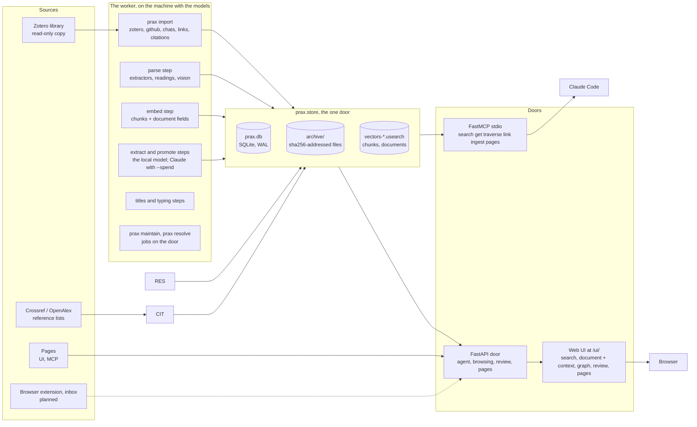
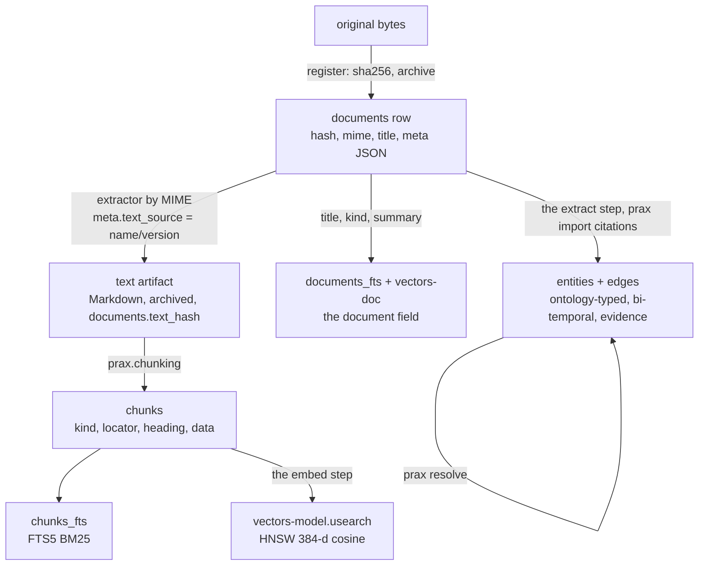
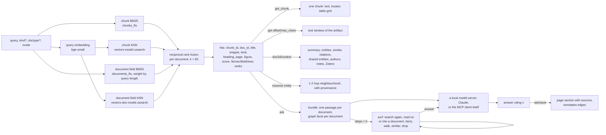

# prax architecture

The picture of the whole system as built through Stage 3 (September 2026).
Invariants are in `CLAUDE.md`, the reasoning behind each choice in
`rationale.md` (R1–R15), practical commands in `howto.md`, the web UI in
`ui.md`. This document explains how the parts fit and where to touch what.

## 1. The shape in one paragraph

prax is one SQLite file plus a content-addressed archive of original files,
wrapped in a single Python package. Everything that changes the store goes
through `prax.store` ("one door"). Sources register originals; batch jobs
turn originals into text artifacts, text into structure-aware chunks, and
chunks into a keyword index and vectors; a document-level field says what
each document is; Claude extraction and the citation importer turn
documents into an evidence-bearing graph over a small versioned ontology;
entity resolution merges names for the same thing; pages written by a
person or an agent are documents too. Two thin doors serve queries: a
FastAPI HTTP service (with a plain web UI as its client) and a FastMCP
server that gives Claude search, get, traverse, link, ingest and page
tools. The desktop runs the batch jobs; a Pi-class board is meant to
serve.

Ten invariants hold that shape, and everything below follows from them:
SQLite is the canonical store; files are content-addressed; one module
writes; one process writes; the MCP server is a thin proxy; endpoints
return snippets and ids; nothing in the serving path needs more than a
gigabyte; edges are evidence with provenance, never truth; the ontology
is small, versioned and modular; importers never write to their source.
They are stated in [`CLAUDE.md`](../CLAUDE.md), with the measurements and
the revisit conditions in [`rationale.md`](rationale.md).



## 2. Two hosts, one directory

| Where | What runs | Why |
|---|---|---|
| Windows desktop (12 cores, GTX 1070 8 GB) | development, every batch job: import, parse, OCR, vision, embed, extract, resolve, eval; the local llama.cpp path | MuPDF layout analysis, OCR, embedding and a 7B model are CPU/GPU heavy; never on the serving path (invariant 7) |
| Pi-class SBC (an 8 GB Radxa Dragon Q6A is on hand; a Mac mini or N100 box under consideration) | the HTTP door and the UI, reachable over the private network (the MCP server runs where Claude Code runs and talks to the door) | under 1 GB resident: SQLite, FTS5, two memory-mapped usearch files and one query embedding |

The store is one directory (`PRAX_DATA_DIR`):

    prax.db, prax.db-wal, prax.db-shm     the database
    archive/<xx>/<sha256>                originals and text artifacts
    vectors-<model>.usearch              chunk vectors, keyed by chunk id
    vectors-doc-<model>.usearch          document-field vectors, keyed by document id
    batches/<id>.json                    submitted extraction batches
    zotero-import/zotero.sqlite          the importer's private copy

Moving the service is a copy of that directory (R11). On Windows the door
keeps the vector files memory-mapped, so an embedding run needs the door
stopped; the batch host and the serving host otherwise coexist under WAL
and the single-writer rule (invariant 4).

## 3. Life of a document

Every source ends up in the same steps. Each step leaves a stamp that lets
a later, better pass find its work again.



1. **Register** (`store.register`). The original bytes are hashed
   (sha256), written once to `archive/`, and a `documents` row is inserted
   with MIME type, title, source URL and a `meta` JSON blob. The same bytes
   under two Zotero records are one document. Nothing is parsed here. (R2,
   R4)
2. **Extract** (`prax.parsers`, the worker's parse step). An extractor
   chosen by MIME type turns the original into Markdown: pymupdf4llm for
   PDFs with a text layer, plain MuPDF as fallback, RapidOCR for scans when
   asked, Docling when named, trafilatura for HTML with `<pre>` blocks
   fenced, plain decode for text with source files fenced as code (by
   extension, else Magika), and `vision` for images (the vision step's
   model — Claude, or llama-server with the model's projector — describes
   the picture and transcribes its text, handwriting included). A figure
   inside a document is read with what the document says around it: its
   title, the figure's caption and the text on either side of the image
   line, because what a plot is *of* is written there and not in the
   picture. The model is told to name things in the document's terms but
   to state only what is visible, so the text names the subject without
   being described in the figure's place.
   The Markdown is its own content-addressed artifact (`documents.text_hash`),
   stamped in `meta.text_source` as `name/version[-rN]`; every attempt is
   appended to `meta.parse_history` with the hash of the text it
   produced, so an earlier text stays addressable. A better extractor
   later is a queue selection (`--upgrade <prefix>`, or the backlog pass
   in scope `all`, which hands out the documents whose stamp is behind
   the extractor's revision, `parsers.behind`), never a migration.
   (R3, R8)
3. **Chunk** (`prax.chunking`, inside `index_text`). The Markdown is parsed
   into sections of paragraphs, whole tables with caption and parsed grid,
   figure captions, display equations, code listings, and the entries of
   the reference list, one chunk each (`prax.references` cuts them under
   a References/Bibliography heading and reads each into surnames, year,
   title and a printed id). Each chunk has a `kind`, a `locator`
   (character range into the artifact plus page, with the invariant
   `chunk.text == artifact[start:end]`), the heading path it sits under,
   and in `data` what it is of: a table's grid, a figure's reference and
   readings, an equation's LaTeX, a reference entry's fields and — once
   the `references` pass has matched it — the library document it cites.
   Chunks are disposable: `prax maintain --rechunk` rebuilds them from
   the artifacts (the citation links come back from `meta.references`).
   (R13)
4. **Index**. FTS5 rows follow chunk inserts through triggers.
   The worker's embed step embeds chunks that have no vector from the
   current model into a usearch HNSW file, then embeds the document
   field; reference entries get no vector and stay out of a search
   unless asked for by kind (`store.ASIDE_KINDS`).
   The document field (title, kind words, creators, venue, extraction
   summary, an image description's opening paragraph) is rebuilt by the
   store whenever a document's text or metadata changes and indexed in
   `documents_fts`; it is what makes "schematic" find the schematic. (R6)
5. **Graph**. The Zotero importer seeds `authored_by` edges;
   `prax.extraction` sends the document's header, its first 12,000
   characters and its closing sections to Claude (sync or the Batch API)
   and writes the returned triples with a quoted `evidence`, parking
   misfits in `review_queue`; `prax.importers.citations` writes `cites`
   edges from Crossref or OpenAlex reference lists. Every edge carries the
   ontology version it was written under and bi-temporal validity; nothing
   is deleted, only invalidated. Types are validated against
   the composed ontology at the door; when a module grows, `prax.review`
   replays the queue. (R7)
6. **Resolve**. `prax.resolution` merges entities that name the same thing
   through `canonical_id`: sure merges (case, accents, punctuation, author
   initials), concept/method twins into the method, and likely merges by
   name embedding that a Claude adjudicator confirms. Traversal, hubs and
   context walk canonical ids; edges keep the alias they were written with.
7. **Pages**. A note on a document, a project thread or a topic write-up is
   a document with `source = wiki`, Markdown text and append-only
   revisions; its relationships are edges (`annotates`, `part_of`). An
   agent may append but never overwrite a person's revision. (R15)

## 4. Life of a query



`search` first expands the query: a token the library defines as an
acronym (the `acronyms` table, from "phrase (ACRONYM)" in the texts)
becomes the token or its phrase for the keyword side (the embedder sees
the query as typed; expanding it measured worse), and the stopwords
(`STOPWORDS`, English and German) and lone characters ("2", "a") are
left out of the match expression: each matched two thirds of a million
chunks, and BM25 gives a term in more than half the rows a negative
weight. It then fuses up to
five rank lists per document: chunk BM25 over any term, chunk BM25 over
chunks holding the query's rare acronym-shaped terms (weight 3), chunk
KNN, and BM25 and KNN over the document field. The field list is weighted 2 for
queries of up to three words and fades to 1 by seven, because a short
query names a thing and a long one describes content. A hit says which
lists found it; a hit found only through the field opens at the
document's best-matching chunk. `fts` and `vec` modes are the raw chunk
lists; hybrid degrades to FTS-only when no vectors exist, so the serving
host works before embeddings do. Responses stay small by design (invariant
6): snippets and ids, then `get_chunk`, `get` or `context` for exactly
what is needed.

`ask` is retrieval plus generation on top of the same search (`prax.ask`). The bundle is one passage per document (the matched chunk, 1,200 characters) for the top eight documents plus what the graph records about each of them (its extracted relations, canonical names, `cites` left out), about 3,000 tokens, so it fits a 7B model with an 8 K window. Which model answers is a per-host setting (`PRAX_ASK`): `local` runs a GGUF model in the door's process on the desktop (Qwen2.5-7B answers in about 20 s on the GTX 1070), `claude` calls the API, `none` returns the bundle alone, which is what the MCP tool gives Claude Code by default and what the serving board does, since it loads no model (invariant 7). The answer cites passages as `[n]`; the numbers are resolved to chunk and document ids, the UI links them, and an answer worth keeping is appended to a page as the agent with its sources listed and `annotates` edges to the documents it rests on.

With `steps` the model surfs before it answers (`prax.surf`; the moves, the budgets and the failure modes are [`docs/ask.md`](ask.md)). The one-shot bundle is what the model gets when it cannot choose; surfing gives it the library for a bounded number of steps, each two lines — a note and one action: `search` again, `read` on where a passage stopped, a document a result named, or — with words — the part of that document which holds them (`store.find_chunk`, the same scoring that opens a document-field hit somewhere), `facts` of a document, `walk` the graph from an entity (its relations and the documents behind them), `similar` documents, `drop` what is beside the point, or `answer`. Every step is one of the door's own reads; nothing is written. A local model is held to the two lines by a grammar whose passage numbers and document ids are the ones it has seen, so it can only point at what exists; Claude follows the same lines without one. The prompt is one growing message — the question, then every step and its result in order — so a llama-server's prefix cache makes a step cost its own tokens (two to four seconds on the 35B-A3B). Two budgets bound the loop, the steps and the tokens of reading, both clamped to the model's context; the answer is a separate call with the ask prompt over the passages kept, under their loop numbers, so a citation points at what was read. The trail (each step's note, action, what it brought) streams to the client as it happens and comes back with the answer; a kept answer carries it on the page.

## 5. Module map

| Module | Responsibility | Writes SQLite? |
|---|---|---|
| `prax.store` | the only door, a package of nine modules whose `__init__` re-exports every name (so callers keep writing `store.<name>`) | yes, the only one |
| `store.base` | the connection, the lock and its retry, migrations, the content-addressed archive, the index files | yes |
| `store.documents` | register, index_text, chunks, get, list, meta, domains, promotion, retiring, the document field | yes |
| `store.retrieval` | acronym expansion and the match expression, BM25 and KNN over chunks and the field, fusion, rerank, the vector index and its delta, embedding bookkeeping | yes |
| `store.graph` | entities, edges with their provenance, traversal, resolution, the review queue, selection for extraction, hubs, a document's facts and context | yes |
| `store.pages` | pages and their revisions (documents too), project membership | yes |
| `store.jobs` | what runs, heartbeats, reaping, the change stamp | yes |
| `store.summary` | `stats`: what the store holds, counted for `prax status` | reads |
| `store.repair` | the damage that recurs (placeholder entities, mangled names, self-edges, stale jobs): `health` finds it, `heal` mends it through the store's own functions | yes |
| `store.backup` | a copy of the store somewhere else: the database as one snapshot, the index files, the archive files the copy lacks; `POST /backup` runs it as a job | no (reads; writes the copy) |
| `prax.chunking` | Markdown → structure-aware chunks with locators | no (pure) |
| `prax.parsers` | extractor registry by MIME type with revisions; `parsers.queue` the parse queue with fallback chain, size/page/OCR guards, history; `parsers.figures` the content images of a page or a PDF as `figure:<sha>` references in the text, served out of the original, and the vision model's reading of each; `parsers.vision` images and scanned pages read by the vision step's model | via store |
| `prax.embeddings` | ONNX embedder registry (bge-small default), provider/variant selection, hash embedder for tests | no |
| `prax.config` | where the store is, and `prax.yaml`: the sections, dotted lookup, an environment variable overriding one setting for one run | no |
| `prax.fetch` | model files fetched once into `<data dir>/models/` (plain HTTPS, resumable, the old Hugging Face cache reused); the embedder, the reranker and `scripts/fetch_model.py` for the GGUFs `prax.yaml` names with `repo` and `file` | no |
| `prax.vectors` | a usearch index file: view for reads, writable copy for batch jobs, atomic save | no (writes the index file) |
| `prax.ontology` | loads the module files in `ontology/` (core, research, studio), composes them (unique names, subtypes, aliases that never shadow a declared name, self types, a composed version), validates edge types, narrows to a document's domains | no |
| `prax.importers.zotero` | read-only copy of `zotero.sqlite` → documents, notes, attachments, authored_by seeds; idempotent per key | via store |
| `prax.importers.citations` | Crossref or OpenAlex by DOI or exact title → `cites` edges, citation counts in `meta.citations`; idempotent per document | via store |
| `prax.importers.feed`, `.github`, `.chats`, `.links`, `.project`, `.claude` | door-side importers: a reader yields `Item`s (a document of its own with a key and a version, or a link), `feed.run` sends them through `POST /ingest` or `POST /ingest/url` and skips what the library holds; `prax import` | no (HTTP) |
| `clients/claude-plugin/` | the Claude Code plugin: the MCP server registered for every session, the skill, five commands, a session-end hook running `prax import project` (and `prax import claude` when the project asks) | no (HTTP) |
| `prax.extraction` | document input (head plus closing sections), ontology-derived prompt and JSON schema, Claude and local extractors, `apply()` into edges / review queue / stamps with guards | via store |
| `prax.lineformat` | tab-separated output format for local models: bounded GBNF grammar from the ontology, parse/render to `Extraction` | no |
| `prax.models` | `prax.yaml`: named models and the step that uses each; the registry that resolves a step to a spec and a runtime (OpenAI-compatible server such as llama-server, Claude, stub), once per process | no |
| `prax.titles` | titles worth the name: the classifier (file names, Zotero's auto names, ALL CAPS), the recase rule, the local-model guess with hints, confidence from the text | via store (`retitle`) |
| `prax.acronyms` | "phrase (ACRONYM)" definitions from a text, letters checked against the phrase's initials; the batch script writes the `acronyms` table the search expands from | no |
| `prax.references` | a reference list read by rules: the entries' spans over the raw text (numbered, listed, author-year, Elsevier's one-paragraph lists), each read into surnames, year, title and a printed id; a score against a library document's title, creators and year; the decision with a threshold and a margin. The chunker cuts `reference` chunks with it; the `references` pass of `prax maintain` matches them, writes the `cites` edges and puts what each entry cites on the chunk (`data.cited`) and the document (`meta.references.links`) | no |
| `prax.ask` | a question answered from the library: bundle (passages plus graph facts), answer backends (local, Claude, none, stub) with their step protocol and reading bounds, citation resolution, saving an answer (and its trail) to a page | via store |
| `prax.surf` | ask as a loop: the tools (search, read, facts, walk, similar, drop) over the store's reads, the per-step grammar, the budgets, the event trail, the answer from what was kept | via store |
| `prax.review` | replay of the review queue against a newer ontology; the typing rules that recover what a model meant from its systematic misfits | via store |
| `prax.resolution` | entity merge candidates (normalized names, initials, concept/method twins, name embeddings), adjudicators, apply through `merge_entities` | via store |
| `prax.rerank` | optional cross-encoder over the top hits, ONNX in-process or a llama-server `/rerank`; off by default (measured no gain, 2026-09-08 and -13) | no |
| `prax.evaluation` | fixture store builder, query set runner, report | via store (throwaway) |
| `prax.pipeline` | the batch passes as functions (extract, retitle, embed) and `process_captures`, the pipeline the inbox watcher runs over new captures without spending money; jobs bookkeeping around each | via store |
| `prax.work` | the door's side of the work protocol: hand out leased batches (parse, titles, extract, embed) and take the results in; a worker's "not yet" (its server loading or paused) keeps the item leased a while so the queue moves on | via store |
| `prax.worker` | the worker: fetches work from a door, does it with this machine's models, posts results; uploads local drop folders; a session job with heartbeats; one bounded pass over everything once past its `nightly` hour; never opens the database | no (HTTP only) |
| `prax.up` | the supervisor: the roles `run:` names (llama-server, a reranker, the door, the worker) started in order behind health gates, restarted with backoff, stopped in reverse, a log each; a pid, a status and a command file under `<data dir>/run/`; children without a console (Windows) or in their own session | no |
| `prax.autostart` | the one login entry per platform that starts `prax up`: a Task Scheduler task under `pythonw.exe`, a systemd user unit, a launchd agent | no |
| `prax.schedule` | the door's clock: `maintain` and `backup` at their hours, the jobs table as the memory | via store (reads) |
| `prax.inbox` | captures: uploads, pages sent with their rendered DOM, URLs fetched server-side, the drop folder scan; canonical URLs and re-capture links; HTML indexed at once, the rest left to the queue; domains from the request, the folder or the rules | via store |
| `prax.auth` | bearer token or session cookie on the HTTP door; loopback-only when unset | no |
| `prax.api` | FastAPI door: agent endpoints, browsing, context, graph overview, review, pages, ask; serves the UI's static files with no-cache | via store |
| `prax/ui/` | the web UI: one page, plain JS and CSS, vendored Markdown renderer and KaTeX (a formula chunk always, the `$…$` of a paper that carries maths and of an answer, never a snippet), a canvas force layout; a client of the door (R14) | no |
| `clients/cli/` | the `prax` command: search, ask, add, show, status, jobs, inbox, work, serve, doctor, models; one HTTP call per command (howto 4a) | no (HTTP only) |
| `clients/browser-extension/` | the browser extension: a client of the door's capture endpoints, nothing of its own (`docs/extension.md`) | no |
| `prax.mcp_server` | the MCP server Claude Code spawns: each tool one HTTP call to the door (`prax.client`); no store import, no logic | no (HTTP only) |
| `prax.client` | the door as a client sees it: JSON calls, one download, one upload; the worker and the MCP server use it | no (HTTP only) |
| `prax.config` | paths, `PRAX_DATA_DIR`, migrations dir | no |

Schema version: `PRAGMA user_version` is the number of the last applied
migration; `store.init_db` runs on every connect (door, scripts, MCP)
and applies the pending numbered files in order, each in its own
transaction, so any client upgrades the store it opens, and refuses a
store newer than the code. Data written by a tool carries the tool's
version on the row (`ontology_version`, `producer`/`run`, the parse
stamp's extractor and revision, the embedding model, `title_source`),
which is how a later pass knows what to redo.
| `scripts/*.py` | thin CLIs over the modules above: import, parse, rechunk, embed, refresh fields, extract, import citations, resolve, replay, eval, compare extractors, bench the local model, build fixture | via store |

## 6. Data model

```
documents        id, hash (sha256 of original), mime, title, source_url,
                 original_path, text_hash (artifact), added_at, parsed_at, meta JSON
chunks           id, doc_id, seq, text, kind, locator JSON, heading JSON, data JSON
chunks_fts       FTS5 over chunks.text (content table; triggers keep it in step)
chunk_embeddings chunk_id, model, embedded_at          (which model made the vector)
documents_fts    FTS5 over the document field (title, kind, creators, venue, summary, ...)
document_embeddings  doc_id, model, embedded_at        (which document has a field vector)
vectors-<model>.usearch       HNSW index keyed by chunk id, f16, cosine (a file, not a table)
vectors-doc-<model>.usearch   HNSW index of the document field, keyed by document id
entities         id, name, type, canonical_id (resolution merges), created_at
edges            src, dst, rel, confidence, weight, source_doc, ontology_version,
                 evidence (a quote or a source id), producer, run,
                 valid_from, valid_to, ingested_at
review_queue     triples the extractor could not fit, with reason, evidence, resolution
pages            doc_id, slug, kind (addendum | project | topic)
page_revisions   doc_id, revision, text_hash, author (human | agent), note, created_at
```

Schema changes are numbered migrations in `src/prax/migrations/`
(`0001_baseline` through `0007_provenance`), applied by `store.init_db` and
tracked in `PRAGMA user_version`. The vector indexes are files beside the
database, not tables (R6). (R12)

`documents.meta` is the extension point for anything a source knows that
has no column yet. Conventions in use:

| key | meaning |
|---|---|
| `source` | `"zotero"`, `"wiki"` for pages; a browser capture or inbox file later |
| `zotero.kind`, `zotero.keys`, `zotero.items`, `zotero.parent`, `zotero.modified`, … | provenance and change detection for the importer |
| `creators`, `date`, `doi`, `abstract`, `tags`, `collections`, `fields` | lifted metadata |
| `text_source` | extractor stamp of the current text artifact |
| `parse_history` | every extraction attempt: extractor, chars, seconds, outcome or error, and the `text_hash` of what it produced |
| `summary` | the extraction's two-sentence summary |
| `extraction`, `extraction_history` | stamp of the last extraction (extractor, ontology version, run, counts, token usage) and every earlier stamp |
| `citations` | source, work id, citation count, reference count, fetch time |
| `page` | slug, kind, current revision and author of a page |

## 7. The passes and their stamps

**What a model makes is kept, not repeated.** Reading a figure, parsing
a PDF, writing a summary, extracting triples, embedding a chunk: each is
a model's work on one thing, done once and written into the store beside
what it was made from — the figure's description in the text under its
image line, the summary in `meta`, the triples as edges, the vector in
the index. Everything after that reads it for nothing. A search over
figures is a search over descriptions a vision model wrote months ago; a
surfing answer that quotes a plot is quoting that same sentence, not
looking at the picture. The library is, in that sense, a cache of model
work over a set of originals that do not change — with three properties
a cache needs:

- **A key that says who made it and how.** Not a hash of the input: the
  producer's stamp — `pymupdf4llm/1.28.2-r2`, `figures/1-r2+<model>`,
  an edge's `producer` and `ontology_version`, `chunk_embeddings.model`.
  Two models' readings of one figure sit side by side, each under its
  own name.
- **Invalidation as a version, not a timestamp.** A better prompt is a
  revision (`-r2`), a better model is a new name, a grown ontology is a
  new version. The work already stored stays valid under the stamp it
  carries; what is behind the current stamp is *found* (`parsers.behind`,
  the `stale-parses` and `unread-figures` ailments) and re-done on
  request. Nothing re-runs because a file changed on disk.
- **A miss that is visible and priced.** What has never been done shows
  up as an ailment on the Jobs page with the count and the way on, and
  the way on says what it costs — about four seconds a figure on a local
  model. A cache miss here is not a slow request; it is a job to run
  tonight.

The originals are the one thing that is never derived (invariant 2), so
the whole of the rest can be thrown away and made again: that is what
makes it safe to re-read 10,901 figures under a better prompt.

Every pass is idempotent because it selects by a stamp and writes a
stamp. Interrupt any of them and run the same command again. The
worker's steps (`prax work`, `prax.work` hands out and takes in) do the
model work through the door; the jobs run on the door itself; nothing
here opens the database file.

| Pass | Selects | Writes | Guards |
|---|---|---|---|
| `prax import zotero` | Zotero keys not in `meta.zotero.keys`, or changed `dateModified` | documents, text from Zotero's cache, `authored_by` edges | the client copies `zotero.sqlite` and plans; the door writes (`POST /import/zotero/item`) |
| parse step | pending captures (scope `all`: every unparsed document, then the stale ones — `parsers.behind`); reading requests first | text artifact, chunks, `text_source`, `parse_history` | fallback chain; scans refused without OCR; 40 MB / 400 page caps; a run chain is not run again; short new text keeps the old; vision, OCR and Docling only when asked (`prax reread`, "read again…", the door's own free readings) |
| titles step | titles that are file names or ALL CAPS, untried | `title`, `meta.title_history`, the document field | the recase rule needs no model; a paid model is refused |
| extract step | indexed documents whose `meta.extraction.ontology_version` is not their subset's current one, with at least 500 characters of text | edges, `review_queue`, `meta.summary`, `meta.extraction` | a paid model is refused; reference-number names rejected; page/project names must be pages; the typing rules run over the document's items right after |
| promote step | flagged documents (`meta.promote`) the promote model has not read; a promoted image is read again first | the same, run `promote-<time>` | only when named, `--spend` for a paid model |
| typing step | untyped review items, a batch of 40 to a request | edges (`typing:<model>`), `review_queue` (dropped, or the model's types on a misfit) | only when named; a paid model is refused |
| embed step | chunks without a vector from the current model, then document fields without one | the delta `.usearch` files, `chunk_embeddings`, `document_embeddings`; the door folds the delta in | dimension check; the door is never stopped |
| `prax maintain` | derived tables: acronyms, document fields, domain rules, duplicate captures, the review queue's rule passes, the `cites` edges a reference list makes to the library (`references`); `--rechunk` every chunk | those tables; `meta.retired` on a duplicate; `cites` edges with `meta.references` | no model, no decision; nightly after the worker's pass |
| `prax resolve` | unmerged entities | `entities.canonical_id` | the sure tier and, when asked, the twins; the likely tier is listed from the pairs the worker's resolve step left (`entity_candidates`; `resolve_entities.py --adjudicate` asks Claude about them) |
| resolve step | an entity type whose likely pairs are a week old or were never computed | `entity_candidates` for that type, the undecided rows replaced | the door never embeds a name; the worker does, a block at a time |
| adjudicate step | the likely pairs nobody has decided | `entities.canonical_id` for a yes, `entity_candidates.decided` for a no | the adjudicate model (paid: `--spend`), forty pairs a call; a no is never asked again |
| `prax import citations` | documents without `meta.citations`, DOIs first (`--resolve-titles` for the rest) | `cites` edges, `meta.citations` | two sources behind one flag; polite-pool contact; retries |
| `prax reread` | a selection: ids, a MIME prefix, a text-source stamp, the unreadable, the documents with read or unread figures or formulas | one reading request per document; the worker does the model work | the extractor is named, never guessed; a paid model is refused by the worker; `--dry-run` counts |
| `prax heal --apply` | the ailments' rows | edges ended, items resolved, jobs closed, texts re-indexed, stamps moved | one ailment at a time; nothing deleted |
| `prax backup` | the database, the indexes, the config, the archive files the copy lacks | a copy that is a store | `--no-archive` for a small disk |
| `eval_retrieval.py` | the query set | a report | throwaway or existing store; opens the file, read-only in spirit |

## 8. Configuration

| Variable | Effect |
|---|---|
| `PRAX_DATA_DIR` | the store directory (default `<repo>/data`) |
| `PRAX_TOKEN` | bearer token for the HTTP door; unset = loopback clients only |
| `ANTHROPIC_API_KEY` | the Claude API for extraction, vision and adjudication |
| `prax.yaml` in the data directory (`PRAX_CONFIG`) | which model does which step: named models (`claude`, `openai`, `stub`) and the `extract`, `promote`, `ask`, `titles`, `vision`, `adjudicate` steps with their settings (howto 3k); `domains:` rules that give documents their domain set (the `domains` pass of `prax maintain`) |
| `PRAX_EXTRACT`, `PRAX_PROMOTE`, `PRAX_ASK`, `PRAX_TITLES`, `PRAX_VISION`, `PRAX_ADJUDICATE`, `PRAX_TYPING` | a model name or `none`: overrides the step for one run |
| `PRAX_EXTRACT_MODEL`, `PRAX_ASK_MODEL`, `PRAX_VISION_MODEL`, `PRAX_EXTRACT_EFFORT` | the Claude model id (and effort) for a step that resolves to Claude |
| `citations.mailto` [`PRAX_CITATIONS_MAILTO`] | polite-pool contact for Crossref and OpenAlex |
| `rerank.model` [`PRAX_RERANK`], `rerank.url` [`PRAX_RERANK_URL`], `rerank.depth` [`PRAX_RERANK_DEPTH`] | cross-encoder name, `server` (a llama-server with `--reranking` at `url`), `stub`, or `0` (default off); how many top hits are rescored (30) |
| `ontology.dir` [`PRAX_ONTOLOGY`] | another ontology directory (or a single legacy file) |
| `embeddings.model` [`PRAX_EMBED`] | model name, `hash` (tests), `0` (off) |
| `embeddings.variant`, `.providers`, `.threads` | onnxruntime precision, providers, threads |
| `vectors.dtype`, `vectors.ef`, `vectors.serve` [`PRAX_VEC_SERVE`] | index precision (`f16`, `i8`), search expansion, and whether the door maps the main file (`view`, the board's) or loads it (`memory`: 2.7 GB resident for 1.4 M f16 vectors, 3 s to load, never given up to another job's reads — a heal or a marker evening evicts a mapped index and the next search pays seconds of page faults) |
| `parse.max_layout_mb`, `.layout_window` | layout analysis: the file size above which the plain extractor reads instead, and the pages per pass — a long document window by window, through pymupdf4llm and through marker's server alike |
| `parse.ocr_max_pages` | page budget of the OCR extractor |
| `parse.ocr_language`, `.ocr_gpu` | the OCR recognizer's script (`ch`, `en`, `latin`, `arabic`, `cyrillic`…; part of the text-source stamp) and whether it runs on DirectML |
| `parse.figures` [`PRAX_FIGURES`] | which figures the `figures` extractor reads: `captioned` (default; a PDF image no caption claims is often decoration) or `all` |
| `parse.marker_url` [`PRAX_MARKER_URL`], `parse.marker_mode` [`PRAX_MARKER_MODE`] | marker's server for the `marker` extractor (the `marker` role of `prax up`); `fast` or `balanced` |
| `parse.formula_readings` [`PRAX_FORMULA_READINGS`] | the `formulas` extractor reads the unread display equations (`new`) or every one again (`again`); `steps.formulas` names its model |
| `parse.vision_pages`, `.vision_max_pages`, `.vision_dpi` | the `vision-pages` extractor: `scans` (pages without a text layer, default) or `all`; its page budget (200); the rendering resolution (150) |
| `door.cors_origins`, `door.inbox_scan_seconds`, `door.clock_seconds` | the extension's origin; how often the door reads its drop folder; how often it looks at its schedule |
| `door.sqlite_cache_mb`, `door.sqlite_mmap_mb` [`PRAX_SQLITE_CACHE_MB`, `PRAX_SQLITE_MMAP_MB`] | SQLite's page cache per connection (64) and how much of the file is memory-mapped (1024; the OS's file-backed cache, 0 for none): a keyword query over a million chunks read its posting lists from disk on SQLite's 2 MB default |
| `run.<role>` | what `prax up` keeps alive on this host: `llama-server` and `reranker` (a `models:` entry with a `serve:` block: slots, projector, `cpu_moe`…), `marker` (its venv, port, `ngl`; `on_demand` declares without starting), `door` (host, port, TLS files), `worker` (interval, steps, the `nightly` hour and limit, another host's `door`) (howto 4b) |
| `schedule.maintain`, `schedule.backup` | the door's clock: an `HH:MM` (or `{at:, only:}` / `{at:, archive:}`) at which the door starts that job on itself once a day |
| `paths.llama_server` [`PRAX_LLAMA_SERVER`] | the llama-server binary `prax up` starts (default: where howto 3h puts it, or the PATH) |
| `paths.models` | where fetched model files go (default `<data dir>/models`) |
| `paths.backup` [`PRAX_BACKUP`] | where `prax backup` copies the store when no directory is given |
| `sources.github.user`, `.token` [`PRAX_GITHUB_USER`, `PRAX_GITHUB_TOKEN`] | whose stars `prax import github` reads, and the token that raises GitHub's limit |
| **environment only** | `PRAX_DATA_DIR`, `PRAX_CONFIG`, `PRAX_TOKEN`, `PRAX_DOOR`, `PRAX_OFFLINE`, `PRAX_DEBUG`; a setting's own `PRAX_*` name overrides the file for one run |
| `PRAX_PYTHON` | interpreter for the MCP server in `.mcp.json` |

## 9. Where to touch what

| I want to… | Touch |
|---|---|
| add a source | a reader under `prax.importers` that yields `feed.Item`s and a line in `clients/cli/prax_cli/importing.py` (`sources.md` 6); only a source that must open something on the door's host calls `store.register` / `index_text` itself and stamps `meta.source`; a fixture and tests |
| add an extractor | a `bytes -> str` function (`filename=` when `hints=True`) and an `Extractor` entry in `prax.parsers.REGISTRY`; bump `revision` when its output changes and the backlog pass re-reads the library a batch at a time (howto 3l¾; `prax reread --extractor <name> --text-source <old stamp>` does it now); an annotating extractor whose addition is what a revision added names it in `covers`, so the stamp moves without a re-read |
| change chunking | `prax.chunking`; run `prax maintain --rechunk`; the locator invariant is asserted |
| add a media kind (audio) | a chunk `kind` and locator shape in `prax.chunking`; an analyzer that produces the searchable rendering (images already go through `vision`) |
| change what a document *is* for search | `store.document_field`; run `prax maintain --only fields`, then a worker's embed step |
| change the embedding model | an entry in `prax.embeddings.MODELS`; the embed step re-embeds into new index files; another dimension also needs `VEC_DIM` |
| add entity or relation types | the module file under `ontology/` plus that module's version bump (a new domain is a new file that requires `core`); `prax maintain --only review` replays the queue; old edges keep their version; the bump re-selects documents for extraction |
| replace one producer's work | re-extract (a new `run`), then `store.retire_run(producer=, run=)` on the old one; history stays |
| change the extraction prompt | `extraction.system_prompt` (the JSON text is cached across calls) and `docs/eval/` for a before/after on the three benchmark papers |
| change the schema | a new `NNNN_name.sql` under `src/prax/migrations/`; never edit an applied one |
| retire a producer's earlier reading of one document | happens in `extraction.apply()` through `store.retire_reading` when the same producer re-reads it under another ontology subset or version; `retire_run` for a whole producer or pass |
| put a document in a domain (which ontology modules it is read against) | `store.set_domains` / `add_domain` / `remove_domain` (`meta.domains`; the document page's "domains…", `PUT /doc/{id}/domains`, the `set_domains` MCP tool) or the `domains:` rules in prax.yaml through the `domains` pass of `prax maintain`; extraction builds prompt, grammar and schema for `ontology.for_domains(doc.domains)` and stamps the subset's version; a document whose subset's version moved is re-selected by the extract step in scope `all`, and one whose set was changed by hand under an extraction at once (`extraction_stale`, first in the queue; the new reading retires the old) |
| retire a document, or find the duplicate captures | `store.retire_document` / `unretire_document` ("retire…" on the document page, `POST /doc/{id}/retire`); `store.dedupe_captures` (the `dedupe` pass of `prax maintain`) by chunk fingerprint per URL; a new capture is compared with the earlier ones before it is registered (`prax.inbox`) |
| see what runs on the batch host | `GET /jobs`, the Jobs view; a pass wraps itself in `store.Job` (`jobs` table, migration 0009); `prax up --status` for the processes themselves |
| keep the processes running, on any host | `run:` in `prax.yaml` and `prax up` (`prax.up`); `prax up --install` for the login entry (`prax.autostart`); `--stop <role>` / `--start <role>` to pause one (the card free for an hour) — a new role is a `Role` built in `up.roles` with its command and health URL |
| run something on the door at an hour | an entry name in `prax.schedule.NAMES` and a starter bound in `prax.api._clock`; the endpoint's own code starts the job, the jobs table remembers |
| do the model passes over new captures | run `prax work --watch` on the machine with the models, against the door (`prax.worker`); the door hands out and applies (`prax.work`) and stays the only writer |
| name a new kind of recurring damage | a `find` (and a `repair` when it is safe) in `store.repair`, an entry in `AILMENTS`; look at what it finds in the library before giving it a repair |
| add a command to `prax` | a handler in `prax.api` first (the contract), then a subcommand in `clients/cli/prax_cli/` that calls it and prints for a person; never a database call |
| take in a file, a page or a URL | `prax.inbox` (`ingest_upload`, `ingest_html`, `ingest_url`, `scan`); the Inbox view, `POST /ingest/file|html|url`, the `capture_url` MCP tool, the door's own scan of the drop folder, `prax work --watch` for the pending parses |
| send a document to the expensive model | flag it (`store.promote`, the page's "promote", the Promote view, the MCP tool); the `promote` work step (`prax work --steps promote --spend`) runs the `promote` step's model over flagged documents it has not read; the worker refuses it without `--spend` |
| add an agent tool | a store function first, a handler in `prax.api`, then the tool in `prax.mcp_server` that calls it; keep responses compact |
| add a UI view | a hash route and a render function in `prax/ui/app.js`; new data needs a read endpoint on the door, never a store call from the browser |
| add a page kind | `store.PAGE_KINDS` and the `pages` view; relationships stay edges |
| fix a document's title | `store.retitle(con, id, title, source="human")`; the old one stays in `meta.title_history`, the paper entity follows; the titles step reruns the model for what still has a file name |
| move a step to another model (a GPU box, a cheaper API) | a `models` entry and the step's `model` in `prax.yaml`; nothing in code; `PRAX_<STEP>` for one run |
| change what a model sees when asked | `ask.gather` (passages, facts) and `ask.SYSTEM`; a backend is an `Answerer` with `name`, `reading`, `answer(bundle)` and `step(system, user, grammar)` |
| give the surfing model another move | a `do_<action>` in `prax.surf` over a store read, the action in `SYSTEM` and `grammar`, a word for it in the UI's `STEP_WORDS` and the CLI's `_STEP_WORDS` |

## 10. Numbers as of 2026-09-12

| | |
|---|---|
| Documents | 9,236 (8,452 with text; 9,019 PDFs, 108 web pages, 100 text files, 3 link records, 1 image, 1 page) |
| Archive / database / vectors | 18 GB / 1.6 GB / 749 MB + 8 MB |
| Chunks | 855,920: 772,304 text, 41,791 figure captions, 35,062 tables, 6,763 code |
| Vectors | 855,920 chunk vectors and 9,236 document vectors (bge-small, f16) |
| Graph | 114,677 live edges: 58,179 by Qwen3.6-35B-A3B on the 4090, 25,641 citations (Crossref), 19,357 by Sonnet 5, 6,756 from Zotero, 3,729 by the typing rules, 553 by replay; 52 invalidated |
| Entities | 34,005 papers, 16,246 concepts, 9,717 methods, 7,024 authors, 4,069 tools, 2,976 claims, 1,075 venues, 327 datasets; 6,888 merged aliases |
| Extraction | 7,897 documents with a summary and entities: 6,878 by the local 35B (8.3 h, about 4 kWh), 1,019 by Sonnet 5 (about $35) |
| Review queue | 18,372 open items after the typing rules and ontology v5, almost all untyped `about`, `cites`, `part_of` and `published_in` from the local pass |
| Citations | 1,545 documents resolved at Crossref by DOI or exact title |
| Titles | 3,503 replaced by the local 7B model (text-confirmed), 268 recased; 801 unconfirmed and 782 without text keep their file name |
| Retrieval eval (62 library queries) | MRR 0.82 fts, 0.79 vec, 0.89 hybrid; hit@1 0.85 hybrid |
| Costs so far | about $60 of Claude API; everything since the title pass ran locally |

## 11. What is not built yet

The browser extension (`docs/extension.md`; the door's side, `POST
/ingest/html`, exists), the backfill of the
old external-disk store, a second, richer extraction pass by Sonnet on the
papers that matter (the local pass covered everything once), a typing
pass for the unmapped review items and an ontology look at what the
local pass queued (affiliations above all), the 801 unconfirmed titles, page deletion or
archiving, the move of the service onto the serving board, and the MCP
server proxying the HTTP door instead of importing the store.
