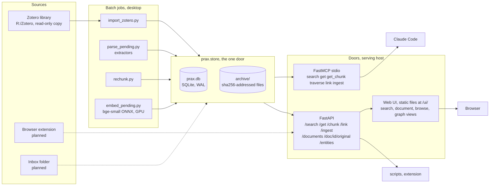
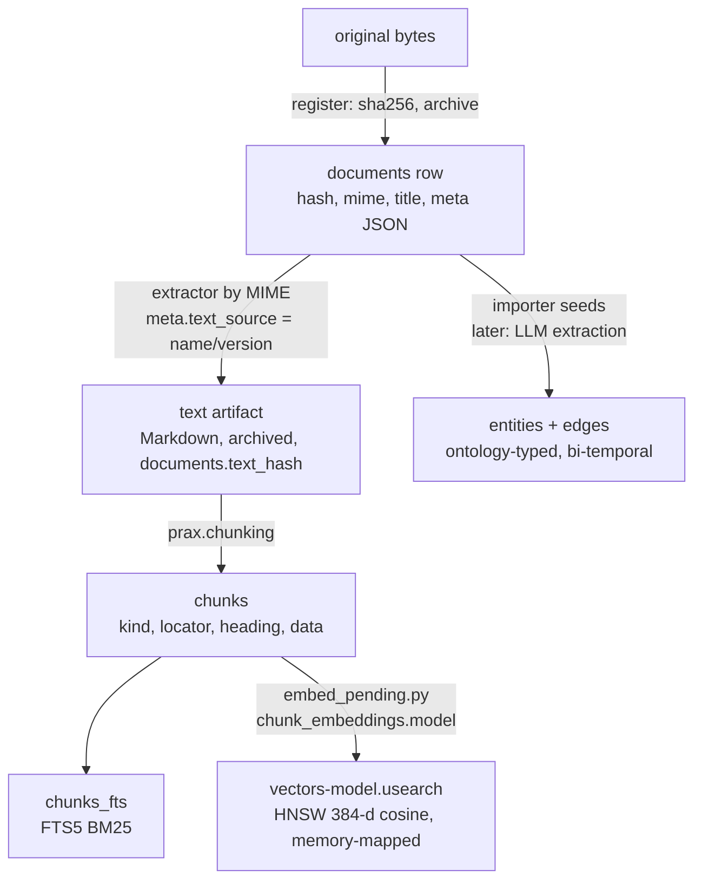
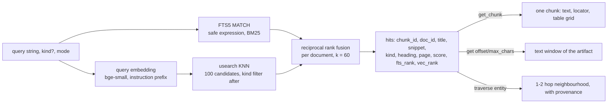

# prax architecture

The picture of the whole system as built through Stage 2 (September 2026).
Invariants are in `CLAUDE.md`, the reasoning behind each choice in
`rationale.md` (R1–R13), practical commands in `howto.md`. This document
explains how the parts fit and where to touch what.

## 1. The shape in one paragraph

prax is one SQLite file plus a content-addressed archive of original files,
wrapped in a single Python package. Everything that changes the store goes
through `prax.store` ("one door"). Sources (the Zotero library, later a
browser extension and a drop folder) register originals; batch jobs turn
originals into text artifacts, text into structure-aware chunks, and chunks
into a keyword index, vectors and graph edges. Two thin doors serve queries:
a FastAPI HTTP service and a FastMCP server that gives Claude `search`,
`get`, `get_chunk`, `traverse`, `link` and `ingest` as tools. The desktop
runs the batch jobs; a Pi-class board serves.



## 2. Two hosts, one directory

| Where | What runs | Why |
|---|---|---|
| Windows desktop (12 cores, GTX 1070) | development, every batch job: import, parse, OCR, re-chunk, embed, eval, later enrichment | MuPDF layout analysis, OCR and embedding are CPU/GPU heavy; never on the serving path (invariant 7) |
| Pi-class SBC (an 8 GB Radxa Dragon Q6A is on hand) | the HTTP door and the MCP door over Tailscale | under 1 GB resident; SQLite, FTS5, sqlite-vec and one query embedding fit easily |

The store is one directory (`PRAX_DATA_DIR`, currently `C:\prax-data`):

    prax.db, prax.db-wal, prax.db-shm     the database
    archive/<xx>/<sha256>                originals and text artifacts
    zotero-import/zotero.sqlite          the importer's private copy

Moving the service is a copy of that directory (R11). The batch host and
the serving host never need to run at the same time against the same file;
when they do, WAL plus the single-writer rule (invariant 4) keep it safe.

## 3. Life of a document

Every source ends up in the same five steps. Each step leaves a stamp that
lets a later, better pass find its work again.



1. **Register** (`store.register`). The original bytes are hashed
   (sha256), written once to `archive/`, and a `documents` row is inserted
   with MIME type, title, source URL and a `meta` JSON blob. The same bytes
   under two Zotero records are one document; every key is kept in
   `meta.zotero.keys`. Nothing is parsed here. (R2, R4)
2. **Extract** (`prax.parsers`, `scripts/parse_pending.py`). An extractor
   chosen by MIME type turns the original into Markdown: pymupdf4llm for
   PDFs with a text layer, plain MuPDF as fallback, RapidOCR for scans when
   asked, trafilatura for HTML, plain decode for text. The Markdown is its
   own content-addressed artifact (`documents.text_hash`), stamped in
   `meta.text_source` as `name/version`; every attempt, failed or not, is
   appended to `meta.parse_history`. A better extractor later is a queue
   selection (`--upgrade <prefix>`), never a migration. (R3, R8)
3. **Chunk** (`prax.chunking`, inside `index_text`). The Markdown is parsed
   into sections of paragraphs, whole tables with caption and parsed grid,
   figure captions and code listings. Each chunk has a `kind`, a `locator`
   (character range into the artifact plus page, with the invariant
   `chunk.text == artifact[start:end]`), the heading path it sits under,
   and for tables a JSON grid in `data`. Chunks are disposable:
   `scripts/rechunk.py` rebuilds them from the artifacts. (R13)
4. **Index**. FTS5 rows follow chunk inserts through triggers.
   `scripts/embed_pending.py` embeds chunks that have no vector from the
   current model: bookkeeping in `chunk_embeddings`, the vectors in a
   usearch HNSW file per model next to the database, memory-mapped by the
   serving process (46 ms per query at 855 K vectors). Re-indexing a
   document leaves stale keys that queries skip and the job compacts. (R6)
5. **Graph**. The Zotero importer seeds `paper --authored_by--> author`
   edges with `confidence = EXTRACTED` and `source_doc`; Stage 3 adds
   LLM-extracted triples. Every edge carries the ontology version it was
   written under and bi-temporal validity; nothing is ever deleted, only
   invalidated. Types are validated against `ontology.yaml` at the door. (R7)

## 4. Life of a query



`search` runs both sides and fuses their rank lists per document (each
side contributes a document's best chunk rank; fusing chunks scored below
FTS alone); a hit says which side found it. It degrades to FTS-only when
there is no index file, no usearch or `PRAX_EMBED=0`, so the serving host
works before embeddings exist and without the model. Responses stay small by design (invariant 6): snippets
and ids, then `get_chunk` or `get` for exactly what is needed.

## 5. Module map

| Module | Responsibility | Writes SQLite? |
|---|---|---|
| `prax.store` | the only door: connect, migrations, register, index_text, chunks, search (FTS, vec, hybrid), get, get_chunk, link, traverse, embedding bookkeeping | yes, the only one |
| `prax.chunking` | Markdown → structure-aware chunks with locators | no (pure) |
| `prax.parsers` | extractor registry by MIME type; `parsers.queue` the parse queue with fallback chain, size/page/OCR guards, history | via store |
| `prax.embeddings` | ONNX embedder registry (bge-small default), provider/variant selection, hash embedder for tests | no |
| `prax.vectors` | the usearch index file: view for reads, writable copy for batch jobs, atomic save | no (writes the index file) |
| `prax.ontology` | parses `ontology.yaml`, validates edge types, versions | no |
| `prax.importers.zotero` | read-only copy of `zotero.sqlite` → documents, notes, URL-only docs, authored_by seeds; idempotent per key | via store |
| `prax.evaluation` | fixture store builder, query set runner, report | via store (throwaway) |
| `prax.extraction` | document input, ontology-derived prompt and JSON schema, Claude extractor, apply() into edges / review queue / stamps | via store |
| `prax.rerank` | optional cross-encoder over the top hits; off by default | no |
| `prax.api` | FastAPI door: agent endpoints, browsing endpoints, serves the UI's static files | via store |
| `prax/ui/` | the web UI: one page, plain JS and CSS, vendored Markdown renderer; a client of the door (R14) | no |
| `prax.mcp_server` | FastMCP stdio door; no logic | via store |
| `prax.config` | paths, `PRAX_DATA_DIR`, migrations dir | no |
| `scripts/*.py` | thin CLIs over the modules above: import, parse, rechunk, embed, eval, compare extractors, build fixture | via store |

## 6. Data model

```
documents        id, hash (sha256 of original), mime, title, source_url,
                 original_path, text_hash (artifact), added_at, parsed_at, meta JSON
chunks           id, doc_id, seq, text, kind, locator JSON, heading JSON, data JSON
chunks_fts       FTS5 over chunks.text (content table; triggers keep it in step)
chunk_embeddings chunk_id, model, embedded_at          (which model made the vector)
vectors-<model>.usearch   HNSW index keyed by chunk id, f16, cosine (a file, not a table)
entities         id, name, type, canonical_id (resolution merges), created_at
edges            src, dst, rel, confidence, weight, source_doc, ontology_version,
                 evidence (a quote), valid_from, valid_to, ingested_at
review_queue     triples the extractor could not fit the ontology, with reason and resolution
```

Schema changes are numbered migrations in `src/prax/migrations/`
(`0001_baseline`, `0002_chunk_structure`, `0003_chunk_embeddings`), applied
by `store.init_db` and tracked in `PRAGMA user_version`. The vector index
is a file beside the database, not a table (R6). (R12)

`documents.meta` is the extension point for anything a source knows that
has no column yet. Conventions in use:

| key | meaning |
|---|---|
| `source` | `"zotero"` today; a browser capture or inbox file later |
| `zotero.kind`, `zotero.keys`, `zotero.items`, `zotero.modified`, … | provenance and change detection for the importer |
| `creators`, `date`, `doi`, `abstract`, `tags`, `collections`, `fields` | lifted metadata |
| `text_source` | extractor stamp of the current text artifact |
| `parse_history` | every extraction attempt: extractor, chars, seconds, outcome or error |

## 7. Batch jobs and their stamps

Every batch job is idempotent because it selects by a stamp and writes a
stamp. Interrupt any of them and rerun the same command.

| Job | Selects | Writes | Guards |
|---|---|---|---|
| `import_zotero.py` | Zotero keys not in `meta.zotero.keys`, or changed `dateModified` | documents, text from Zotero's cache, `authored_by` edges | copies `zotero.sqlite`, opens read-only |
| `parse_pending.py` | `parsed_at IS NULL`, or `meta.text_source` prefix | text artifact, chunks, `text_source`, `parse_history` | fallback chain; scans refused without OCR; 40 MB / 400 page caps; "seen" skip; short new text keeps the old |
| `rechunk.py` | indexed documents (or legacy rows) | chunks only | none needed |
| `embed_pending.py` | chunks without a vector from the current model | the `.usearch` file, `chunk_embeddings` | dimension check; batch 64; saves every 50 K; reconciles on start |
| `eval_retrieval.py` | the query set | a report | throwaway store |

Long passes run as batches of short-lived processes (`--limit N` in a
loop); the queue makes each batch do real work.

## 8. Configuration

| Variable | Effect |
|---|---|
| `PRAX_DATA_DIR` | the store directory (default `<repo>/data`) |
| `PRAX_TOKEN` | bearer token for the HTTP door; unset = loopback clients only |
| `PRAX_EXTRACT_MODEL`, `PRAX_EXTRACT_EFFORT` | Claude model and effort for graph extraction (`PRAX_EXTRACT=stub` in tests) |
| `PRAX_RERANK` | cross-encoder name, `stub`, or `0` (default off) |
| `PRAX_ONTOLOGY` | alternative `ontology.yaml` |
| `PRAX_EMBED` | model name, `hash` (tests), `0` (off) |
| `PRAX_EMBED_VARIANT`, `PRAX_EMBED_PROVIDERS`, `PRAX_EMBED_THREADS` | onnxruntime precision, providers, threads |
| `PRAX_VEC_DTYPE`, `PRAX_VEC_EF` | index precision (`f16`, `i8`) and search expansion |
| `PRAX_MAX_LAYOUT_MB`, `PRAX_MAX_LAYOUT_PAGES` | caps for MuPDF layout analysis |
| `PRAX_OCR_MAX_PAGES` | page budget of the OCR extractor |
| `PRAX_PYTHON` | interpreter for the MCP server in `.mcp.json` |

## 9. Where to touch what

| I want to… | Touch |
|---|---|
| add a source | a module under `prax.importers` that calls `store.register` / `index_text` and stamps `meta.source`; a script; a fixture and tests |
| add an extractor | a `bytes -> str` function and an `Extractor` entry in `prax.parsers.REGISTRY`; run `parse_pending.py --upgrade <old stamp>` |
| change chunking | `prax.chunking`; run `rechunk.py --all`; the locator invariant is asserted |
| add a media kind (audio, image) | a chunk `kind` and locator shape in `prax.chunking`; an analyzer that produces the searchable rendering; a second vec table for its embedding space, fused by the same RRF |
| change the embedding model | an entry in `prax.embeddings.MODELS`; `embed_pending.py` re-embeds into a new index file; another dimension also needs `VEC_DIM` |
| add entity or relation types | `ontology.yaml` plus a version bump; old edges keep their version |
| change the schema | a new `NNNN_name.sql` under `src/prax/migrations/`; never edit an applied one |
| add an agent tool | a store function first, then one handler each in `prax.api` and `prax.mcp_server`; keep responses compact |
| add a UI view | a hash route and a render function in `prax/ui/app.js`; new data needs a read endpoint on the door, never a store call from the browser |

## 10. Numbers as of 2026-09-07

| | |
|---|---|
| Documents | 9,235 (8,448 indexed; 779 PDFs pending: 71 scanned books, 56 unreadable, artwork) |
| Archive / database | 17 GB / 1.8 GB |
| Chunks | 855,731: 772,340 text, 41,740 figure captions, 35,060 tables, 6,591 code |
| Vectors | 855,731 in a 784 MB f16 usearch file; 46 ms per query |
| Graph | 6,756 `authored_by` edges, 2,967 papers, 5,129 authors |
| Retrieval eval (62 queries, full store) | MRR 0.82 fts, 0.81 vec, 0.83 hybrid; hit@1 0.77 hybrid |

## 11. What is not built yet

Browser capture and the inbox watcher (Stage 1), the zoetrope backfill,
the optional cross-encoder rerank (Stage 2, to be decided by the eval
harness on a larger query set), LLM extraction, entity resolution and edge
invalidation (Stage 3), the move of the service onto the SBC, and the MCP
server proxying the HTTP door instead of importing the store.
