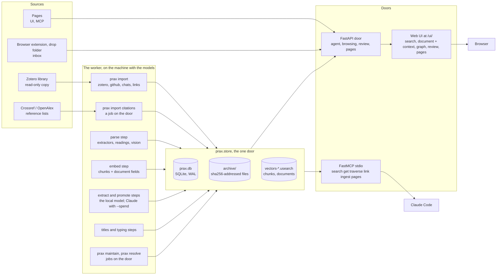
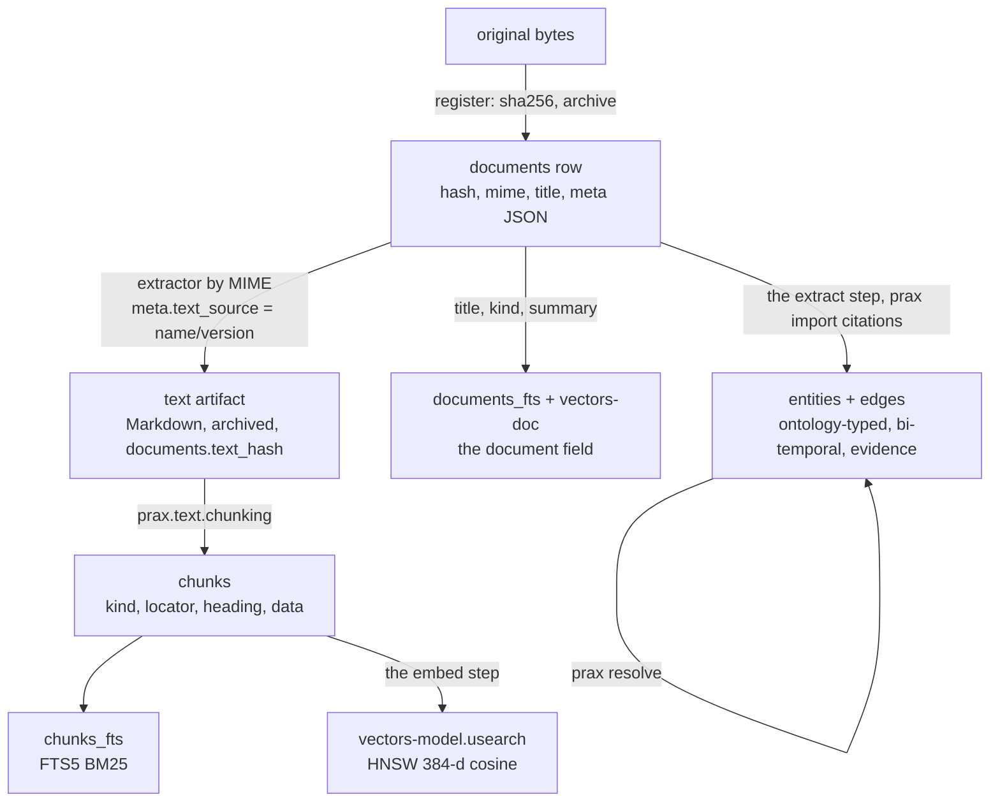
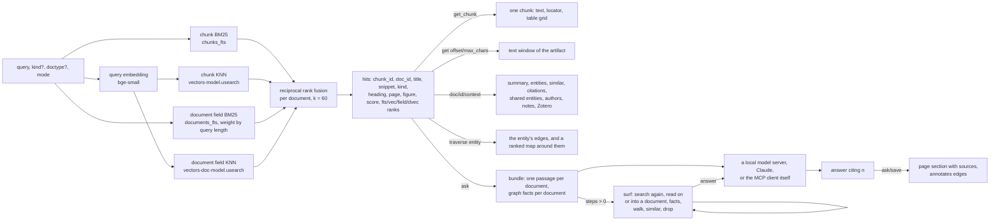

# prax architecture

The picture of the whole system as built (October 2026). The
invariants are in `CLAUDE.md`. The reasoning behind each choice is in
`rationale.md` (R1–R17). The practical commands are in `howto.md`, the
web UI in `ui.md`. This document explains how the
parts fit and where to touch what.

## 1. The shape in one paragraph

prax is one SQLite file plus a content-addressed archive of original
files, wrapped in a single Python package. Everything that changes the
store goes through `prax.store`, the one door. Sources register
originals. Batch jobs turn originals into text artifacts, text into
structure-aware chunks, and chunks into a keyword index and vectors. A
document-level field says what each document is. The extraction and
the citation importer turn documents into an evidence-bearing graph
over a small versioned ontology. Entity resolution merges names for
the same thing. Pages written by a person or an agent are documents
too. Two thin doors serve queries: a FastAPI HTTP service, with a
plain web UI as its client, and a FastMCP server that gives Claude
search, get, traverse, connect, link, ingest, ask and page tools
(`EXPECTED_TOOLS` in `tests/test_mcp.py` is the full list). The
desktop runs the batch jobs. A Pi-class board is meant to serve.

Ten invariants hold that shape, and everything below follows from
them:

1. SQLite is the canonical store.
2. Files are content-addressed.
3. One package writes and reads (`prax.store`).
4. One process writes.
5. The MCP server is a thin proxy.
6. Endpoints return snippets and ids.
7. Nothing in the serving path needs more than a gigabyte.
8. Edges are evidence with provenance, never truth.
9. The ontology is small, versioned and modular.
10. Importers never write to their source.

They are stated in [`CLAUDE.md`](../CLAUDE.md), with the measurements
and the revisit conditions in [`rationale.md`](rationale.md).


```mermaid
flowchart LR
  subgraph sources [Sources]
    Z[Zotero library<br/>read-only copy]
    CR[Crossref / OpenAlex<br/>reference lists]
    W[Pages<br/>UI, MCP]
    B[Browser extension, drop folder<br/>inbox]
  end
  subgraph batch [The worker, on the machine with the models]
    IMP[prax import<br/>zotero, github, chats, links]
    CIT[prax import citations<br/>a job on the door]
    PQ[parse step<br/>extractors, readings, vision]
    EMB[embed step<br/>chunks + document fields]
    EXT[extract and promote steps<br/>the local model; Claude with --spend]
    TYP[titles and typing steps]
    MNT[prax maintain, prax resolve<br/>jobs on the door]
  end
  subgraph store [prax.store, the one door]
    DB[(prax.db<br/>SQLite, WAL)]
    AR[(archive/<br/>sha256-addressed files)]
    VX[(vectors-*.usearch<br/>chunks, documents)]
  end
  subgraph doors [Doors]
    API[FastAPI door<br/>agent, browsing, review, pages]
    MCP[FastMCP stdio<br/>search get traverse link ingest pages]
    UI[Web UI at /ui/<br/>search, document + context, graph, review, pages]
  end
  Z --> IMP --> store
  CR --> CIT --> store
  W --> API
  B --> API
  PQ --> store
  EMB --> store
  EXT --> store
  TYP --> store
  MNT --> store
  store --> API
  store --> MCP --> C[Claude Code]
  API --> UI --> Browser
```

## 2. Two hosts, one directory

| Where | What runs | Why |
|---|---|---|
| Windows desktop (12 cores, RTX 4090 24 GB) | development, and every batch job: import, parse, OCR, vision, embed, extract, resolve, eval; the local llama.cpp path | MuPDF layout analysis, OCR, embedding and a 7B model are CPU/GPU heavy. None of it is on the serving path (invariant 7) |
| Pi-class SBC (an 8 GB Radxa Dragon Q6A is on hand; a Mac mini or N100 box under consideration) | the HTTP door and the UI, reachable over the private network. The MCP server runs where Claude Code runs and talks to the door | under 1 GB resident: SQLite, FTS5, two memory-mapped usearch files and one query embedding |

The store is one directory (`PRAX_DATA_DIR`):

    prax.db, prax.db-wal, prax.db-shm     the database
    archive/<xx>/<sha256>                originals and text artifacts
    vectors-<model>.usearch              chunk vectors, keyed by chunk id
    vectors-doc-<model>.usearch          document-field vectors, keyed by document id
    batches/<id>.json                    submitted extraction batches
    zotero-import/zotero.sqlite          the importer's private copy

Moving the service is a copy of that directory (R11). On Windows the
door keeps the vector files memory-mapped, so an embedding run needs
the door stopped. Otherwise the batch host and the serving host coexist
under WAL and the single-writer rule (invariant 4).

## 3. Life of a document

Every source ends up in the same steps. Each step leaves a stamp that lets
a later, better pass find its work again.


```mermaid
flowchart TD
  O[original bytes] -->|register: sha256, archive| D[documents row<br/>hash, mime, title, meta JSON]
  D -->|extractor by MIME<br/>meta.text_source = name/version| T[text artifact<br/>Markdown, archived, documents.text_hash]
  T -->|prax.text.chunking| CH[chunks<br/>kind, locator, heading, data]
  CH --> F[chunks_fts<br/>FTS5 BM25]
  CH -->|the embed step| V[vectors-model.usearch<br/>HNSW 384-d cosine]
  D -->|title, kind, summary| DF[documents_fts + vectors-doc<br/>the document field]
  D -->|the extract step, prax import citations| G[entities + edges<br/>ontology-typed, bi-temporal, evidence]
  G -->|prax resolve| G
```

1. **Register** (`store.register`). The original bytes are hashed
   (sha256) and written once to `archive/`. A `documents` row is
   inserted with MIME type, title, source URL and a `meta` JSON blob.
   The same bytes under two Zotero records are one document. Nothing is
   parsed here. (R2, R4)
2. **Extract** (`prax.parsers`, the worker's parse step). An extractor
   chosen by MIME type turns the original into Markdown. The extractors are these.
   pymupdf4llm reads PDFs with a text layer, and plain MuPDF is the
   fallback. RapidOCR reads scans, when asked. Docling runs when named.
   trafilatura reads HTML, with `<pre>` blocks fenced. A plain decode
   reads text, with source files fenced as code (by extension, else
   Magika). `vision` reads images. The vision step's model (Claude, or
   llama-server with the model's projector) describes the picture and
   transcribes its text, handwriting included. A figure inside a
   document is read with what the document says around it: its title,
   the figure's caption, and the text on either side of the image line.
   What a plot is *of* is written there, not in the picture. The model
   is told to name things in the document's terms but to state only
   what is visible, so the text supplies the subject without being
   described in the figure's place.

   The Markdown is its own content-addressed artifact
   (`documents.text_hash`), stamped in `meta.text_source` as
   `name/version[-rN]`. Every attempt is appended to
   `meta.parse_history` with the hash of the text it produced, so an
   earlier text stays addressable. A better extractor later is a queue
   selection, never a migration: `--upgrade <prefix>`, or the backlog
   pass in scope `all`, which hands out the documents whose stamp is
   behind the extractor's revision (`parsers.behind`). (R3, R8)
3. **Chunk** (`prax.text.chunking`, inside `index_text`). The Markdown is
   parsed into sections of paragraphs, whole tables with caption and
   parsed grid, figure captions, display equations, code listings, and
   the entries of the reference list, one chunk each.
   `prax.text.references` cuts the entries under a References/Bibliography
   heading and reads each into surnames, year, title and a printed id.
   Each chunk has a `kind`, a `locator` (character range into the
   artifact plus page, with the invariant `chunk.text ==
   artifact[start:end]`), the heading path it sits under, and in `data`
   what it is of. `data` holds a table's grid, a figure's reference and
   readings, an equation's LaTeX, a reference entry's fields and, once
   the `references` pass has matched it, the library document it cites,
   or an ask block's question, id and state. A page's standing question
   (`prax.text.blocks`) is one `ask` chunk from head marker to tail. A
   reference entry and an ask block are set aside (`store.ASIDE_KINDS`):
   never embedded, out of a search unless asked for by kind. Chunks are
   disposable. `prax maintain --rechunk` rebuilds them from the
   artifacts, and the citation links come back from `meta.references`.
   (R13)
4. **Index**. FTS5 rows follow chunk inserts through triggers. The
   worker's embed step embeds the chunks that have no vector from the
   current model into a usearch HNSW file, then embeds the document
   field. Reference entries get no vector and stay out of a search
   unless asked for by kind (`store.ASIDE_KINDS`). The document field
   holds the title, kind words, creators, venue, the extraction summary
   and an image description's opening paragraph. The store rebuilds it
   whenever a document's text or metadata changes and indexes it in
   `documents_fts`. It is what makes "schematic" find the schematic.
   (R6)
5. **Graph**. The Zotero importer seeds `authored_by` edges.
   `prax.graph.extraction` sends the document's header, its first 12,000
   characters and its closing sections to the model (sync or the Batch
   API) and writes the returned triples with a quoted `evidence`;
   misfits are parked in `review_queue`. `prax.importers.citations`
   writes `cites` edges from Crossref or OpenAlex reference lists. Every
   edge carries the ontology version it was written under and
   bi-temporal validity. Nothing is deleted, only invalidated. Types are
   validated against the composed ontology at the door. When a module
   grows, `prax.graph.review` replays the queue. (R7)

   An edge's quote keeps where it stood: `evidence_start`,
   `evidence_end` and `evidence_text_hash` (migration 48), placed by
   `prax.text.quotes` and written once. The `places` pass of `prax
   maintain` places the quotes of older edges. The `worlddates` step
   (`prax.graph.worlddates`) reads the sentences that date a fact and
   states the fact again with `world_from`/`world_to`. It ends the
   undated edge with `edge_endings.corrected_by`. The `rules` pass
   (`store.derive_rules`) writes INFERRED edges with their premises
   (`edge_premises`). The `conflicts` pass keeps two facts of a
   functional relation that cannot both hold in `edge_conflicts`.
6. **Resolve**. `prax.graph.resolution` merges entities that name the same
   thing through `canonical_id`. Sure merges are by case, accents,
   punctuation and author initials. Concept/method twins merge into
   the method. Likely merges are by name embedding, and a Claude
   adjudicator confirms them. Traversal, hubs and context walk
   canonical ids; edges keep the alias they were written with.
7. **Pages**. A note on a document, a project thread or a topic
   write-up is a document with `source = wiki`, Markdown text and
   append-only revisions. Its relationships are edges (`annotates`,
   `part_of`). An agent may append but never overwrite a person's
   revision. (R15)

## 4. Life of a query


```mermaid
flowchart LR
  Q[query, kind?, doctype?, mode] --> FTS[chunk BM25<br/>chunks_fts]
  Q --> QE[query embedding<br/>bge-small] --> KNN[chunk KNN<br/>vectors-model.usearch]
  Q --> DF[document field BM25<br/>documents_fts, weight by query length]
  QE --> DK[document field KNN<br/>vectors-doc-model.usearch]
  FTS --> RRF[reciprocal rank fusion<br/>per document, k = 60]
  KNN --> RRF
  DF --> RRF
  DK --> RRF
  RRF --> H[hits: chunk_id, doc_id, title, snippet, kind,<br/>heading, page, figure, score, fts/vec/field/dvec ranks]
  H -->|get_chunk| C[one chunk: text, locator, table grid]
  H -->|get offset/max_chars| T[text window of the artifact]
  H -->|doc/id/context| X[summary, entities, similar, citations,<br/>shared entities, authors, notes, Zotero]
  H -->|traverse entity| G[the entity's edges, and a ranked map around them]
  H -->|ask| B[bundle: one passage per document,<br/>graph facts per document] --> M[a local model server, Claude,<br/>or the MCP client itself] --> A[answer citing n] -->|ask/save| P[page section with sources,<br/>annotates edges]
  B -->|steps > 0| S[surf: search again, read on<br/>or into a document, facts,<br/>walk, similar, drop] --> S
  S -->|answer| M
```

`search` first expands the query. A token the library defines as an
acronym becomes the token or its phrase for the keyword side. The
`acronyms` table is built from "phrase (ACRONYM)" in the texts. The
embedder sees the query as typed, because expanding it measured worse.
The stopwords (`STOPWORDS`, English and German) and lone characters
("2", "a") are left out of the match expression. Each of those matched
two thirds of a million chunks, and BM25 gives a term in more than half
the rows a negative weight.

It then fuses up to five rank lists per document: chunk BM25 over any
term, chunk BM25 over chunks holding the query's rare acronym-shaped
terms (weight 3), chunk KNN, and BM25 and KNN over the document field.
The field list is weighted 2 for queries of up to three words and fades
to 1 by seven words, because a short query names a thing and a long one
describes content. A hit says which lists found it. A hit found only
through the field opens at the document's best-matching chunk. The
`fts` and `vec` modes are the raw chunk lists. Hybrid degrades to
FTS-only when no vectors exist, so the serving host works before
embeddings do. Responses stay small by design (invariant 6): snippets
and ids first, then `get_chunk`, `get` or `context` for exactly what is
needed.

A hit carries its document's publication date (`published`: the date
as precise as its source, a year, a month or a day), and
`published_since`/`published_before` filter by it; an undated document
is left out of a filtered search. The date is `meta.published`, chosen
by `store.published_of` from the most trusted source that gives one
(section 7, the `published` pass and the `dates` step).

`traverse` walks the edges in force, or with `as_of` the edges prax held
at that moment: written at or before it and not ended before it
(`store.held_at`, the one place that builds the condition). That is
record time. An edge whose source says when the fact holds in the world
also carries `world_from`/`world_to` with their precision, and says
nothing about it otherwise. The first hop is capped (`graph.edges`). A
fact several documents state is one edge per document, and each row
says how many (`support`). The cap is spent on distinct facts first:
the best supported first within a relation, round-robin over the
relations. A walk as of an earlier day still follows today's entity
merges.

`ask` is retrieval plus generation on top of the same search
(`prax.answering.ask`). The bundle is one passage per document (the matched
chunk, 1,200 characters) for the top eight documents, plus what the
graph records about each of them: its extracted relations and
canonical names, `cites` left out. That is about 3,000 tokens, so it
fits a 7B model with an 8 K window. Which model answers is a per-host
setting (`PRAX_ASK`). `local` runs a GGUF model in the door's process
on the desktop; Qwen2.5-7B answers in about 20 s on the GTX 1070.
`claude` calls the API. `none` returns the bundle alone, which is what
the MCP tool gives Claude Code by default and what the serving board
does, since it loads no model (invariant 7). The answer cites passages
as `[n]`. The numbers are resolved to chunk and document ids, and the
UI links them. An answer worth keeping is appended to a page as the
agent, with its sources listed and `annotates` edges to the documents
it rests on.

With `steps` the model surfs before it answers (`prax.answering.surf`; the
moves, the budgets and the failure modes are in
[`docs/ask.md`](ask.md)). The one-shot bundle is what the model gets
when it cannot choose. Surfing gives it the library for a bounded
number of steps. Each step is two lines, a note and one action. The actions:

- `search` again;
- `read` on where a passage stopped, or a document a result named, or,
  with words, the part of that document which holds them
  (`store.find_chunk`, the same scoring that opens a document-field
  hit somewhere);
- `facts` of a document;
- `walk` the graph from an entity: its relations and the documents
  behind them, a fact once with how many documents state it;
- `similar` documents;
- `drop` what is beside the point;
- `answer`.

Every step is one of the door's own reads; nothing is written. A grammar holds a local model to
the two lines, and its passage numbers and document ids are the ones
the model has seen, so it can only point at what exists. Claude
follows the same lines without a grammar. The prompt is one growing
message: the question, then every step and its result in order. A
llama-server's prefix cache therefore makes a step cost its own tokens,
two to four seconds on the 35B-A3B. Two budgets bound the loop, the
steps and the tokens of reading, both clamped to the model's context.
The answer is a separate call with the ask prompt over the passages
kept, under their loop numbers, so a citation points at what was read.
The trail (each step's note, action, what it brought) streams to the
client as it happens and comes back with the answer. A kept answer
carries it on the page.

## 5. Module map

| Module | Responsibility | Writes SQLite? |
|---|---|---|
| `prax.store` | the only door, a package of ten modules (`base`, `documents`, `retrieval`, `graph`, `pages`, `jobs`, `summary`, `repair`, `maintain`, `backup`, each importing only the ones before it) whose `__init__` re-exports every name (so callers keep writing `store.<name>`) | yes, the only one |
| `store.base` | the connection, the lock and its retry, migrations, the content-addressed archive (`archive_path`, the one place that says where an artifact lives), the index files, the wall's viewer, which documents belong to a domain (`holds_domain`, `domain_clause`: each caller names its modules and whether a document with no set counts), and `DocumentMeta`, every key of `documents.meta` with its shape (`docs/meta.md`) | yes |
| `store.documents` | a package of parts, in order: `meta` (meta, the document field, summary, title, sections), `text` (register, index_text, chunks, references, ingest), `library` (retiring, duplicates, captures), `domains` (domains, their rules and the dry run, promotion, extraction stamps), `genres` (what a document is and is about: the labels, the gold sample, the training set), `readings` (the readings queue, pages, figures), `reads` (get, list, chunks) | yes |
| `store.retrieval` | a package of parts (2026-10-03): `knobs` (the switches a test or host turns, read at call time), `compounds` (a compound split where both halves are words the library uses, `Apfelkuchen`, and the other forms a rare word takes, taco and tacos), `query` (acronym expansion, the match expression, the words the graph adds), `legs` (BM25 and KNN over chunks and the field, fusion), `vectors` (the vector index and its delta, embedding bookkeeping), `fusion` (`search`, the domain prior, the filters, rerank), `similar` | yes |
| `store.graph` | a package of parts, in order: `edges` (entities and edges with their provenance, selection for extraction, `evidence_place`), `decisions` (the review queue, resolution candidates), `labels` (names, merges, the shown name), `languages` (the vocabulary step's store half, and the library as its own dictionary: `in_english_text`), `context` (a document's facts and context, hubs), `communities` (the regions' tables), `traversal` (the walk, `changes`, one module's documents with `domain`), `rules` (`derive_rules`, `edge_premises`), `paths` (the store's half of the path index, `connect_entities`) | yes |
| `store.pages` | pages and their revisions (documents too), project membership | yes |
| `store.jobs` | what runs, heartbeats, reaping, the change stamp | yes |
| `store.summary` | `stats`: what the store holds, counted for `prax status` | reads |
| `store.repair` | the damage that recurs (placeholder entities, mangled names, self-edges, stale jobs): `health` finds it, `heal` mends it through the store's own functions; a package of parts, in order: `common`, `graph`, `documents`, `ailments` | yes |
| `store.maintain` | the maintenance pass, what the store does to itself without a model or a decision: the passes named in `PASSES` (acronyms, fields, domains, dedupe, review, references, proposes, fts, lengths, languages, published, places, markup, private, names, attachment, rules, conflicts, communities, histories) and those run only when named (`ON_REQUEST`: rechunk, rejudge, vectors); `prax maintain` runs it as a job, the clock every night | yes |
| `store.backup` | a copy of the store somewhere else: the database as one snapshot, the index files, the archive files the copy lacks; `POST /backup` runs it as a job | no (reads; writes the copy) |
| `prax.text.markup` | the marks prax puts in a text, written and matched in one place: the page mark, a figure line and its inlined form, a reading, a heading, a table separator, a display formula and its number, the `## Figures` and `## Comments` sections, a `[title](#doc/N)` link. Each is a writer *and* a matcher, and a test asserts that what one emits the other matches — before it existed the page mark was written in four places and matched by three copies of one pattern. Imports nothing of prax | no (pure) |
| `prax.text.answers` | what a model wrapped its answer in, taken off: a fence, a preamble, a label the message used, quotes, a chat token. What a *good* answer looks like stays with the caller that asked; this is the packaging, and seven modules kept their own copy of it until 2026-09-24 | no (pure) |
| `prax.text.chunking` | Markdown → structure-aware chunks with locators: the text's elements walked by a `_Chunker`, one method a kind of element | no (pure) |
| `prax.text.names` | a name's matching key (case, accents, punctuation, suffixes and, for a thing, a plural `s` left out): what entity resolution's tiers and the review lists compare | no (pure) |
| `prax.text.mimes` | what a document's type says where the type alone misleads (DjVu is a document, not a picture) | no (pure) |
| `prax.text.clutter` | what a path and a name say about clutter (a system folder, a program's help): the rules that pick a set for a bulk clean-up, which a person decides | no (pure) |
| `prax.parsers` | extractor registry by MIME type with revisions; `parsers.queue` the parse queue with fallback chain, size/page/OCR guards, history; `parsers.figures` the content images of a page or a PDF as `figure:<sha>` references in the text, served out of the original, and the vision model's reading of each; `parsers.vision` images and scanned pages read by the vision step's model | via store |
| `prax.ml.embeddings` | ONNX embedder registry (bge-small default), provider/variant selection, hash embedder for tests | no |
| `prax.config` | where the store is (`PRAX_DATA_DIR`, the migrations), and `prax.yaml`: the sections, dotted lookup, an environment variable overriding one setting for one run, and `overriding`, one call's own value of a setting in its thread (a reading's mode) | no |
| `prax.ml.fetch` | model files fetched once into `<data dir>/models/` (plain HTTPS, resumable, the old Hugging Face cache reused); the embedder, the reranker and `scripts/fetch_model.py` for the GGUFs `prax.yaml` names with `repo` and `file` | no |
| `prax.ml.vectors` | a usearch index file: view for reads, writable copy for batch jobs, atomic save | no (writes the index file) |
| `prax.graph.ontology` | loads `ontology/core.yaml` and each pack's modules (`src/prax/packs/<pack>/`: research, studio, electronics, craft, kitchen, workshop, computing, society), composes them (unique names, subtypes, aliases that never shadow a declared name, self types, a composed version), validates edge types, narrows to a document's domains; says whether a type's names are `proper` (one particular thing, the same string in every language) or `common` (a kind of thing, which every language has its own word for), which is what tells the vocabulary pass what it may translate and fold; and loads `ontology/lexicon.yaml`, the words that say what a name *is* — kept out of the composed modules, so it cannot join the version string, as are `sameness.yaml` and the two facets `genres.yaml` and `subjects.yaml` (`Facet`) | no |
| `prax.packs` | every domain as a pack (`docs/packs.md`): `PACKS` holds the manifests (`Pack`, in `prax.packs.base`), data the config, the step names and the store read; research, craft, studio, computing and society bring modules, maths a tool and the `equations` step. A pack's code loads when it is first used | no |
| `prax.importers.zotero` | read-only copy of `zotero.sqlite` → documents, notes, attachments, authored_by seeds; idempotent per key | via store |
| `prax.importers.citations` | Crossref or OpenAlex by DOI or exact title → `cites` edges, citation counts in `meta.citations`; idempotent per document | via store |
| `prax.importers.feed`, `.github`, `.chats`, `.links`, `.project`, `.claude` | door-side importers: a reader yields `Item`s (a document of its own with a key and a version, or a link), `feed.run` sends them through `POST /ingest` or `POST /ingest/url` and skips what the library holds; `prax import` | no (HTTP) |
| `clients/claude-plugin/` | the Claude Code plugin: the MCP server registered for every session, the skill, five commands, a session-end hook running `prax import project` (and `prax import claude` when the project asks) | no (HTTP) |
| `prax.graph.extraction` | document input (head plus closing sections), ontology-derived prompt and JSON schema, Claude and local extractors, `apply()` into edges / review queue / stamps with guards | via store |
| `prax.graph.lineformat` | tab-separated output format for local models: bounded GBNF grammar from the ontology, parse/render to `Extraction` | no |
| `prax.models` | `prax.yaml`: named models and the step that uses each; the registry that resolves a step to a spec and a runtime (OpenAI-compatible server such as llama-server, Claude, stub), once per process; `Runtime`, the protocol every step's model answers; `post_json` (a server down or loading is `ServerNotReady`) and `top_logprobs`, a yes-or-no question's first token read as its alternatives | no |
| `prax.writing.titles` | titles worth the name: the classifier (file names, Zotero's auto names, ALL CAPS), the recase rule, the local-model guess with hints, confidence from the text | via store (`retitle`) |
| `prax.text.acronyms` | "phrase (ACRONYM)" definitions from a text, letters checked against the phrase's initials; the batch script writes the `acronyms` table the search expands from | no |
| `prax.text.references` | a reference list read by rules: the entries' spans over the raw text (numbered, listed, author-year, Elsevier's one-paragraph lists), each read into surnames, year, title and a printed id; a score against a library document's title, creators and year; the decision with a threshold and a margin. The chunker cuts `reference` chunks with it; the `references` pass of `prax maintain` matches them, writes the `cites` edges and puts what each entry cites on the chunk (`data.cited`) and the document (`meta.references.links`) | no |
| `prax.answering.ask` | a question answered from the library: bundle (passages plus graph facts), answer backends (local, Claude, none, stub) with their step protocol and reading bounds, citation resolution, saving an answer (and its trail) to a page | via store |
| `prax.text.blocks` | the ask block's grammar (R17): the head and tail markers in a page's text, the interior between them, the tail's hash of the door's own text (keep regions and edge whitespace left out), `held` (the interior no longer matches: a hand was in it), `fill` (interiors replaced by id, keep regions carried over, tails written; a held block refused unless released, a missing block reported), the answer alone out of an interior for a re-ask's history | no |
| `prax.answering.questions` | the standing questions: a question page's fingerprint (sources and their hashes, the search's top, the library's high-water mark), the check that needs no model, the re-ask as a new agent revision keeping a person's sections; the same for the ask blocks of any page (`meta.asks[id]`, one agent revision per page through `store.fill_blocks`, a held block left and noted until released); the day's briefing; a job on the door's clock (`schedule: questions`), and for one page when it is saved with a block not yet answered | via store and ask |
| `prax.answering.surf` | ask as a loop: the tools (search, read, facts, walk, similar, drop) over the store's reads, the per-step grammar, the budgets, the event trail, the answer from what was kept | via store |
| `prax.capture.routes` | the routes from a document for its page's "process…" dialog: the document's state (text stamp and length, a scan's signs, figures and equations with their readings, extraction, promote, the waiting reading) and the reading requests, the extraction request and the promote flag it can take, grouped, each with the model its step resolves to on this host and whether it is paid, whether it is available and whether it is requested already. Reads only; the buttons call the door | via store (reads) |
| `prax.graph.review` | replay of the review queue against a newer ontology; the typing rules that recover what a model meant from its systematic misfits | via store |
| `prax.graph.resolution` | entity merge candidates (normalized names, initials, the ontology's subtype folds, concept/method twins, name embeddings), adjudicators, apply through `merge_entities`; the design and what each tier is for: `docs/normalization.md` | via store |
| `prax.graph.vocabulary` | one name per thing, whatever language the document was in: which types may be folded across languages at all (the ontology's `naming:`), which names are not English (asked of the library — a name no English document uses — rather than of a rule per language), and the local model's answer, recorded as a label with its language, producer and run. The `vocabulary` step is its front; `store.name_in_english` merges, renames or hands a type clash to the review queue | via store |
| `prax.graph.calibration` | whether a model's probability means what it says: P(yes) from the first token's alternatives, Platt's fit on a person's decisions | no |
| `prax.graph.communities` | the regions of the library: a partition of the topical entities at two levels, named and described by the local model (`docs/communities.md`) | via store |
| `prax.graph.graphio` | a piece of the graph as a file and back: an export from a seed (a project, a domain, a tag, an entity) as JSON lines, and its import (`docs/graph-files.md`) | via store |
| `prax.graph.paths` | how A is connected to B (stage AM): a path index derived from the live edges, held in memory as arrays and rebuilt when the edges change; only sound paths (`paths.SOUND`); `store.connect_entities` feeds it, `connect` asks it | no |
| `prax.graph.worlddates` | when a fact holds in the world: the sentences of a document that hold a year and a word of `world_time:` (`ontology/lexicon.yaml`), the facts they date, kept only when the quote holds the year; `apply` ends the undated edge and states it again with its dates (producer `world-dates:<model>`). The `worlddates` step is its front | via store |
| `prax.graph.venues` | which venue names are one series and which name an edition of it, so `published_in` to two editions is no conflict | no |
| `prax.graph.typing_pass` | the review queue's untyped items handed to the typing model in batches, its answers applied through the door | via store |
| `prax.text.glyphs` | the ligatures and symbols a PDF extractor leaves mangled, and the documents damaged enough to be worth reading again | no |
| `prax.ml.labeller` | the small labeller: bge-small fine-tuned with one output a genre or subject, run with onnxruntime; `models/labeller/CURRENT` names the run the genres step uses (`scripts/train_labeller.py` trains one) | no |
| `prax.ml.pricing` | what a call to a model costs and what a Claude model accepts: the price table, the cache shares, `cost_usd` | no |
| `prax.ml.rerank` | optional cross-encoder over the top hits, ONNX in-process or a llama-server `/rerank`; off by default (measured no gain, 2026-09-08 and -13) | no |
| `prax.evaluation` | fixture store builder, query set runner, report | via store (throwaway) |
| `prax.capture.pipeline` | what the steps ask of a capture after it arrives: which documents want a title or a summary in the library's language, and which reading the door asks for next once a parse has landed (`follow_ups`), only from a model that costs nothing and is free. The in-process runner it once held went on 2026-09-30: the steps do that work | via store (reads) |
| `prax.text.furniture` | what a captured page carries that is not the document: the comment section's heading, and the runs of advertising (a sponsor's mark with an offer beside it, extended over the pieces naming the same brand) | no |
| `prax.text.ingredients` | a recipe's ingredient list read as one thing: the servings, the groups, and every line with its amount, unit and note | no |
| `prax.writing.summaries` | the document field's language: the summary translated into English by the local model, `meta.summaries` keeping every summary there is keyed by language so the native one is not lost, `meta.summary_lang` saying which the canonical one is. The `summaries` step is its front | no |
| `prax.writing.genres` | what a document is and is about, asked of the local model: the labels it lists, one yes-or-no question a label, the probability read off the answer token and calibrated; the teacher of the small labeller (`ml.labeller`) | no |
| `prax.writing.sections` | what a long document's parts are about: the top-level heading regions worth a sentence, the prompt that asks what is in one, and the opener ("This section explores…") taken off rather than the summary thrown away. The `sections` step is its front; `meta.sections` holds them with the text artifact they were read from | no |
| `prax.text.language` | what language a text is in: py3langid narrowed to the host's expected languages, a stopword count as the fallback, None rather than a guess. Written to `meta.lang` at index time and by the `languages` maintain pass | no |
| `readings` (table) | what each document waits to be read by, oldest first, one row per request with its outcome when it lands; the door's follow-ups queue beside a person's requests instead of replacing them (migration 21) | via store |
| `prax.ml.usage` | what a call to a paid model used, recorded thread-locally by the client and taken by the worker, so a reading's tokens travel home with its result and the door can write the ledger row | no |
| `prax.steps` | every step as one object (`base.Step`): `hand_out` and `take_in` on the door, `run` on the worker (fetch, do, post); one module per family (`parse`, `writing`, `vocabulary`, `extract`, `graph`, `embed`). A model step runs only on a worker that has its model (`ModelStep.available`). The package's names (`STEPS`, `WATCHED_STEPS`) import nothing, for the thin client | via store |
| `prax.steps.leases` | the door's lease table: which worker holds which item of a step until when, a worker's "not yet" as a longer lease, the scope check, the spending note. Below both `work` and the steps, so neither imports the other back | no (memory) |
| `prax.work` | the door's side of the work protocol, what every step shares: the budget gate, a worker's deferral (the leases themselves are `prax.steps.leases`), who asked when; the batch itself is the step's (`prax.steps`); a worker's "not yet" (its server loading or paused) keeps the item leased a while so the queue moves on; `who_runs` answers why a queue sits still (the step is off, no run names it, the budget is spent) | via store |
| `prax.worker` | the worker: fetches work from a door, does it with this machine's models, posts results; uploads local drop folders; a session job with heartbeats; one bounded pass over everything once past its `nightly` hour; never opens the database | no (HTTP only) |
| `prax.host.roles` | what `run:` asks this host to keep alive, as roles: each one's command line (llama-server with its model and flags, marker and its OCR server, the door, the worker), the environment it starts with, which share the card, and the companions that move with a role. Starts nothing | no |
| `prax.host.readers` | a reader's manifest (AJ): the roles it needs, what each holds of the card and of RAM and its load time, the settings prax passes it, its companions, the lock file of its venv (`locks/`) and the logs it writes itself; `drift`, `write_lock`, `trim_log`. Data, no processes | no |
| `prax.host.plan` | what the card does next: the door's plan over the work that waits for a role of `prax up`, from what each swap and each group costs (`GET /work/plan`). Acts on nothing; `prax up` swaps | no |
| `prax.host.process` | the supervisor's files and the processes it starts: the pid file, the status it writes, the commands a client leaves (stop, start, swap, restart, one file each under `<data dir>/run/`), a role's log, the Windows job object; what the tray, the autostart entry, the CLI and the door use to talk to a running `prax up` | no |
| `prax.host.up` | the supervisor: the roles started in order behind health gates, restarted with backoff, stopped in reverse; children without a console (Windows) or in their own session. Every name of `roles` and `process` is still `up.<name>` for a caller | no |
| `prax.host.autostart` | the one login entry per platform that starts `prax up`: a Task Scheduler task under `pythonw.exe`, a systemd user unit, a launchd agent; `--tray` on a desktop when the tray library is installed | no |
| `prax.host.tray` | the tray icon: the mark with a red dot when a role is down, the roles' states as the tooltip, a menu to open prax, restart or stop a role, the logs, quit; a client of the supervisor through its status and command files; `prax up --tray` runs both (the icon on the main thread, the supervisor on a thread), `prax tray` attaches | no |
| `prax.host.schedule` | the door's clock: `resolve`, `maintain`, `backup`, `questions` and the `figures` slice at their hours (`schedule:` in prax.yaml), the jobs table as the memory | via store (reads) |
| `prax.ml.budget` | what the paid steps may spend and what they have: the two numbers of `budget:` in `prax.yaml` against the `spend` ledger (one row per paid call, the money at the price of that moment). `allows` is what the work hand-out and the ask ask before a paid call; `note` is what every taken-in result writes | via store |
| `prax.host.hostinfo` | what the host has left: free RAM and commit on Windows and Linux, the cards through `nvidia-smi` (`gpu`, `vram_free_mb`), this process's own footprint. No dependency, no raising: a host that cannot say has no numbers | no |
| `prax.text.quotes` | where a quote stands in a text: the character range of an edge's evidence in the artifact it was read from (migration 48), found as written, then over runs of whitespace, then across a hyphen at a line's end | no (pure) |
| `prax.text.dates` | a document's publication date as precise as its source, read without a model from a record, a page's tags, schema.org markup or an arXiv id; `store.published_of` chooses among them | no (pure) |
| `prax.text.schemaorg` | what a web page says of itself in JSON-LD: its own work, never the site around it; the `markup` pass files it with producer `jsonld` | no (pure) |
| `prax.writing.dates` | a document's publication date read from its first page by a model, kept only when the words that state it are on the page and hold the year (`checked`). The `dates` step is its front | no |
| `prax.text.status` | what a note says of itself: front matter (`status`, `retired`, `superseded_by`) and an explicit status line near the top, never a word in passing; the state, its date, the line, the paths it names. Read by a project's sync only. Imports only its own package | no (pure) |
| `prax.text.paths` | the paths a text refers to: a Markdown link resolved against the file's folder, a backticked path, a bare `docs/x.md`, each with its candidate locations and the words as written. What a project's sync makes `links_to` edges of. Imports nothing of prax | no (pure) |
| `prax.capture.projects` | a project's sync, the door's half of `POST /projects/sync`: each path planned (add, refresh, unchanged, moved, skip and why; a document whose path no longer comes is gone, reported and never retired), keyed by the canonical git remote and the path in the repository, applied unless a dry run; the manifest (`store.save_project`) and the page `project-<name>`, every synced document a member of it; the notes' links to each other as `links_to` edges (run `links:<name>`), kept in step by each sync. The client half, which files of a working copy are documents, is `prax.client.project_files` | via store |
| `prax.capture.drop` | a drop folder's rules, shared by the door's inbox scan and the worker's upload of its own folders: what is settled, what is a sidecar, what goes to `failed/`. Touches no store | no |
| `prax.capture.inbox` | captures: uploads, pages sent with their rendered DOM, URLs fetched server-side, the drop folder scan; canonical URLs and re-capture links; HTML indexed at once, the rest left to the queue; domains from the request, the folder or the rules | via store |
| `prax.wall.auth` | bearer token or session cookie on the HTTP door; loopback-only when unset | no |
| `prax.wall.private` | what makes a document look personal: the rules that suspect it (never decide it), with the owner's names and paths from `private:` in prax.yaml | no (the store applies them) |
| `prax.api` | the FastAPI door, a package: `__init__` holds the app, its lifespan (the inbox scan, the clock), the middleware (auth, the body cap, the change counter, CORS), the open endpoints and the UI's static files; one router per area beside it: `capture` (documents coming in), `documents` (reading them), `graph`, `pages` (pages and the standing questions), `ask`, `process` (domains, promote, routes, readings, the genre labels), `work` (the work protocol, the vector index), `curation` (a hand on the graph: labels, retirements, merges, a resolution round), `importing` (Zotero item by item, citations), `admin` (heal, maintain, backup, figures, stats, spending, the supervisor, jobs), `wall` (tokens, what is personal), `maths` (the maths pack's calculator); `passes` starts the door's own jobs, for a request and for the clock, through one `run_as_job`; `_base` holds what they share | via store |
| `prax/ui/` | the web UI: one page, plain JS and CSS, vendored Markdown renderer and KaTeX (a formula chunk always, the `$…$` of a paper that carries maths and of an answer, never a snippet), a canvas force layout; a client of the door (R14) | no |
| `clients/cli/` | the `prax` command: search, ask, add, show, status, jobs, inbox, work, serve, doctor, models; one HTTP call per command (howto 4a) | no (HTTP only) |
| `clients/browser-extension/` | the browser extension: a client of the door's capture endpoints, nothing of its own (`docs/extension.md`) | no |
| `prax.mcp_server` | the MCP server Claude Code spawns: each tool one HTTP call to the door (`prax.client`); no store import, no logic | no (HTTP only) |
| `prax.client` | the door as a client sees it: JSON calls, one download, one upload; the worker and the MCP server use it | no (HTTP only) |
| `scripts/*.py` | thin CLIs over the modules above: import, parse, rechunk, embed, refresh fields, extract, import citations, resolve, replay, eval, compare extractors, bench the local model, build fixture | via store |

Schema version: `PRAGMA user_version` is the number of the last
applied migration. `store.init_db` runs on every connect (door,
scripts, MCP) and applies the pending numbered files in order, each in
its own transaction. Any client therefore upgrades the store it opens,
and refuses a store newer than the code. Data written by a tool carries
the tool's version on the row: `ontology_version`, `producer` and
`run`, the parse stamp's extractor and revision, the embedding model,
`title_source`. That is how a later pass knows what to redo.


## 6. Data model

```
documents        id, hash (sha256 of original), mime, title, source_url,
                 original_path, text_hash (artifact), added_at, parsed_at, meta JSON
chunks           id, doc_id, seq, text, kind, locator JSON, heading JSON, data JSON
chunks_fts       FTS5 over chunks.text (content table; triggers keep it in step)
chunk_embeddings chunk_id, model, embedded_at          (which model made the vector)
documents_fts    FTS5 over the document field (title, kind, creators, venue, summary, ...)
document_embeddings  doc_id, model, embedded_at        (which document has a field vector)
vectors-<model>.usearch       HNSW index keyed by chunk id, f16, cosine (a file, not a table)
vectors-doc-<model>.usearch   HNSW index of the document field, keyed by document id
entities         id, name, type, canonical_id (resolution merges), created_at
entity_labels    entity_id, label, lang, kind (pref | alt), was (the name it had
                 before a pass renamed it), from_entity (the merge it came from),
                 source_doc, producer, run, confidence, at
edges            src, dst, rel, confidence, weight, source_doc, ontology_version,
                 evidence (a quote or a source id), producer, run,
                 valid_from, valid_to, ingested_at (record time),
                 world_from, world_to + precision (world time, where a source says),
                 evidence_start, evidence_end, evidence_text_hash (where the
                 quote stood in the text it was read from, written once)
edge_premises    edge_id, premise_id   (what a rule-derived edge follows from)
edge_conflicts   id, edge_a, edge_b, rel, producer, run, found_at, ended_at
                 (two facts of a functional relation that cannot both hold)
edge_endings     edge_id, run, ended_at, restated_as, corrected_by
                 (the edges a repair ended, so restore_run undoes it whole)
review_queue     triples the extractor could not fit, with reason, evidence, resolution
entity_candidates a, b, type, score, producer, at, decided, decided_by, held
                 (the likely tier's pairs, kept until something decides them)
readings         id, doc_id, extractor, mode, asked_by, state, at, finished_at,
                 outcome, stamp, error   (the queue of what to read: several per
                 document, oldest first, one a document a batch)
acronyms         acronym, expansion, docs  (built from the texts; the search
                 expands a query token the library defines)
spend            id, at, step, model, doc_id, run, input_tokens, output_tokens,
                 cached_tokens, usd   (one row per paid call, at that moment's price)
jobs             id, name, host, pid, started_at, updated_at, finished_at, status,
                 done, total, note   (what runs and what ran)
pages            doc_id, slug, kind (addendum | project | topic)
page_revisions   doc_id, revision, text_hash, author (human | agent), note, created_at
projects         name, remote (canonical git remote), prefix (the folder in the
                 repository), settings JSON (domains, tags, include, exclude),
                 auto_sync, created_at, synced_at, last   (a project's manifest)
```

An entity's names are the shape SKOS gives a concept: one preferred
label per language, enforced by a unique index (migration 22), and any
number of alternatives. `store.add_label` demotes the preferred name
already there rather than colliding with it, and `store.link` lands on
the entity that *answers* to a name when none carries it — so a rename
does not start a split over. `entities.name` is still the identity;
making it a display label is `docs/stratification.md` step 5.

An edge is evidence (invariant 8), and the database holds it to that:
migration 35's triggers refuse a `DELETE` on `edges` and an `UPDATE` of
an edge's fact (`src`, `dst`, `rel`, `confidence`, `evidence`).
Migration 48's triggers refuse a second write of an edge's evidence
place. A correction ends the edge (`valid_to`) and links anew. A repair
records what it ended in `edge_endings`, with the edge that corrects it
in `corrected_by` (migration 46). Provenance and the
source document may still be mended: a duplicate's edges move to the
survivor, a missing producer is backfilled. `page_revisions` and
`spend` refuse every update and delete: a page's history and a ledger.

Schema changes are numbered migrations in `src/prax/migrations/`
(`0001_baseline` through `0048_evidence_place`), applied by
`store.init_db` and tracked in `PRAGMA user_version`. The vector indexes are files
beside the database, not tables (R6). (R12)

`documents.meta` is the extension point for anything a source knows
that has no column yet. `store.DocumentMeta` declares every key, and
[`meta.md`](meta.md) is the full catalogue. The keys most passes read:

| key | meaning |
|---|---|
| `source` | where the document came from: `zotero`, `wiki` for pages, `capture`, `drop`, `feed`, `github`, `project`, `claude`, `citations`… |
| `zotero.kind`, `zotero.keys`, `zotero.items`, `zotero.parent`, `zotero.modified`, … | provenance and change detection for the importer |
| `creators`, `date`, `doi`, `abstract`, `tags`, `collections`, `fields` | lifted metadata |
| `text_source` | extractor stamp of the current text artifact |
| `parse_history` | every extraction attempt: extractor, chars, seconds, outcome or error, and the `text_hash` of what it produced |
| `summary` | the extraction's two-sentence summary, in the library's language (`graph.language`) |
| `sections` | what a long document's parts are about, one summary a heading region, with the `text_hash` they were read from |
| `summaries`, `summary_lang` | every summary there is keyed by language, so translating the German one does not lose it, and which language the canonical one is in |
| `lang` | the document's own language, ISO 639-1, from `prax.text.language` |
| `status` | what the document says of itself, as a project's sync read it (`prax.text.status`): `state` (retired, superseded, invalid, deprecated, current, draft), `since`, `words` (the line), `by` (`sync`; a person's is never replaced), `at` |
| `published` | when the document was published: `date` (`2019`, `2019-07`, `2019-07-03`), `precision`, `by` (human, record, paper, citation, jsonld, arxiv, generic, first-page, in that order of trust), `at`; from the `dates` step also `words`, `confidence`, `run` |
| `extraction`, `extraction_history` | stamp of the last extraction (extractor, ontology version, run, counts, token usage) and every earlier stamp |
| `citations` | source, work id, citation count, reference count, fetch time |
| `page` | slug, kind, current revision and author of a page |

## 7. The passes and their stamps

**What a model makes is kept, not repeated.** Reading a figure,
parsing a PDF, writing a summary, extracting triples, embedding a
chunk: each is a model's work on one thing, done once and written into
the store beside what it was made from. The figure's description goes
in the text under its image line, the summary in `meta`, the triples
as edges, the vector in the index. Everything after that reads it for
nothing. A search over figures is a search over descriptions a vision
model wrote months ago. A surfing answer that quotes a plot is quoting
that same sentence, not looking at the picture. The library is, in
that sense, a cache of model work over a set of originals that do not
change, with the three properties a cache needs:

- **A key that says who made it and how.** Not a hash of the input but
  the producer's stamp: `pymupdf4llm/1.28.2-r2`, `figures/1-r2+<model>`,
  an edge's `producer` and `ontology_version`,
  `chunk_embeddings.model`. Two models' readings of one figure sit
  side by side, each under its own name.
- **Invalidation as a version, not a timestamp.** A better prompt is a
  revision (`-r2`), a better model is a new name, a grown ontology is a
  new version. The work already stored stays valid under the stamp it
  carries. What is behind the current stamp is found (`parsers.behind`,
  the `stale-parses` and `unread-figures` ailments) and redone on
  request. Nothing re-runs because a file changed on disk.
- **A miss that is visible and priced.** What has never been done
  shows up as an ailment on the Jobs page with the count and the way
  on, and the way on says what it costs: about four seconds a figure on
  a local model. A cache miss here is not a slow request. It is a job
  to run tonight.

The originals are the one thing that is never derived (invariant 2),
so the whole of the rest can be thrown away and made again. That is
what makes it safe to re-read 10,901 figures under a better prompt.

Every pass is idempotent, because it selects by a stamp and writes a
stamp. Interrupt any of them and run the same command again. The
worker's steps do the model work through the door (`prax work`;
`prax.work` hands out and takes in). The jobs run on the door itself.
Nothing here opens the database file.

| Pass | Selects | Writes | Guards |
|---|---|---|---|
| `prax import zotero` | Zotero keys not in `meta.zotero.keys`, or changed `dateModified` | documents, text from Zotero's cache, `authored_by` edges | the client copies `zotero.sqlite` and plans; the door writes (`POST /import/zotero/item`) |
| parse step | pending captures (scope `all`: every unparsed document, then the stale ones — `parsers.behind`); reading requests first | text artifact, chunks, `text_source`, `parse_history` | fallback chain; scans refused without OCR; 40 MB / 400 page caps; a run chain is not run again; short new text keeps the old; vision, OCR and Docling only when asked (`prax reread`, the page's "process…" dialog, the door's own free readings) |
| titles step | titles that are file names or ALL CAPS, untried | `title`, `meta.title_history`, the document field | the recase rule needs no model; a paid model is refused |
| summaries step | documents whose `meta.summary_lang` is not the language the document field is written in | `meta.summary` (English), `meta.summaries` keyed by language, the document field | watched, so a worker asks without being told; no document is read, the summary itself is the whole input; a paid model is refused; a translation the check refuses leaves the summary as it was and is not asked for again (`meta.summary_tried`) |
| sections step | documents over 60,000 characters whose sections nobody has read, or has read from a text since replaced; longest first | `meta.sections`, the document field | only when named; a paid model is refused; a section shorter than 4,000 characters is not a chapter, and at most 40 a document; an empty answer is recorded, so a document with no chapters is not asked again |
| vocabulary step | live entities of a type the ontology marks `naming: common` whose evidence is all non-English and whose name no English document in the library uses | `entities.name`, `entity_labels`, merges, and a review item for a type clash | watched, and off while its model is `none` (the default); a paid model is refused; the run signs every label and merge, so `prax resolve --unmerge <run>` takes a round back whole |
| extract step | indexed documents whose `meta.extraction.ontology_version` is not their subset's current one, with at least 500 characters of text | edges, `review_queue`, `meta.summary` (English, with its language), `meta.extraction` | a paid model is refused; reference-number names rejected; page/project names must be pages; the typing rules run over the document's items right after |
| promote step | flagged documents (`meta.promote`) the promote model has not read; a promoted image is read again first | the same, run `promote-<time>` | only when named, `--spend` for a paid model |
| typing step | untyped review items, a batch of 40 to a request | edges (`typing:<model>`), `review_queue` (dropped, or the model's types on a misfit) | only when named; a paid model is refused. The rules that run before it sign their work (`typing-rules/<rule>`), so a rule can be judged on its own edges — `docs/eval/typing-rules-2026-09-24.md` says what each is worth |
| embed step | chunks without a vector from the current model, then document fields without one | the delta `.usearch` files, `chunk_embeddings`, `document_embeddings`; the door folds the delta in | dimension check; the door is never stopped |
| `prax maintain` | derived tables: acronyms, document fields, domain rules, duplicate captures, the review queue's rule passes, the `cites` edges a reference list makes to the library (`references`), the `proposes` edge between a paper and the method named after it (`proposes`), the INFERRED edges of the ontology's rules (`rules`), the facts that cannot both hold (`conflicts`), where older edges' quotes stand (`places`), a page's schema.org facts (`markup`); `--rechunk` every chunk; the full list is `store.maintain.PASSES` | those tables; `meta.retired` on a duplicate; `cites` edges with `meta.references`; `edge_premises`, `edge_conflicts`, the evidence place of an edge | no model, no decision; nightly after the worker's pass |
| `published` pass (`prax maintain`) | documents without `meta.published`, or with one from a less trusted source | `meta.published` from the record, a page's citation tags, schema.org markup, the arXiv id, generic tags (`prax.text.dates`) | no model; a source never replaces a more trusted one, a person's date never |
| dates step | undated documents no model has tried, newest first, 60 a batch | `meta.published` with `by: first-page`, the words that state it and a confidence | watched; kept only when the words are on the first page and hold the year (`writing.dates.checked`); an answer of none is recorded, an error is not |
| worlddates step | documents whose text the step has not read (`meta.world_dates.text_hash` is not `text_hash`), newest first, 30 a batch | edges with `world_from`/`world_to` (producer `world-dates:<model>`), the undated edge ended with `edge_endings.corrected_by`, `meta.world_dates` | watched, and off until prax.yaml names a served model for it (it reads log probabilities, so an API model is refused); a document with no candidate sentence is stamped without a call; a fact is kept only when its quote is in a sentence handed out and holds the year |
| genres step | open documents no pass has tried, newest first, then the ones an older labeller run labelled (`store.genres_needed`) | `meta.genres` and `meta.subjects` as the model's labels with the run (`store.set_genres`), `meta.genres_tried` for a try without result; a person's labels are never taken | watched; off until prax.yaml names a model, or until `steps.genres.method: small` has a current run of the small labeller (`prax.ml.labeller`) |
| `prax resolve` | unmerged entities | `entities.canonical_id`, `entity_labels` | the sure tier and, when asked, the twins; the likely tier is listed from the pairs the worker's resolve step left (`entity_candidates`; `resolve_entities.py --adjudicate` asks Claude about them) |
| resolve step | an entity type whose likely pairs are a week old or were never computed (`RESOLVE_TYPES`) | `entity_candidates` for that type, the undecided rows replaced: name-embedding pairs, and for papers and organizations names written nearly alike (`names.near_pairs`: 3-gram MinHash, Jaccard 0.9) | the door never embeds a name; the worker does, a block at a time; a near pair whose numbers differ is never proposed (ICASSP 2012 and 2018) |
| adjudicate step | the likely pairs nobody has decided and nothing holds | `entities.canonical_id` for a yes, `entity_candidates.decided` for a no, `entity_candidates.held` for a yes that reaches far | the adjudicate model (paid: `--spend`), forty pairs a call; a no is never asked again; a yes on an entity with 100 live edges or more, or one a page speaks of, waits for a person (`store.merge_risk`) |
| `prax import citations` | documents without `meta.citations`, DOIs first (`--resolve-titles` for the rest) | `cites` edges, `meta.citations` | two sources behind one flag; polite-pool contact; retries |
| `prax reread` | a selection: ids, a MIME prefix, a text-source stamp, the unreadable, the documents with read or unread figures or formulas | one reading request per document; the worker does the model work | the extractor is named, never guessed; a paid model is refused by the worker; `--dry-run` counts |
| `prax heal --apply` | the ailments' rows | edges ended, items resolved, jobs closed, texts re-indexed, stamps moved | one ailment at a time; nothing deleted |
| `prax backup` | the database, the indexes, the config, the archive files the copy lacks | a copy that is a store | `--no-archive` for a small disk |
| `eval_retrieval.py` | the query set | a report | throwaway or existing store; opens the file, read-only in spirit |

## 8. Configuration

| Variable | Effect |
|---|---|
| `PRAX_DATA_DIR` | the store directory (default `<repo>/data`) |
| `PRAX_TOKEN` | bearer token for the HTTP door; unset = loopback clients only |
| `ANTHROPIC_API_KEY` | the Claude API for extraction, vision and adjudication |
| `prax.yaml` in the data directory (`PRAX_CONFIG`) | which model does which step: named models (`claude`, `openai`, `stub`) and every step of `models.STEP_DEFAULTS` with its settings (howto 3k); `domains:` rules that give documents their domain set (the `domains` pass of `prax maintain`) |
| `PRAX_<STEP>` (`PRAX_EXTRACT`, `PRAX_ASK`, `PRAX_WORLDDATES`…) | a model name or `none`: overrides the step for one run |
| `PRAX_EXTRACT_MODEL`, `PRAX_ASK_MODEL`, `PRAX_VISION_MODEL`, `PRAX_EXTRACT_EFFORT` | the Claude model id (and effort) for a step that resolves to Claude |
| `citations.mailto` [`PRAX_CITATIONS_MAILTO`] | polite-pool contact for Crossref and OpenAlex |
| `rerank.model` [`PRAX_RERANK`], `rerank.url` [`PRAX_RERANK_URL`], `rerank.depth` [`PRAX_RERANK_DEPTH`] | cross-encoder name, `server` (a llama-server with `--reranking` at `url`), `stub`, or `0` (default off); how many top hits are rescored (30) |
| `ontology.dir` [`PRAX_ONTOLOGY`] | another ontology directory (or a single legacy file) |
| `embeddings.model` [`PRAX_EMBED`] | model name, `hash` (tests), `0` (off) |
| `embeddings.variant`, `.providers`, `.threads` | onnxruntime precision, providers, threads |
| `vectors.dtype`, `vectors.ef`, `vectors.serve` [`PRAX_VEC_SERVE`] | index precision (`f16`, `i8`), search expansion, and whether the door maps the main file (`view`, the board's) or loads it (`memory`: 2.7 GB resident for 1.4 M f16 vectors, 3 s to load, never given up to another job's reads — a heal or a marker evening evicts a mapped index and the next search pays seconds of page faults) |
| `parse.max_layout_mb`, `.layout_window` | layout analysis: the file size above which the plain extractor reads instead, and the pages per pass — a long document window by window, through pymupdf4llm and through marker's server alike |
| `parse.ocr_max_pages` | the pages the OCR reads a pass; a longer scan is read in windows, the door asking for the next while pages wait (`meta.ocr`) |
| `parse.ocr_language`, `.ocr_gpu` | the OCR recognizer's script (`ch`, `en`, `latin`, `arabic`, `cyrillic`…; part of the text-source stamp) and whether it runs on DirectML |
| `parse.figures` [`PRAX_FIGURES`] | which figures the `figures` extractor reads: `captioned` (default; a PDF image no caption claims is often decoration) or `all` |
| `parse.marker_url` [`PRAX_MARKER_URL`], `parse.marker_mode` [`PRAX_MARKER_MODE`] | marker's server for the `marker` extractor (the `marker` role of `prax up`); `fast` or `balanced` |
| `parse.formula_readings` [`PRAX_FORMULA_READINGS`] | the `formulas` extractor reads the unread display equations (`new`) or every one again (`again`); `steps.formulas` names its model |
| `parse.vision_pages`, `.vision_max_pages`, `.vision_dpi` | the `vision-pages` extractor: `scans` (pages without a text layer, default) or `all`; its page budget (200); the rendering resolution (150) |
| `door.cors_origins`, `door.inbox_scan_seconds`, `door.clock_seconds` | the extension's origin; how often the door reads its drop folder; how often it looks at its schedule |
| `door.sqlite_cache_mb`, `door.sqlite_mmap_mb` [`PRAX_SQLITE_CACHE_MB`, `PRAX_SQLITE_MMAP_MB`] | SQLite's page cache per connection (64) and how much of the file is memory-mapped (1024; the OS's file-backed cache, 0 for none): a keyword query over a million chunks read its posting lists from disk on SQLite's 2 MB default |
| `door.sqlite_journal_mb` [`PRAX_SQLITE_JOURNAL_MB`] | the size the write-ahead log is cut back to when a checkpoint empties it (16); nothing set it before, and it stood at 48 MB between writes |
| `run.<role>` | what `prax up` keeps alive on this host: `llama-server` and `reranker` (a `models:` entry with a `serve:` block: slots, projector, `cpu_moe`…), `marker` (its venv, port, `ngl`; `on_demand` declares without starting), `ocr-server` (marker's OCR model as a `models:` entry; its companion, with marker's group), `door` (host, port, TLS files), `worker` (interval, steps, the `nightly` hour and limit, another host's `door`) (howto 4b) |
| `schedule.maintain`, `schedule.backup`, `schedule.questions`, `schedule.figures`, `schedule.resolve` | the door's clock (`prax.host.schedule.NAMES`): an `HH:MM` (or `{at:, only:}` / `{at:, archive:}` / `{at:, briefing: false}`) at which the door starts that job on itself once a day |
| `paths.llama_server` [`PRAX_LLAMA_SERVER`] | the llama-server binary `prax up` starts (default: where howto 3h puts it, or the PATH) |
| `paths.models` | where fetched model files go (default `<data dir>/models`) |
| `paths.backup` [`PRAX_BACKUP`] | where `prax backup` copies the store when no directory is given |
| `sources.github.user`, `.token` [`PRAX_GITHUB_USER`, `PRAX_GITHUB_TOKEN`] | whose stars `prax import github` reads, and the token that raises GitHub's limit |
| **environment only** | `PRAX_DATA_DIR`, `PRAX_CONFIG`, `PRAX_TOKEN`, `PRAX_DOOR`, `PRAX_OFFLINE`, `PRAX_DEBUG`; a setting's own `PRAX_*` name overrides the file for one run |
| `PRAX_PYTHON` | interpreter for the MCP server in `.mcp.json` |

## 9. How a change reaches the library

Three kinds, and knowing which one a change is answers most of "do I need
to run something afterwards".

**A serving change** is computed per request and stores nothing. Ship the
code, restart the door, and every answer is different from that moment;
nothing old needs fixing because nothing old was kept. `traverse`'s
neighbourhood map and its cap on a hub's own edges are this, and so is
the dictionary encoding of provenance when it comes. The cost of one is
never in the store — it is in the clients, since the UI, the CLI, the MCP
tool and the surfer all read the shape.

**A pass** changes the store, and the queue is what makes it happen. The
step's hand-out asks for what lacks the current answer — chunks without a
vector *from the configured model*, documents whose `meta.sections`
stamp does not match their text, entities without a label from the
vocabulary pass — so changing the model or the code makes the whole
library pending and the worker grinds through it. Automatic, and slow:
re-embedding 1.1 M chunks is hours on the card and days on the CPU.
Reversible where the answer is a file beside the old one (a new
`vectors-<model>.usearch` while the old keeps serving) and by
`retire_run` where it is edges.

**A repair** is for damage a pass will never find, because the pass
thinks its work is done. `prax heal` names each ailment, finds it, and
fixes it under a run; `--apply` is deliberate and the dry run comes
first. The 851 citations that pointed at a proceedings volume rather than
at the work inside it are this: no pass asks whether a finished
extraction was right.

Prevention cuts across all three, and is usually the cheaper half. The
container work was one of each — a rule in the extraction prompt so the
next extraction never writes one, a cue in `ontology/lexicon.yaml` so the
typing rules know the words, and a heal ailment for what predates both.
A library started today needs only the first; `docs/generalizing.md` is
the audit of which repairs have earned their prevention.

## 10. Where to touch what

| I want to… | Touch |
|---|---|
| add a source | a reader under `prax.importers` that yields `feed.Item`s and a line in `clients/cli/prax_cli/importing.py` (`sources.md` 6); only a source that must open something on the door's host calls `store.register` / `index_text` itself and stamps `meta.source`; a fixture and tests |
| add an extractor | a `bytes -> str` function (`filename=` when `hints=True`) and an `Extractor` entry in `prax.parsers.REGISTRY`; bump `revision` when its output changes and the backlog pass re-reads the library a batch at a time (howto 3l¾; `prax reread --extractor <name> --text-source <old stamp>` does it now); an annotating extractor whose addition is what a revision added names it in `covers`, so the stamp moves without a re-read |
| change chunking | `prax.text.chunking`; run `prax maintain --rechunk`; the locator invariant is asserted |
| add a media kind (audio) | a chunk `kind` and locator shape in `prax.text.chunking`; an analyzer that produces the searchable rendering (images already go through `vision`) |
| change what a document *is* for search | `store.document_field`; run `prax maintain --only fields`, then a worker's embed step |
| change the embedding model | an entry in `prax.ml.embeddings.MODELS`; the embed step re-embeds into new index files; another dimension also needs `VEC_DIM` |
| add entity or relation types | the module file in its pack (`src/prax/packs/<pack>/`; `core.yaml` under `ontology/`) plus that module's version bump (a new domain is a new pack whose module requires `core`, `docs/packs.md`); `prax maintain --only review` replays the queue; old edges keep their version; the bump re-selects documents for extraction |
| replace one producer's work | re-extract (a new `run`), then `store.retire_run(producer=, run=)` on the old one; history stays |
| change the extraction prompt | `extraction.system_prompt` (the JSON text is cached across calls) and `docs/eval/` for a before/after on the three benchmark papers |
| change the schema | a new `NNNN_name.sql` under `src/prax/migrations/`; never edit an applied one |
| retire a producer's earlier reading of one document | happens in `extraction.apply()` through `store.retire_reading` when the same producer re-reads it under another ontology subset or version; `retire_run` for a whole producer or pass |
| put a document in a domain (which ontology modules it is read against) | `store.set_domains` / `add_domain` / `remove_domain` (`meta.domains`; the document page's "domains…", `PUT /doc/{id}/domains`, the `set_domains` MCP tool) or the `domains:` rules in prax.yaml through the `domains` pass of `prax maintain`; extraction builds prompt, grammar and schema for `ontology.for_domains(doc.domains)` and stamps the subset's version; a document whose subset's version moved is re-selected by the extract step in scope `all`, and one whose set was changed by hand under an extraction at once (`extraction_stale`, first in the queue; the new reading retires the old) |
| retire a document, or find the duplicate captures | `store.retire_document` / `unretire_document` ("retire…" on the document page, `POST /doc/{id}/retire`); `store.dedupe_captures` (the `dedupe` pass of `prax maintain`) by chunk fingerprint per URL; a new capture is compared with the earlier ones before it is registered (`prax.capture.inbox`) |
| see what runs on the batch host | `GET /jobs`, the Jobs view; a pass wraps itself in `store.Job` (`jobs` table, migration 0009); `prax up --status` for the processes themselves |
| keep the processes running, on any host | `run:` in `prax.yaml` and `prax up` (`prax.host.up`); `prax up --install` for the login entry (`prax.host.autostart`); `--stop <role>` / `--start <role>` to pause one (the card free for an hour) — a new role is a `Role` built in `prax.host.roles` with its command and health URL |
| run something on the door at an hour | an entry name in `prax.host.schedule.NAMES`, a starter in `prax.api.passes` and its binding in the clock of `prax.api`; the endpoint's own code starts the job, the jobs table remembers |
| add a work step | a `Step` in a module of `prax.steps` (its `REGISTERED`), its name in `STEPS` and `_HOMES`, and the worker's half as the step's `run` (or `do`, for a `ModelStep`); the shapes that repeat are in `prax.steps.base` (`HandOut.documents`, `TakeIn.each`, `ModelStep`) |
| do the model passes over new captures | run `prax work --watch` on the machine with the models, against the door (`prax.worker`); the door hands out and applies (`prax.work`) and stays the only writer |
| name a new kind of recurring damage | a `find` (and a `repair` when it is safe) in `store.repair`, an entry in `AILMENTS`; look at what it finds in the library before giving it a repair |
| add a command to `prax` | a handler in `prax.api` first (the contract), then a subcommand in `clients/cli/prax_cli/` that calls it and prints for a person; never a database call |
| sync a project's documents | `prax.client.project_files` (which files: tracked, documents, not in a build or vendored folder) and `prax.capture.projects` (the plan and its application); `POST /projects/sync`, `GET /projects`, the `sync_project` MCP tool, `prax sync`, the plugin's session-end hook (`--if-auto`) |
| take in a file, a page or a URL | `prax.capture.inbox` (`ingest_upload`, `ingest_html`, `ingest_url`, `scan`); the Inbox view, `POST /ingest/file|html|url`, the `capture_url` MCP tool, the door's own scan of the drop folder, `prax work --watch` for the pending parses |
| send a document to the expensive model | flag it (`store.promote`, the page's "process…" dialog, the Promote view, the MCP tool); the `promote` work step (`prax work --steps promote --spend`) runs the `promote` step's model over flagged documents it has not read; the worker refuses it without `--spend`, and asks for it only when the run names the step (`prax.steps`), which is what `waiting` in `GET /promote` says |
| add an agent tool | a store function first, a handler in `prax.api`, then the tool in `prax.mcp_server` that calls it; keep responses compact |
| add a UI view | a hash route and a render function in a `prax/ui/view-<name>.js` of its own, its file named in `index.html` before `boot.js`, and the function in `boot.js`'s views map; new data needs a read endpoint on the door, never a store call from the browser |
| add a page kind | `store.PAGE_KINDS` and the `pages` view; relationships stay edges |
| keep a question answered inside a page, or change how a block behaves | write the markers (`prax.text.blocks`, the editor's "+ standing question", `blocks.head_line`); the pass is `questions.refresh_blocks` (the check, the re-ask with the earlier interior as history, `store.fill_blocks` for the one revision), its state `meta.asks[id]`; a hand inside the block holds it (`blocks.held`, released with `--release`), a `prax:keep` region is carried over; the grammar and the hash rule are `prax.text.blocks` alone, the chunk is `chunking.ask_data` |
| fix a document's title | `store.retitle(con, id, title, source="human")`; the old one stays in `meta.title_history`, the paper entity follows; the titles step reruns the model for what still has a file name |
| move a step to another model (a GPU box, a cheaper API) | a `models` entry and the step's `model` in `prax.yaml`; nothing in code; `PRAX_<STEP>` for one run |
| change what a model sees when asked | `ask.gather` (passages, facts) and `ask.SYSTEM`; a backend is an `Answerer` with `name`, `reading`, `answer(bundle)` and `step(system, user, grammar)` |
| give the surfing model another move | a `do_<action>` in `prax.answering.surf` over a store read, the action in `SYSTEM` and `grammar`, a word for it in the UI's `STEP_WORDS` and the CLI's `_STEP_WORDS` |

## 11. Numbers as of 2026-09-12

| | |
|---|---|
| Documents | 9,236 (8,452 with text; 9,019 PDFs, 108 web pages, 100 text files, 3 link records, 1 image, 1 page) |
| Archive / database / vectors | 18 GB / 1.6 GB / 749 MB + 8 MB |
| Chunks | 855,920: 772,304 text, 41,791 figure captions, 35,062 tables, 6,763 code |
| Vectors | 855,920 chunk vectors and 9,236 document vectors (bge-small, f16) |
| Graph | 114,677 live edges: 58,179 by Qwen3.6-35B-A3B on the 4090, 25,641 citations (Crossref), 19,357 by Sonnet 5, 6,756 from Zotero, 3,729 by the typing rules, 553 by replay; 52 invalidated |
| Entities | 34,005 papers, 16,246 concepts, 9,717 methods, 7,024 authors, 4,069 tools, 2,976 claims, 1,075 venues, 327 datasets; 6,888 merged aliases |
| Extraction | 7,897 documents with a summary and entities: 6,878 by the local 35B (8.3 h, about 4 kWh), 1,019 by Sonnet 5 (about $35) |
| Review queue | 18,372 open items after the typing rules and ontology v5, almost all untyped `about`, `cites`, `part_of` and `published_in` from the local pass |
| Citations | 1,545 documents resolved at Crossref by DOI or exact title |
| Titles | 3,503 replaced by the local 7B model (text-confirmed), 268 recased; 801 unconfirmed and 782 without text keep their file name |
| Retrieval eval (62 library queries) | MRR 0.82 fts, 0.79 vec, 0.89 hybrid; hit@1 0.85 hybrid |
| Costs so far | about $60 of Claude API; everything since the title pass ran locally |

## 12. What is not built yet

The backfill of the old external-disk store. The move of the service
onto the serving board (the code is in `deploy/`). The figures nobody
has read (55,607 on 2026-09-23, going down as the vision pass runs).
What else is open is in
`PLAN.md`. The scans nothing could read are down to seven documents:
the OCR and marker passes took the rest.
